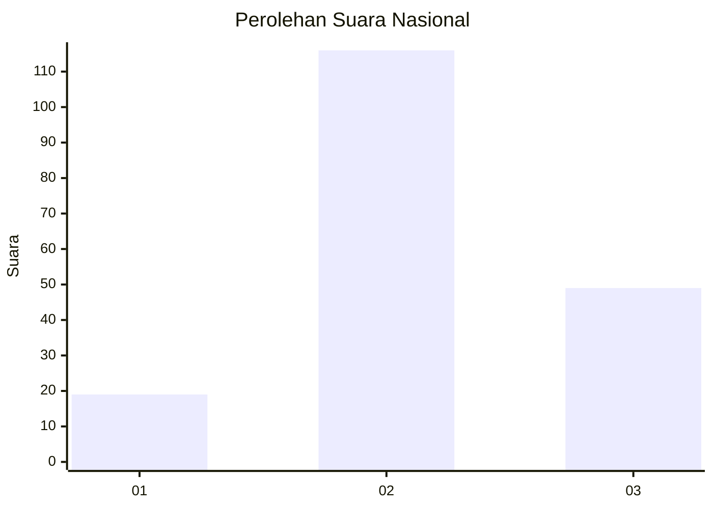
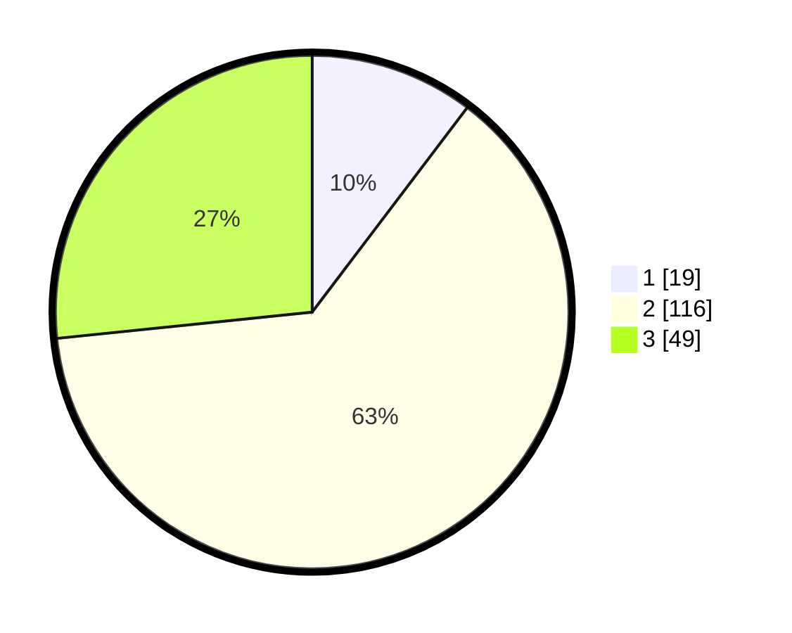

# Hasil

## Grafik

## Tabel

| No. | Nama Paslon    | Suara | Suara (raw) | Persentase |
|:--- |:-------------- | -----:| -----------:| ----------:|
| 1   | ANIES MUHAIMIN | 19    | [19][p-1]   | 10,33      |
| 2   | PRABOWO GIBRAN | 116   | [116][p-2]  | 63,04      |
| 3   | GANJAR MAHFUD  | 49    | [49][p-3]   | 26,63      |

[p-1]: https://github.com/gigit-pemilu/pemilu-2024/blob/main/pilpres/hitung-suara/sub/34-di-yogyakarta/sub/02-bantul/sub/03-kretek/sub/2001-tirtomulyo/sub/021-tps/sub/paslon-1.txt
[p-2]: https://github.com/gigit-pemilu/pemilu-2024/blob/main/pilpres/hitung-suara/sub/34-di-yogyakarta/sub/02-bantul/sub/03-kretek/sub/2001-tirtomulyo/sub/021-tps/sub/paslon-2.txt
[p-3]: https://github.com/gigit-pemilu/pemilu-2024/blob/main/pilpres/hitung-suara/sub/34-di-yogyakarta/sub/02-bantul/sub/03-kretek/sub/2001-tirtomulyo/sub/021-tps/sub/paslon-3.txt

## Foto C Plano

https://sirekap-obj-formc.kpu.go.id/c93a/pemilu/ppwp/34/02/03/20/01/3402032001021-20240214-234755--eb273578-3c3b-4b47-82b3-d9b3cfd228f7.jpg

https://sirekap-obj-formc.kpu.go.id/c93a/pemilu/ppwp/34/02/03/20/01/3402032001021-20240214-234847--69b960c4-b940-40f8-ae00-e0820a740689.jpg

https://sirekap-obj-formc.kpu.go.id/c93a/pemilu/ppwp/34/02/03/20/01/3402032001021-20240214-235020--19a09c54-0169-4b0e-a300-38d16b6bf08e.jpg

## Metadata

| Key        | Value               |
| ---------- | ------------------- |
| Time Stamp | 2024-02-24 22:31:28 |

