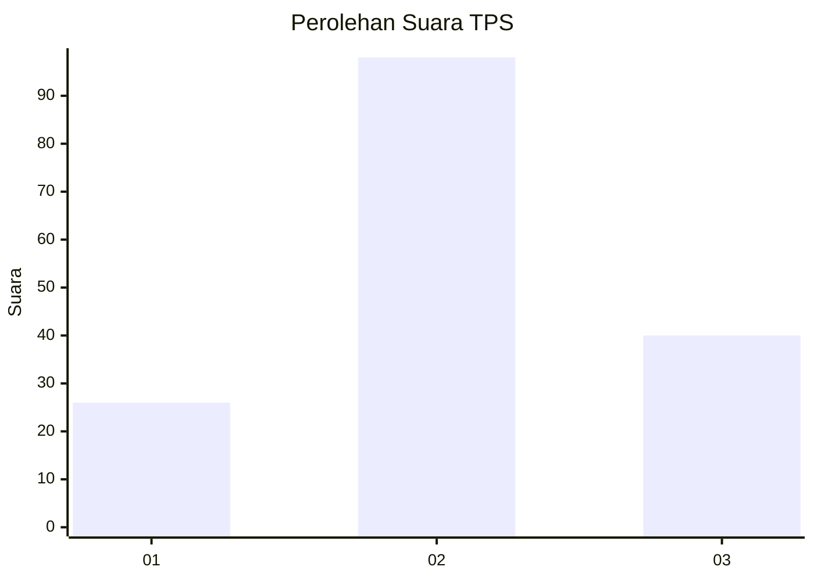
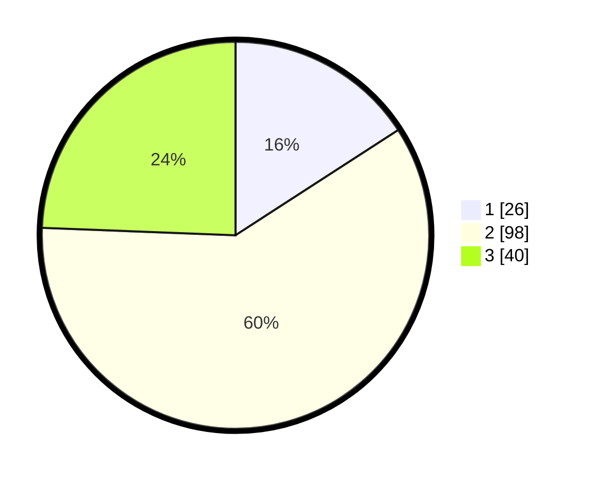

# Hasil

## Grafik

## Tabel

| No. | Nama Paslon    | Suara | Suara (raw) | Persentase |
|:--- |:-------------- | -----:| -----------:| ----------:|
| 1   | ANIES MUHAIMIN | 26    | [26][p-1]   | 15,85      |
| 2   | PRABOWO GIBRAN | 98    | [98][p-2]   | 59,76      |
| 3   | GANJAR MAHFUD  | 40    | [40][p-3]   | 24,39      |

[p-1]: https://github.com/gigit-pemilu/pemilu-2024-34-di-yogyakarta/blob/main/pilpres/hitung-suara/sub/34-di-yogyakarta/sub/02-bantul/sub/03-kretek/sub/2001-tirtomulyo/sub/026-tps/sub/paslon-1.txt
[p-2]: https://github.com/gigit-pemilu/pemilu-2024-34-di-yogyakarta/blob/main/pilpres/hitung-suara/sub/34-di-yogyakarta/sub/02-bantul/sub/03-kretek/sub/2001-tirtomulyo/sub/026-tps/sub/paslon-2.txt
[p-3]: https://github.com/gigit-pemilu/pemilu-2024-34-di-yogyakarta/blob/main/pilpres/hitung-suara/sub/34-di-yogyakarta/sub/02-bantul/sub/03-kretek/sub/2001-tirtomulyo/sub/026-tps/sub/paslon-3.txt

## Foto C Plano

https://sirekap-obj-formc.kpu.go.id/3cc1/pemilu/ppwp/34/02/03/20/01/3402032001026-20240214-230923--8c7744a0-03a2-45dd-9d16-f75b69647014.jpg

https://sirekap-obj-formc.kpu.go.id/3cc1/pemilu/ppwp/34/02/03/20/01/3402032001026-20240214-231028--ef76746f-4f59-487f-a1dd-69e057100853.jpg

https://sirekap-obj-formc.kpu.go.id/3cc1/pemilu/ppwp/34/02/03/20/01/3402032001026-20240215-213550--8c8550ce-f02f-4c31-bd1a-2050bce55253.jpg

## Metadata

| Key        | Value               |
| ---------- | ------------------- |
| Time Stamp | 2024-02-15 22:00:27 |

