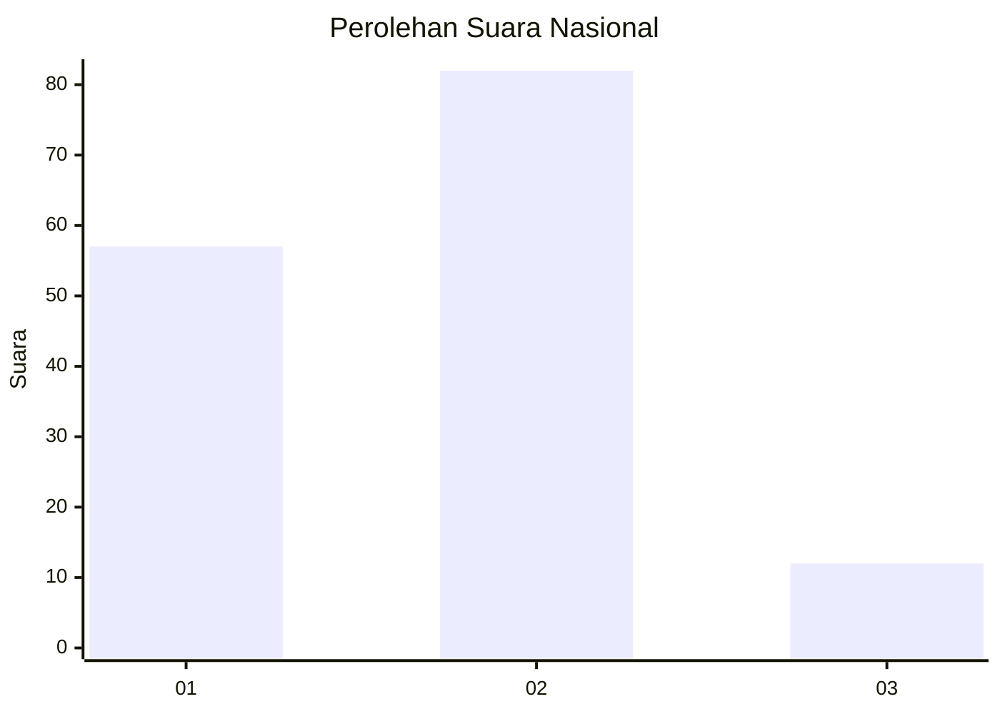
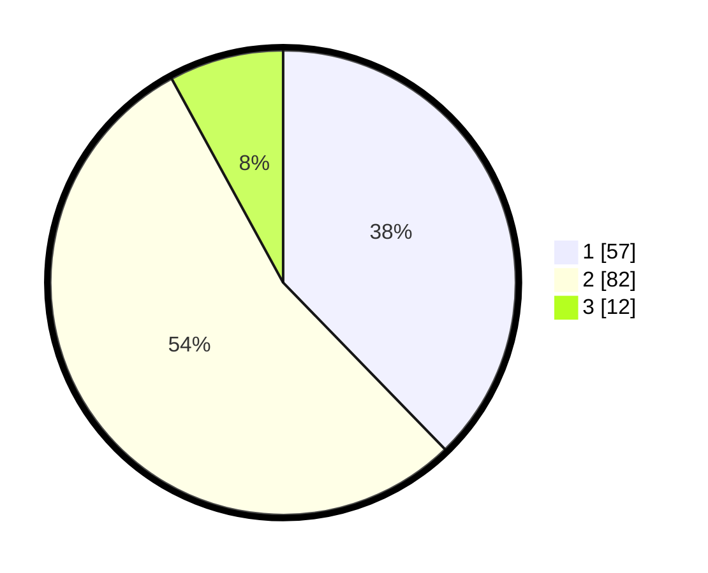

# Hasil

## Grafik

## Tabel

| No. | Nama Paslon    | Suara | Suara (raw) | Persentase |
|:--- |:-------------- | -----:| -----------:| ----------:|
| 1   | ANIES MUHAIMIN | 57    | [57][p-1]   | 37,75      |
| 2   | PRABOWO GIBRAN | 82    | [82][p-2]   | 54,30      |
| 3   | GANJAR MAHFUD  | 12    | [12][p-3]   | 7,95       |

[p-1]: https://github.com/gigit-pemilu/pemilu-2024/blob/main/pilpres/hitung-suara/sub/34-di-yogyakarta/sub/02-bantul/sub/03-kretek/sub/2001-tirtomulyo/sub/027-tps/sub/paslon-1.txt
[p-2]: https://github.com/gigit-pemilu/pemilu-2024/blob/main/pilpres/hitung-suara/sub/34-di-yogyakarta/sub/02-bantul/sub/03-kretek/sub/2001-tirtomulyo/sub/027-tps/sub/paslon-2.txt
[p-3]: https://github.com/gigit-pemilu/pemilu-2024/blob/main/pilpres/hitung-suara/sub/34-di-yogyakarta/sub/02-bantul/sub/03-kretek/sub/2001-tirtomulyo/sub/027-tps/sub/paslon-3.txt

## Foto C Plano

https://sirekap-obj-formc.kpu.go.id/67cf/pemilu/ppwp/34/02/03/20/01/3402032001027-20240218-154003--be3f39d7-4479-454c-a6c9-6721dd5e04dd.jpg

https://sirekap-obj-formc.kpu.go.id/67cf/pemilu/ppwp/34/02/03/20/01/3402032001027-20240214-202456--fcb86ebf-cc95-4f2e-87e6-5a39508e6d48.jpg

https://sirekap-obj-formc.kpu.go.id/67cf/pemilu/ppwp/34/02/03/20/01/3402032001027-20240214-215354--32467ccf-3c8d-4d04-b818-870d0002ae32.jpg

## Metadata

| Key        | Value               |
| ---------- | ------------------- |
| Time Stamp | 2024-02-19 06:16:00 |

