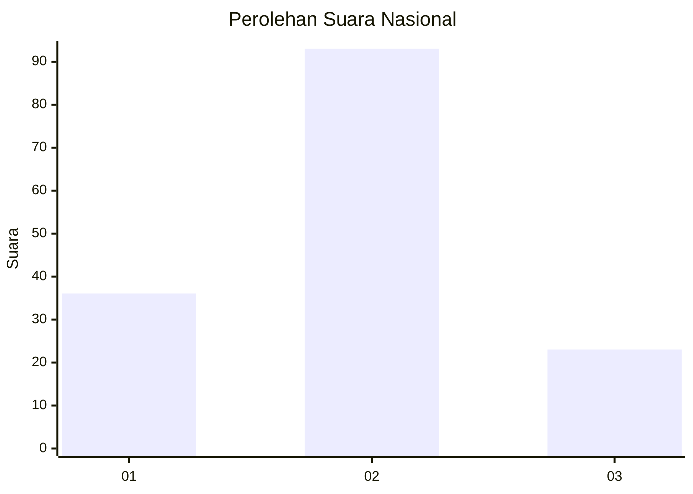
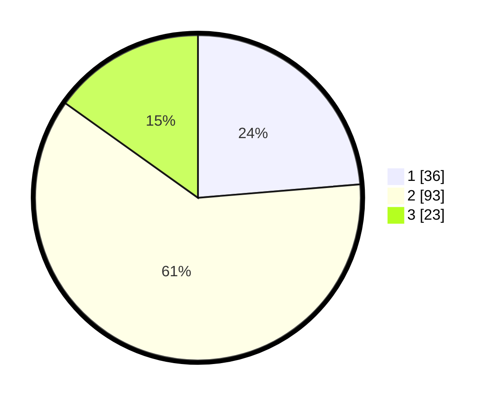

# Hasil

## Grafik

## Tabel

| No. | Nama Paslon    | Suara | Suara (raw) | Persentase |
|:--- |:-------------- | -----:| -----------:| ----------:|
| 1   | ANIES MUHAIMIN | 36    | [36][p-1]   | 23,68      |
| 2   | PRABOWO GIBRAN | 93    | [93][p-2]   | 61,18      |
| 3   | GANJAR MAHFUD  | 23    | [23][p-3]   | 15,13      |

[p-1]: https://github.com/gigit-pemilu/pemilu-2024/blob/main/pilpres/hitung-suara/sub/34-di-yogyakarta/sub/02-bantul/sub/03-kretek/sub/2002-parangtritis/sub/002-tps/sub/paslon-1.txt
[p-2]: https://github.com/gigit-pemilu/pemilu-2024/blob/main/pilpres/hitung-suara/sub/34-di-yogyakarta/sub/02-bantul/sub/03-kretek/sub/2002-parangtritis/sub/002-tps/sub/paslon-2.txt
[p-3]: https://github.com/gigit-pemilu/pemilu-2024/blob/main/pilpres/hitung-suara/sub/34-di-yogyakarta/sub/02-bantul/sub/03-kretek/sub/2002-parangtritis/sub/002-tps/sub/paslon-3.txt

## Foto C Plano

https://sirekap-obj-formc.kpu.go.id/911d/pemilu/ppwp/34/02/03/20/02/3402032002002-20240220-131904--48444f3b-59ae-433e-880c-a68036443f67.jpg

https://sirekap-obj-formc.kpu.go.id/911d/pemilu/ppwp/34/02/03/20/02/3402032002002-20240220-132540--0837285b-56e3-4822-8616-861074f07f22.jpg

https://sirekap-obj-formc.kpu.go.id/911d/pemilu/ppwp/34/02/03/20/02/3402032002002-20240220-132317--4dbafe27-7610-4993-bf5d-2d460a7754b6.jpg

## Metadata

| Key        | Value               |
| ---------- | ------------------- |
| Time Stamp | 2024-02-20 14:00:00 |

## DATA PEMILIH TETAP

Jumlah pemilih dalam DPT: **169**.
 * L: **93**.
 * P: **76**.

## DATA PENGGUNA HAK PILIH

Jumlah pengguna hak pilih dalam DPT: **146**.
 * L: **81**.
 * P: **65**.

Jumlah pengguna hak pilih dalam DPTb: **4**.
 * L: **82**.
 * P: **2**.

Jumlah pengguna hak pilih dalam DPK: **4**.
 * L: **1**.
 * P: **3**.

Jumlah pengguna hak pilih: **154**.
 * L: **84**.
 * P: **70**.

## JUMLAH SUARA SAH DAN TIDAK SAH

JUMLAH SELURUH SUARA SAH: **152**.

JUMLAH SUARA TIDAK SAH: **2**.

JUMLAH SELURUH SUARA SAH DAN SUARA TIDAK SAH: **154**.

