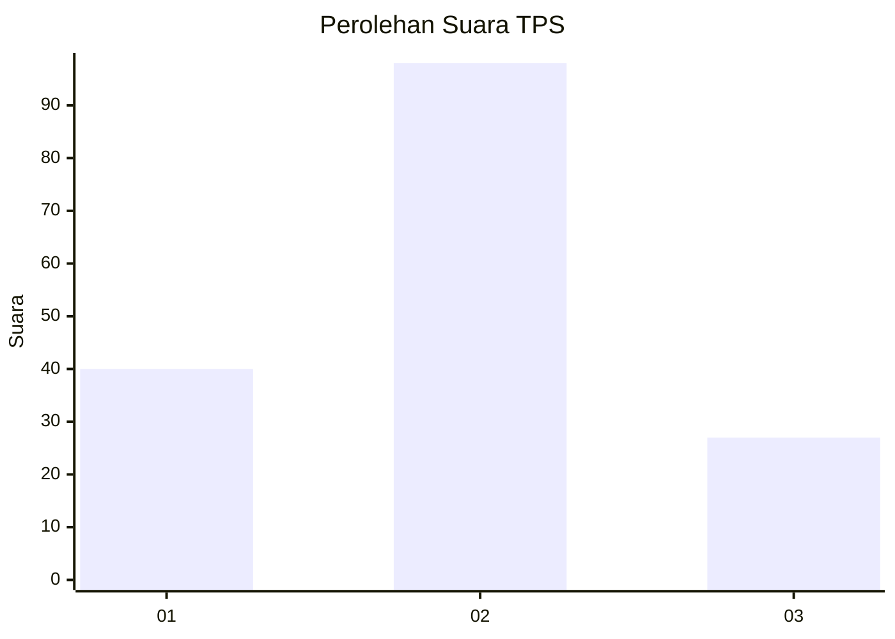
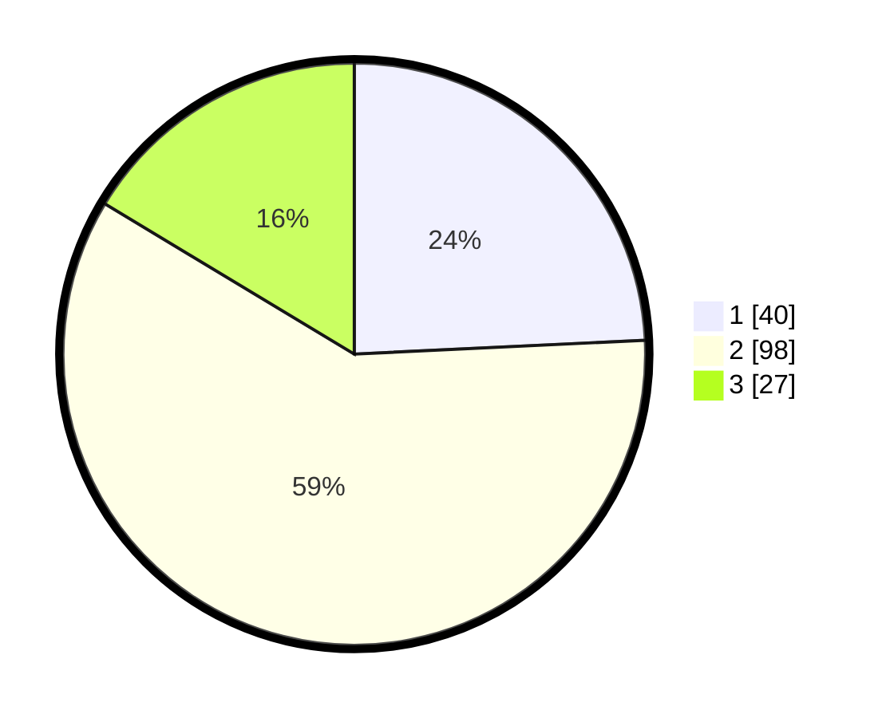

# Hasil

## Grafik

## Tabel

| No. | Nama Paslon    | Suara | Suara (raw) | Persentase |
|:--- |:-------------- | -----:| -----------:| ----------:|
| 1   | ANIES MUHAIMIN | 40    | [40][p-1]   | 24,24      |
| 2   | PRABOWO GIBRAN | 98    | [98][p-2]   | 59,39      |
| 3   | GANJAR MAHFUD  | 27    | [27][p-3]   | 16,36      |

[p-1]: https://github.com/gigit-pemilu/pemilu-2024-34-di-yogyakarta/blob/main/pilpres/hitung-suara/sub/34-di-yogyakarta/sub/02-bantul/sub/03-kretek/sub/2002-parangtritis/sub/004-tps/sub/paslon-1.txt
[p-2]: https://github.com/gigit-pemilu/pemilu-2024-34-di-yogyakarta/blob/main/pilpres/hitung-suara/sub/34-di-yogyakarta/sub/02-bantul/sub/03-kretek/sub/2002-parangtritis/sub/004-tps/sub/paslon-2.txt
[p-3]: https://github.com/gigit-pemilu/pemilu-2024-34-di-yogyakarta/blob/main/pilpres/hitung-suara/sub/34-di-yogyakarta/sub/02-bantul/sub/03-kretek/sub/2002-parangtritis/sub/004-tps/sub/paslon-3.txt

## Foto C Plano

https://sirekap-obj-formc.kpu.go.id/e8d1/pemilu/ppwp/34/02/03/20/02/3402032002004-20240220-140636--f8d09ce8-dec3-443f-8d73-045dd63fc4b7.jpg

https://sirekap-obj-formc.kpu.go.id/e8d1/pemilu/ppwp/34/02/03/20/02/3402032002004-20240220-140334--ab3a5487-a8b8-43ab-8282-e7a6029a0d53.jpg

https://sirekap-obj-formc.kpu.go.id/e8d1/pemilu/ppwp/34/02/03/20/02/3402032002004-20240220-141643--90fade08-33ec-49bd-8161-6b9a4bf604b9.jpg

## Metadata

| Key        | Value               |
| ---------- | ------------------- |
| Time Stamp | 2024-02-20 15:00:00 |

## DATA PEMILIH TETAP

Jumlah pemilih dalam DPT: **195**.
 * L: **95**.
 * P: **100**.

## DATA PENGGUNA HAK PILIH

Jumlah pengguna hak pilih dalam DPT: **195**.
 * L: **95**.
 * P: **100**.

Jumlah pengguna hak pilih dalam DPTb: **2**.
 * L: **2**.
 * P: **0**.

Jumlah pengguna hak pilih dalam DPK: **0**.
 * L: **0**.
 * P: **0**.

Jumlah pengguna hak pilih: **171**.
 * L: **81**.
 * P: **90**.

## JUMLAH SUARA SAH DAN TIDAK SAH

JUMLAH SELURUH SUARA SAH: **165**.

JUMLAH SUARA TIDAK SAH: **6**.

JUMLAH SELURUH SUARA SAH DAN SUARA TIDAK SAH: **171**.

