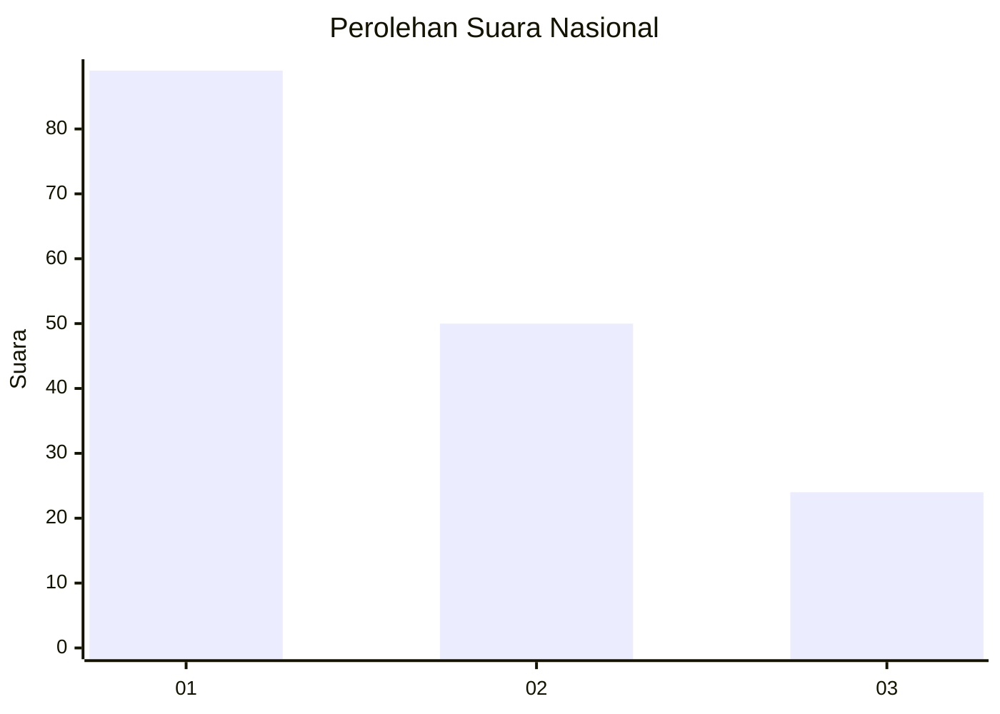
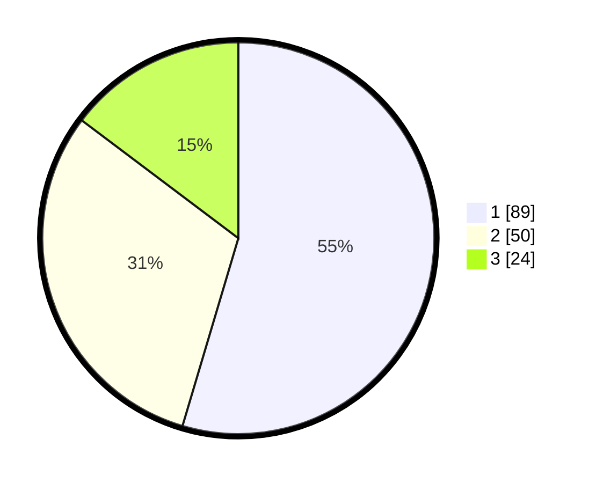

# Hasil

## Grafik

## Tabel

| No. | Nama Paslon    | Suara | Suara (raw) | Persentase |
|:--- |:-------------- | -----:| -----------:| ----------:|
| 1   | ANIES MUHAIMIN | 89    | [89][p-1]   | 54,60      |
| 2   | PRABOWO GIBRAN | 50    | [50][p-2]   | 30,67      |
| 3   | GANJAR MAHFUD  | 24    | [24][p-3]   | 14,72      |

[p-1]: https://github.com/gigit-pemilu/pemilu-2024/blob/main/pilpres/hitung-suara/sub/34-di-yogyakarta/sub/02-bantul/sub/03-kretek/sub/2002-parangtritis/sub/007-tps/sub/paslon-1.txt
[p-2]: https://github.com/gigit-pemilu/pemilu-2024/blob/main/pilpres/hitung-suara/sub/34-di-yogyakarta/sub/02-bantul/sub/03-kretek/sub/2002-parangtritis/sub/007-tps/sub/paslon-2.txt
[p-3]: https://github.com/gigit-pemilu/pemilu-2024/blob/main/pilpres/hitung-suara/sub/34-di-yogyakarta/sub/02-bantul/sub/03-kretek/sub/2002-parangtritis/sub/007-tps/sub/paslon-3.txt

## Foto C Plano

https://sirekap-obj-formc.kpu.go.id/9b22/pemilu/ppwp/34/02/03/20/02/3402032002007-20240220-190207--3e895fe8-3770-482f-873c-f5b1c1642894.jpg

https://sirekap-obj-formc.kpu.go.id/9b22/pemilu/ppwp/34/02/03/20/02/3402032002007-20240220-190547--8d5d10b0-46db-4b11-82ed-50acc034a50e.jpg

https://sirekap-obj-formc.kpu.go.id/9b22/pemilu/ppwp/34/02/03/20/02/3402032002007-20240220-191148--52d2a243-0388-45e7-b5c7-ac3dc990bdca.jpg

## Metadata

| Key        | Value               |
| ---------- | ------------------- |
| Time Stamp | 2024-02-20 20:00:00 |

## DATA PEMILIH TETAP

Jumlah pemilih dalam DPT: **186**.
 * L: **91**.
 * P: **95**.

## DATA PENGGUNA HAK PILIH

Jumlah pengguna hak pilih dalam DPT: **161**.
 * L: **75**.
 * P: **86**.

Jumlah pengguna hak pilih dalam DPTb: **4**.
 * L: **1**.
 * P: **3**.

Jumlah pengguna hak pilih dalam DPK: **1**.
 * L: **1**.
 * P: **0**.

Jumlah pengguna hak pilih: **166**.
 * L: **77**.
 * P: **89**.

## JUMLAH SUARA SAH DAN TIDAK SAH

JUMLAH SELURUH SUARA SAH: **163**.

JUMLAH SUARA TIDAK SAH: **3**.

JUMLAH SELURUH SUARA SAH DAN SUARA TIDAK SAH: **166**.

