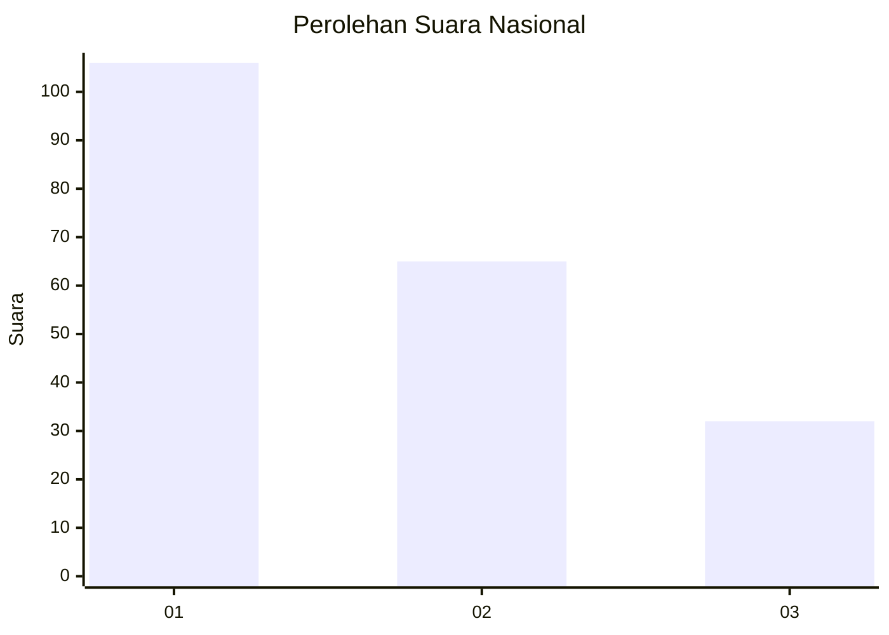
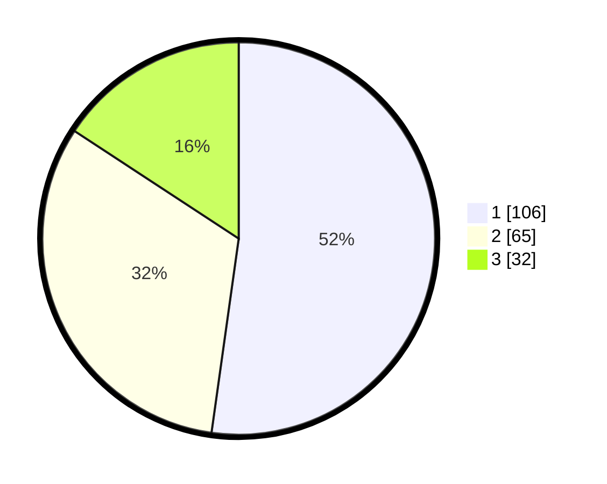

# Hasil

## Grafik

## Tabel

| No. | Nama Paslon    | Suara | Suara (raw) | Persentase |
|:--- |:-------------- | -----:| -----------:| ----------:|
| 1   | ANIES MUHAIMIN | 106   | [106][p-1]  | 52,22      |
| 2   | PRABOWO GIBRAN | 65    | [65][p-2]   | 32,02      |
| 3   | GANJAR MAHFUD  | 32    | [32][p-3]   | 15,76      |

[p-1]: https://github.com/gigit-pemilu/pemilu-2024/blob/main/pilpres/hitung-suara/sub/34-di-yogyakarta/sub/02-bantul/sub/03-kretek/sub/2002-parangtritis/sub/009-tps/sub/paslon-1.txt
[p-2]: https://github.com/gigit-pemilu/pemilu-2024/blob/main/pilpres/hitung-suara/sub/34-di-yogyakarta/sub/02-bantul/sub/03-kretek/sub/2002-parangtritis/sub/009-tps/sub/paslon-2.txt
[p-3]: https://github.com/gigit-pemilu/pemilu-2024/blob/main/pilpres/hitung-suara/sub/34-di-yogyakarta/sub/02-bantul/sub/03-kretek/sub/2002-parangtritis/sub/009-tps/sub/paslon-3.txt

## Foto C Plano

https://sirekap-obj-formc.kpu.go.id/282b/pemilu/ppwp/34/02/03/20/02/3402032002009-20240219-173716--765a7893-a69e-460c-abe5-86e4d323ef54.jpg

https://sirekap-obj-formc.kpu.go.id/282b/pemilu/ppwp/34/02/03/20/02/3402032002009-20240219-174101--0cc48964-5362-496c-af23-d8b54544b58d.jpg

https://sirekap-obj-formc.kpu.go.id/282b/pemilu/ppwp/34/02/03/20/02/3402032002009-20240220-190411--21c5860e-596e-40db-8019-ac471675e9ac.jpg

## Metadata

| Key        | Value               |
| ---------- | ------------------- |
| Time Stamp | 2024-02-20 20:00:00 |

## DATA PEMILIH TETAP

Jumlah pemilih dalam DPT: **218**.
 * L: **101**.
 * P: **117**.

## DATA PENGGUNA HAK PILIH

Jumlah pengguna hak pilih dalam DPT: **206**.
 * L: **93**.
 * P: **113**.

Jumlah pengguna hak pilih dalam DPTb: **807**.
 * L: **80**.
 * P: **1**.

Jumlah pengguna hak pilih dalam DPK: **0**.
 * L: **0**.
 * P: **0**.

Jumlah pengguna hak pilih: **207**.
 * L: **93**.
 * P: **114**.

## JUMLAH SUARA SAH DAN TIDAK SAH

JUMLAH SELURUH SUARA SAH: **203**.

JUMLAH SUARA TIDAK SAH: **4**.

JUMLAH SELURUH SUARA SAH DAN SUARA TIDAK SAH: **207**.

