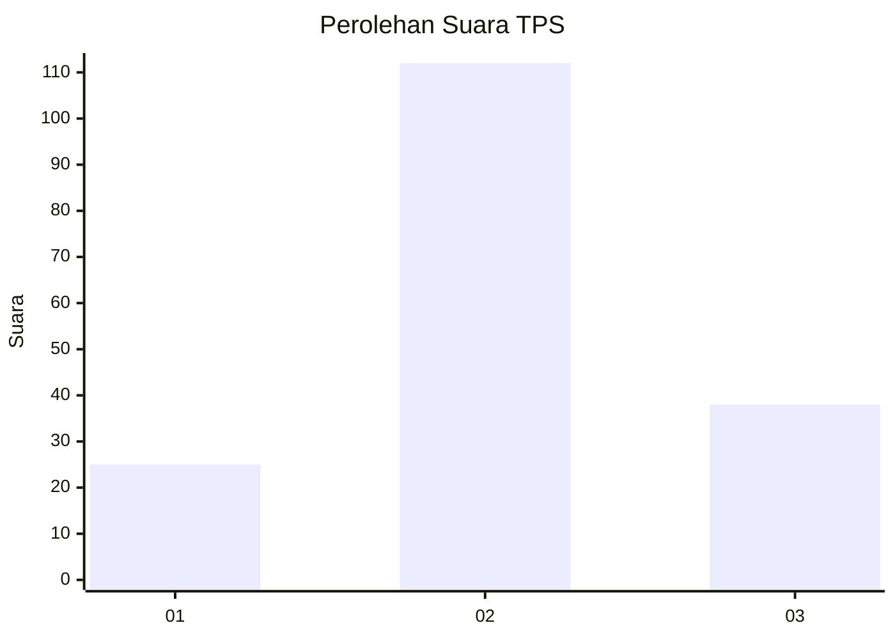
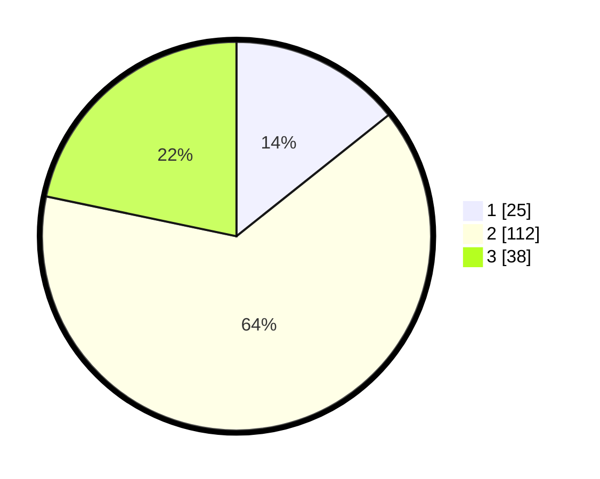

# Hasil

## Grafik

## Tabel

| No. | Nama Paslon    | Suara | Suara (raw) | Persentase |
|:--- |:-------------- | -----:| -----------:| ----------:|
| 1   | ANIES MUHAIMIN | 25    | [25][p-1]   | 14,29      |
| 2   | PRABOWO GIBRAN | 112   | [112][p-2]  | 64,00      |
| 3   | GANJAR MAHFUD  | 38    | [38][p-3]   | 21,71      |

[p-1]: https://github.com/gigit-pemilu/pemilu-2024-34-di-yogyakarta/blob/main/pilpres/hitung-suara/sub/34-di-yogyakarta/sub/02-bantul/sub/03-kretek/sub/2002-parangtritis/sub/013-tps/sub/paslon-1.txt
[p-2]: https://github.com/gigit-pemilu/pemilu-2024-34-di-yogyakarta/blob/main/pilpres/hitung-suara/sub/34-di-yogyakarta/sub/02-bantul/sub/03-kretek/sub/2002-parangtritis/sub/013-tps/sub/paslon-2.txt
[p-3]: https://github.com/gigit-pemilu/pemilu-2024-34-di-yogyakarta/blob/main/pilpres/hitung-suara/sub/34-di-yogyakarta/sub/02-bantul/sub/03-kretek/sub/2002-parangtritis/sub/013-tps/sub/paslon-3.txt

## Foto C Plano

https://sirekap-obj-formc.kpu.go.id/6fed/pemilu/ppwp/34/02/03/20/02/3402032002013-20240220-224048--7456550b-5dbb-4d93-8936-f44cbba591b5.jpg

https://sirekap-obj-formc.kpu.go.id/6fed/pemilu/ppwp/34/02/03/20/02/3402032002013-20240221-004240--f5ae9980-f2f1-4ef9-b226-0295f7d5d068.jpg

https://sirekap-obj-formc.kpu.go.id/6fed/pemilu/ppwp/34/02/03/20/02/3402032002013-20240220-223814--1c9665ad-1d85-4818-9f68-a40c7589d88b.jpg

## Metadata

| Key        | Value               |
| ---------- | ------------------- |
| Time Stamp | 2024-02-21 08:00:00 |

## DATA PEMILIH TETAP

Jumlah pemilih dalam DPT: **195**.
 * L: **91**.
 * P: **104**.

## DATA PENGGUNA HAK PILIH

Jumlah pengguna hak pilih dalam DPT: **180**.
 * L: **82**.
 * P: **98**.

Jumlah pengguna hak pilih dalam DPTb: **0**.
 * L: **0**.
 * P: **0**.

Jumlah pengguna hak pilih dalam DPK: **1**.
 * L: **1**.
 * P: **0**.

Jumlah pengguna hak pilih: **181**.
 * L: **83**.
 * P: **98**.

## JUMLAH SUARA SAH DAN TIDAK SAH

JUMLAH SELURUH SUARA SAH: **175**.

JUMLAH SUARA TIDAK SAH: **6**.

JUMLAH SELURUH SUARA SAH DAN SUARA TIDAK SAH: **181**.

