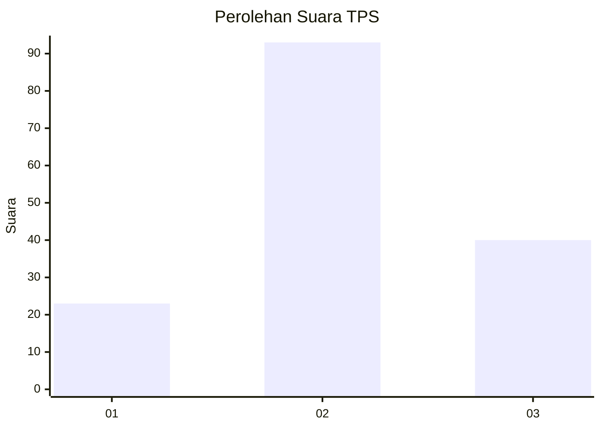
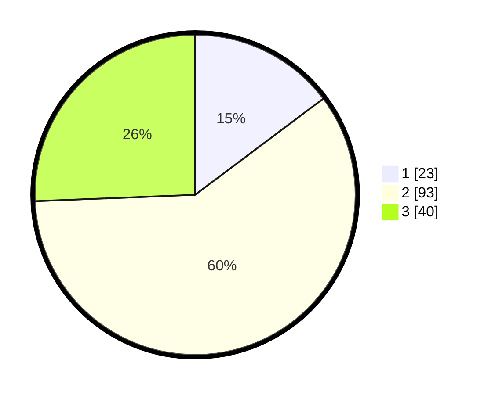

# Hasil

## Grafik

## Tabel

| No. | Nama Paslon    | Suara | Suara (raw) | Persentase |
|:--- |:-------------- | -----:| -----------:| ----------:|
| 1   | ANIES MUHAIMIN | 23    | [23][p-1]   | 14,74      |
| 2   | PRABOWO GIBRAN | 93    | [93][p-2]   | 59,62      |
| 3   | GANJAR MAHFUD  | 40    | [40][p-3]   | 25,64      |

[p-1]: https://github.com/gigit-pemilu/pemilu-2024-34-di-yogyakarta/blob/main/pilpres/hitung-suara/sub/34-di-yogyakarta/sub/02-bantul/sub/03-kretek/sub/2002-parangtritis/sub/015-tps/sub/paslon-1.txt
[p-2]: https://github.com/gigit-pemilu/pemilu-2024-34-di-yogyakarta/blob/main/pilpres/hitung-suara/sub/34-di-yogyakarta/sub/02-bantul/sub/03-kretek/sub/2002-parangtritis/sub/015-tps/sub/paslon-2.txt
[p-3]: https://github.com/gigit-pemilu/pemilu-2024-34-di-yogyakarta/blob/main/pilpres/hitung-suara/sub/34-di-yogyakarta/sub/02-bantul/sub/03-kretek/sub/2002-parangtritis/sub/015-tps/sub/paslon-3.txt

## Foto C Plano

https://sirekap-obj-formc.kpu.go.id/8f4a/pemilu/ppwp/34/02/03/20/02/3402032002015-20240220-160328--2a4640b8-f998-43e7-8159-81ae4659a91e.jpg

https://sirekap-obj-formc.kpu.go.id/8f4a/pemilu/ppwp/34/02/03/20/02/3402032002015-20240220-160542--6000e053-8426-4452-a7b5-1ee757477337.jpg

https://sirekap-obj-formc.kpu.go.id/8f4a/pemilu/ppwp/34/02/03/20/02/3402032002015-20240220-160652--99600e75-d30d-450f-92be-4e00d5a12dd0.jpg

## Metadata

| Key        | Value               |
| ---------- | ------------------- |
| Time Stamp | 2024-02-20 17:00:00 |

## DATA PEMILIH TETAP

Jumlah pemilih dalam DPT: **168**.
 * L: **0**.
 * P: **88**.

## DATA PENGGUNA HAK PILIH

Jumlah pengguna hak pilih dalam DPT: **154**.
 * L: **73**.
 * P: **81**.

Jumlah pengguna hak pilih dalam DPTb: **0**.
 * L: **0**.
 * P: **0**.

Jumlah pengguna hak pilih dalam DPK: **4**.
 * L: **2**.
 * P: **2**.

Jumlah pengguna hak pilih: **158**.
 * L: **75**.
 * P: **83**.

## JUMLAH SUARA SAH DAN TIDAK SAH

JUMLAH SELURUH SUARA SAH: **156**.

JUMLAH SUARA TIDAK SAH: **2**.

JUMLAH SELURUH SUARA SAH DAN SUARA TIDAK SAH: **158**.

