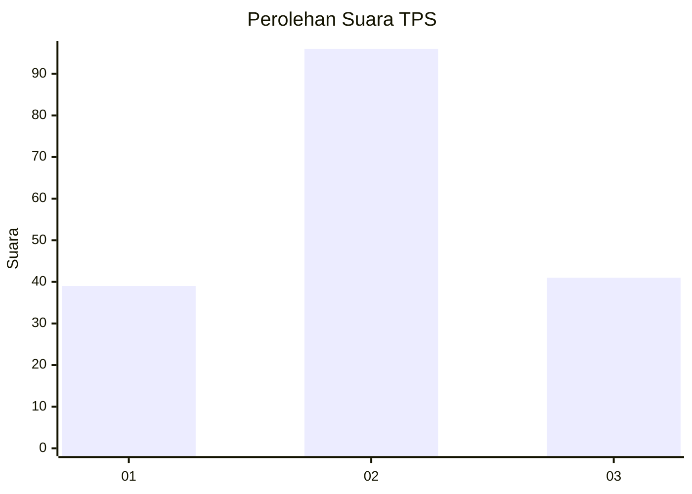
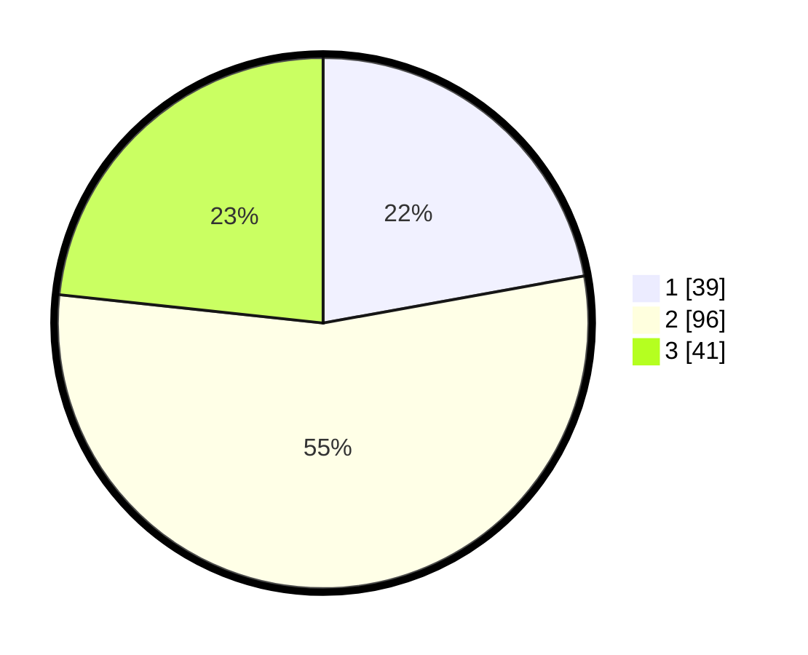

# Hasil

## Grafik

## Tabel

| No. | Nama Paslon    | Suara | Suara (raw) | Persentase |
|:--- |:-------------- | -----:| -----------:| ----------:|
| 1   | ANIES MUHAIMIN | 39    | [39][p-1]   | 22,16      |
| 2   | PRABOWO GIBRAN | 96    | [96][p-2]   | 54,55      |
| 3   | GANJAR MAHFUD  | 41    | [41][p-3]   | 23,30      |

[p-1]: https://github.com/gigit-pemilu/pemilu-2024-34-di-yogyakarta/blob/main/pilpres/hitung-suara/sub/34-di-yogyakarta/sub/02-bantul/sub/03-kretek/sub/2002-parangtritis/sub/018-tps/sub/paslon-1.txt
[p-2]: https://github.com/gigit-pemilu/pemilu-2024-34-di-yogyakarta/blob/main/pilpres/hitung-suara/sub/34-di-yogyakarta/sub/02-bantul/sub/03-kretek/sub/2002-parangtritis/sub/018-tps/sub/paslon-2.txt
[p-3]: https://github.com/gigit-pemilu/pemilu-2024-34-di-yogyakarta/blob/main/pilpres/hitung-suara/sub/34-di-yogyakarta/sub/02-bantul/sub/03-kretek/sub/2002-parangtritis/sub/018-tps/sub/paslon-3.txt

## Foto C Plano

https://sirekap-obj-formc.kpu.go.id/8ef4/pemilu/ppwp/34/02/03/20/02/3402032002018-20240220-204225--f481cb5a-aee5-4d22-b530-53904375a16d.jpg

https://sirekap-obj-formc.kpu.go.id/8ef4/pemilu/ppwp/34/02/03/20/02/3402032002018-20240220-204430--89a8f945-e43c-4ec9-86bd-026e26d89ae0.jpg

https://sirekap-obj-formc.kpu.go.id/8ef4/pemilu/ppwp/34/02/03/20/02/3402032002018-20240220-205347--35e0ea33-8d99-4000-96c9-af4c0228b348.jpg

## Metadata

| Key        | Value               |
| ---------- | ------------------- |
| Time Stamp | 2024-02-20 21:00:00 |

## DATA PEMILIH TETAP

Jumlah pemilih dalam DPT: **195**.
 * L: **92**.
 * P: **103**.

## DATA PENGGUNA HAK PILIH

Jumlah pengguna hak pilih dalam DPT: **180**.
 * L: **86**.
 * P: **94**.

Jumlah pengguna hak pilih dalam DPTb: **1**.
 * L: **0**.
 * P: **1**.

Jumlah pengguna hak pilih dalam DPK: **0**.
 * L: **0**.
 * P: **0**.

Jumlah pengguna hak pilih: **181**.
 * L: **86**.
 * P: **95**.

## JUMLAH SUARA SAH DAN TIDAK SAH

JUMLAH SELURUH SUARA SAH: **176**.

JUMLAH SUARA TIDAK SAH: **5**.

JUMLAH SELURUH SUARA SAH DAN SUARA TIDAK SAH: **181**.

