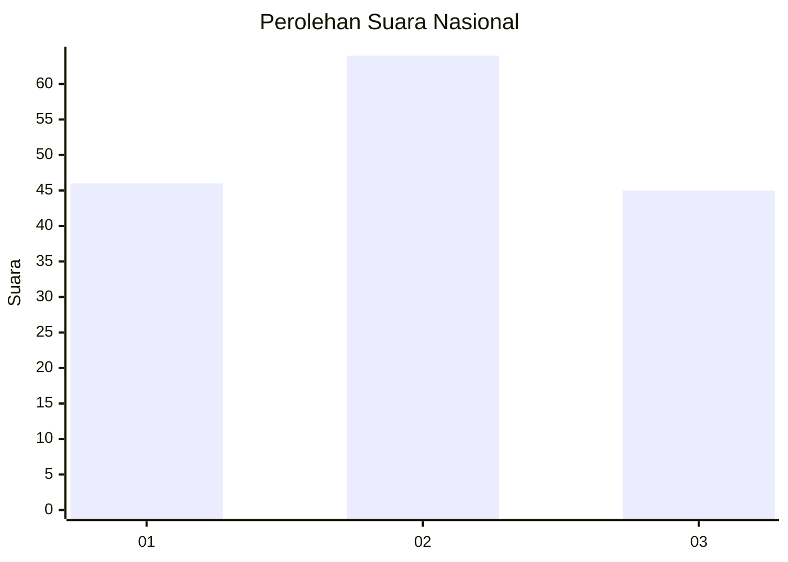
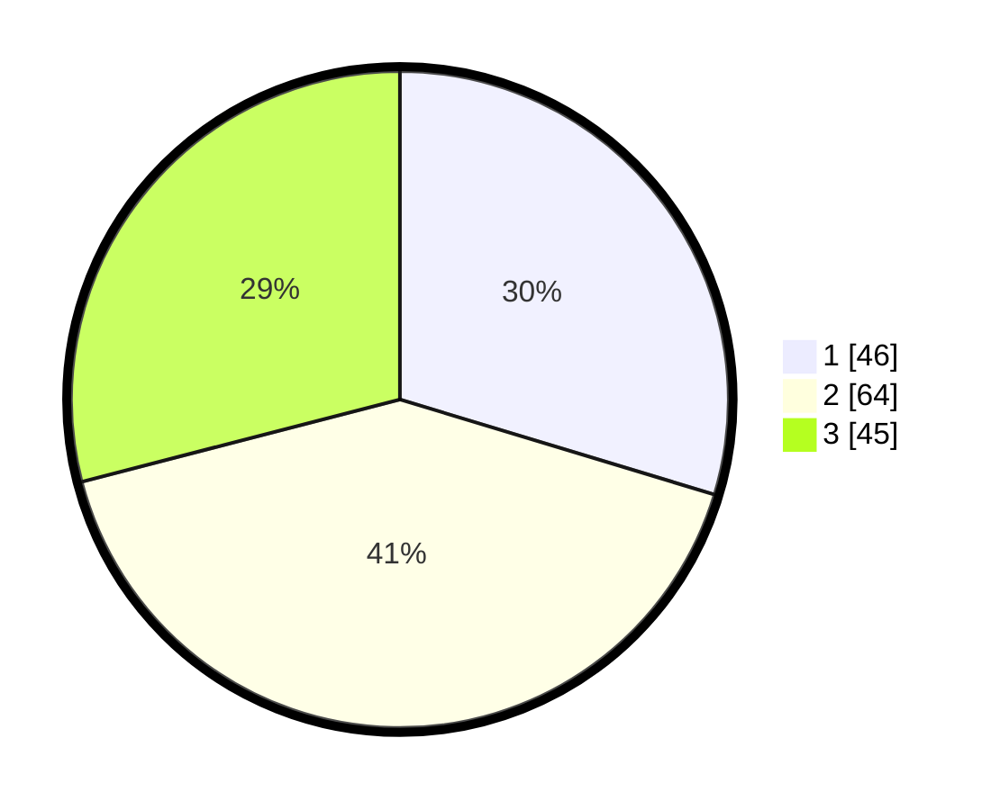

# Hasil

## Grafik

## Tabel

| No. | Nama Paslon    | Suara | Suara (raw) | Persentase |
|:--- |:-------------- | -----:| -----------:| ----------:|
| 1   | ANIES MUHAIMIN | 46    | [46][p-1]   | 29,68      |
| 2   | PRABOWO GIBRAN | 64    | [64][p-2]   | 41,29      |
| 3   | GANJAR MAHFUD  | 45    | [45][p-3]   | 29,03      |

[p-1]: https://github.com/gigit-pemilu/pemilu-2024/blob/main/pilpres/hitung-suara/sub/34-di-yogyakarta/sub/02-bantul/sub/03-kretek/sub/2002-parangtritis/sub/019-tps/sub/paslon-1.txt
[p-2]: https://github.com/gigit-pemilu/pemilu-2024/blob/main/pilpres/hitung-suara/sub/34-di-yogyakarta/sub/02-bantul/sub/03-kretek/sub/2002-parangtritis/sub/019-tps/sub/paslon-2.txt
[p-3]: https://github.com/gigit-pemilu/pemilu-2024/blob/main/pilpres/hitung-suara/sub/34-di-yogyakarta/sub/02-bantul/sub/03-kretek/sub/2002-parangtritis/sub/019-tps/sub/paslon-3.txt

## Foto C Plano

https://sirekap-obj-formc.kpu.go.id/fc46/pemilu/ppwp/34/02/03/20/02/3402032002019-20240220-225825--bc67b9f1-4ce0-4f23-ba97-12321f352028.jpg

https://sirekap-obj-formc.kpu.go.id/fc46/pemilu/ppwp/34/02/03/20/02/3402032002019-20240220-225826--fc46c3d9-96e2-43f8-ae2b-cb1ffb64e1de.jpg

https://sirekap-obj-formc.kpu.go.id/fc46/pemilu/ppwp/34/02/03/20/02/3402032002019-20240220-225825--c0107651-faea-4c68-a760-178ca6de67c1.jpg

## Metadata

| Key        | Value               |
| ---------- | ------------------- |
| Time Stamp | 2024-02-21 08:00:00 |

## DATA PEMILIH TETAP

Jumlah pemilih dalam DPT: **188**.
 * L: **85**.
 * P: **103**.

## DATA PENGGUNA HAK PILIH

Jumlah pengguna hak pilih dalam DPT: **158**.
 * L: **73**.
 * P: **85**.

Jumlah pengguna hak pilih dalam DPTb: **5**.
 * L: **2**.
 * P: **3**.

Jumlah pengguna hak pilih dalam DPK: **0**.
 * L: **0**.
 * P: **0**.

Jumlah pengguna hak pilih: **163**.
 * L: **75**.
 * P: **88**.

## JUMLAH SUARA SAH DAN TIDAK SAH

JUMLAH SELURUH SUARA SAH: **155**.

JUMLAH SUARA TIDAK SAH: **8**.

JUMLAH SELURUH SUARA SAH DAN SUARA TIDAK SAH: **163**.

