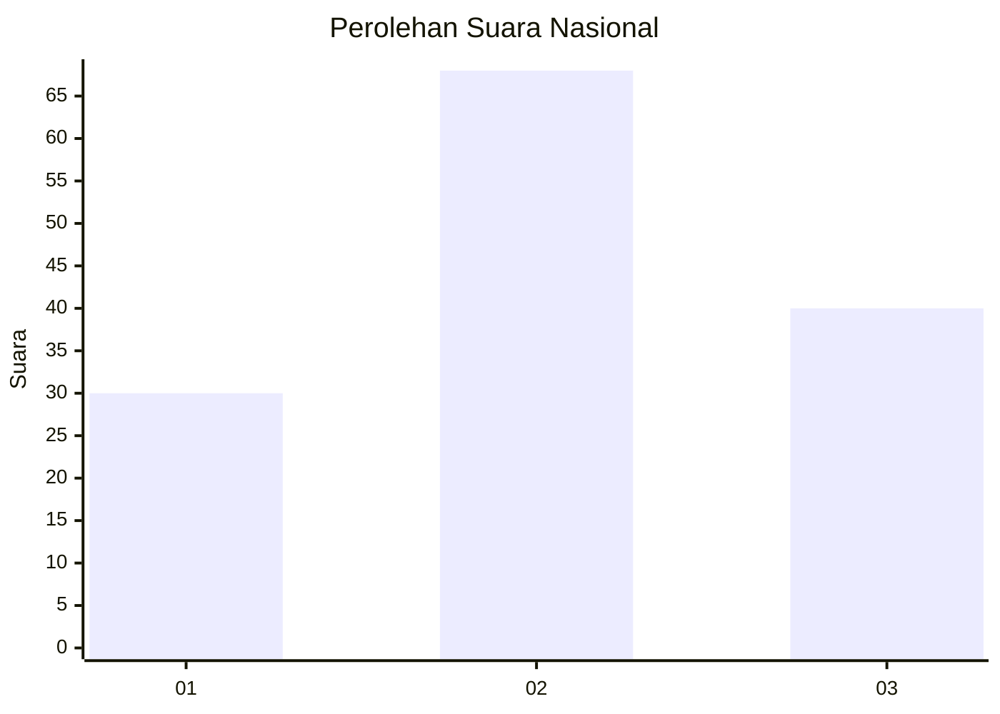
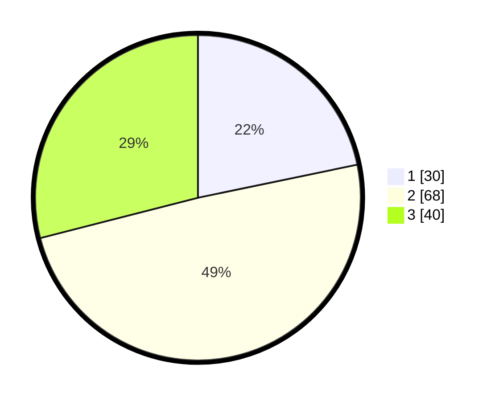

# Hasil

## Grafik

## Tabel

| No. | Nama Paslon    | Suara | Suara (raw) | Persentase |
|:--- |:-------------- | -----:| -----------:| ----------:|
| 1   | ANIES MUHAIMIN | 30    | [30][p-1]   | 21,74      |
| 2   | PRABOWO GIBRAN | 68    | [68][p-2]   | 49,28      |
| 3   | GANJAR MAHFUD  | 40    | [40][p-3]   | 28,99      |

[p-1]: https://github.com/gigit-pemilu/pemilu-2024/blob/main/pilpres/hitung-suara/sub/34-di-yogyakarta/sub/02-bantul/sub/03-kretek/sub/2002-parangtritis/sub/020-tps/sub/paslon-1.txt
[p-2]: https://github.com/gigit-pemilu/pemilu-2024/blob/main/pilpres/hitung-suara/sub/34-di-yogyakarta/sub/02-bantul/sub/03-kretek/sub/2002-parangtritis/sub/020-tps/sub/paslon-2.txt
[p-3]: https://github.com/gigit-pemilu/pemilu-2024/blob/main/pilpres/hitung-suara/sub/34-di-yogyakarta/sub/02-bantul/sub/03-kretek/sub/2002-parangtritis/sub/020-tps/sub/paslon-3.txt

## Foto C Plano

https://sirekap-obj-formc.kpu.go.id/6394/pemilu/ppwp/34/02/03/20/02/3402032002020-20240220-175940--a2b3f15f-f012-476a-9a41-c41a750efee6.jpg

https://sirekap-obj-formc.kpu.go.id/6394/pemilu/ppwp/34/02/03/20/02/3402032002020-20240220-180201--6e223bac-9816-4a39-87d2-c43ed9ada5f6.jpg

https://sirekap-obj-formc.kpu.go.id/6394/pemilu/ppwp/34/02/03/20/02/3402032002020-20240220-180831--542ae08f-d7ad-4d2f-b182-f423f2576b3f.jpg

## Metadata

| Key        | Value               |
| ---------- | ------------------- |
| Time Stamp | 2024-02-20 19:00:00 |

## DATA PEMILIH TETAP

Jumlah pemilih dalam DPT: **156**.
 * L: **69**.
 * P: **87**.

## DATA PENGGUNA HAK PILIH

Jumlah pengguna hak pilih dalam DPT: **139**.
 * L: **63**.
 * P: **76**.

Jumlah pengguna hak pilih dalam DPTb: **4**.
 * L: **1**.
 * P: **3**.

Jumlah pengguna hak pilih dalam DPK: **0**.
 * L: **0**.
 * P: **0**.

Jumlah pengguna hak pilih: **143**.
 * L: **64**.
 * P: **79**.

## JUMLAH SUARA SAH DAN TIDAK SAH

JUMLAH SELURUH SUARA SAH: **138**.

JUMLAH SUARA TIDAK SAH: **5**.

JUMLAH SELURUH SUARA SAH DAN SUARA TIDAK SAH: **143**.

