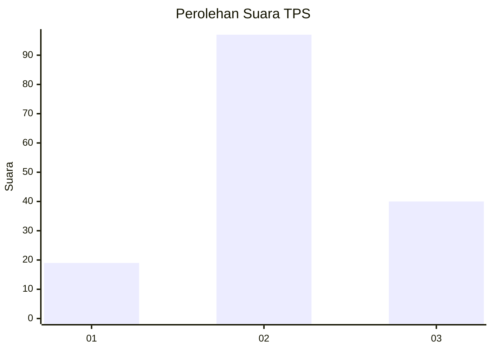
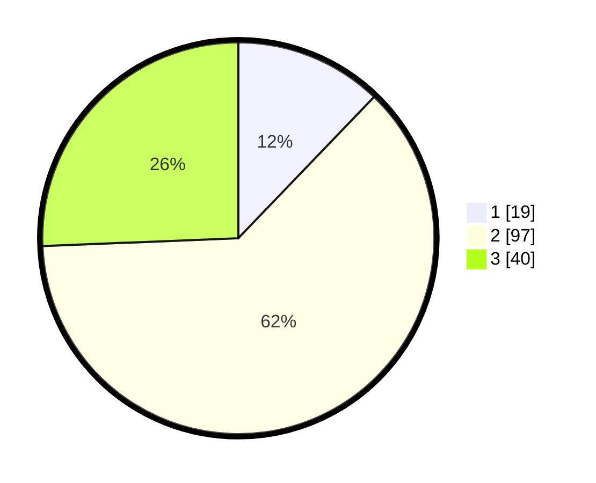

# Hasil

## Grafik

## Tabel

| No. | Nama Paslon    | Suara | Suara (raw) | Persentase |
|:--- |:-------------- | -----:| -----------:| ----------:|
| 1   | ANIES MUHAIMIN | 19    | [19][p-1]   | 12,18      |
| 2   | PRABOWO GIBRAN | 97    | [97][p-2]   | 62,18      |
| 3   | GANJAR MAHFUD  | 40    | [40][p-3]   | 25,64      |

[p-1]: https://github.com/gigit-pemilu/pemilu-2024-34-di-yogyakarta/blob/main/pilpres/hitung-suara/sub/34-di-yogyakarta/sub/02-bantul/sub/03-kretek/sub/2002-parangtritis/sub/022-tps/sub/paslon-1.txt
[p-2]: https://github.com/gigit-pemilu/pemilu-2024-34-di-yogyakarta/blob/main/pilpres/hitung-suara/sub/34-di-yogyakarta/sub/02-bantul/sub/03-kretek/sub/2002-parangtritis/sub/022-tps/sub/paslon-2.txt
[p-3]: https://github.com/gigit-pemilu/pemilu-2024-34-di-yogyakarta/blob/main/pilpres/hitung-suara/sub/34-di-yogyakarta/sub/02-bantul/sub/03-kretek/sub/2002-parangtritis/sub/022-tps/sub/paslon-3.txt

## Foto C Plano

https://sirekap-obj-formc.kpu.go.id/dc14/pemilu/ppwp/34/02/03/20/02/3402032002022-20240220-172934--3d87c2de-4059-478f-a5c3-fd43062a5b8b.jpg

https://sirekap-obj-formc.kpu.go.id/dc14/pemilu/ppwp/34/02/03/20/02/3402032002022-20240220-173315--2578cee4-d357-4883-85be-9935eeb13a47.jpg

https://sirekap-obj-formc.kpu.go.id/dc14/pemilu/ppwp/34/02/03/20/02/3402032002022-20240220-173540--7bde1c26-b3df-41b1-8744-2b5a30699d89.jpg

## Metadata

| Key        | Value               |
| ---------- | ------------------- |
| Time Stamp | 2024-02-20 18:00:00 |

## DATA PEMILIH TETAP

Jumlah pemilih dalam DPT: **180**.
 * L: **84**.
 * P: **96**.

## DATA PENGGUNA HAK PILIH

Jumlah pengguna hak pilih dalam DPT: **157**.
 * L: **75**.
 * P: **82**.

Jumlah pengguna hak pilih dalam DPTb: **4**.
 * L: **0**.
 * P: **4**.

Jumlah pengguna hak pilih dalam DPK: **0**.
 * L: **0**.
 * P: **0**.

Jumlah pengguna hak pilih: **161**.
 * L: **75**.
 * P: **86**.

## JUMLAH SUARA SAH DAN TIDAK SAH

JUMLAH SELURUH SUARA SAH: **156**.

JUMLAH SUARA TIDAK SAH: **5**.

JUMLAH SELURUH SUARA SAH DAN SUARA TIDAK SAH: **161**.

