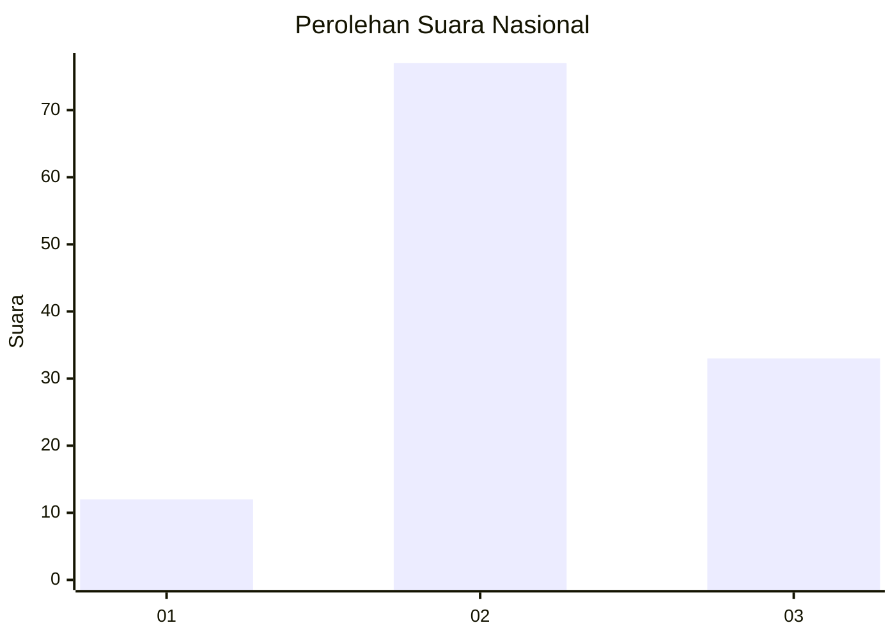
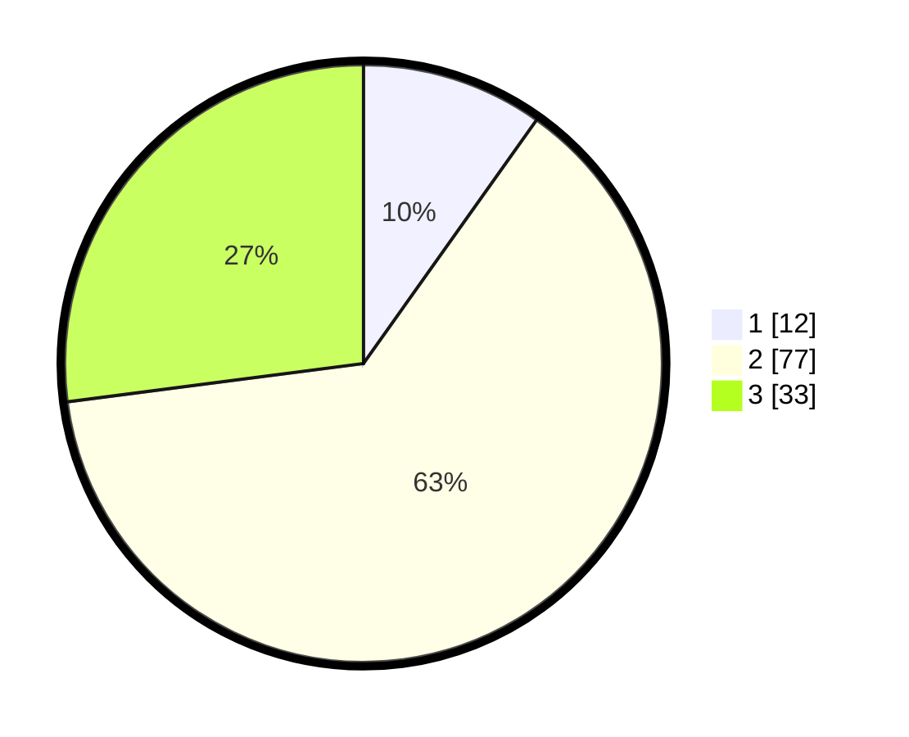

# Hasil

## Grafik

## Tabel

| No. | Nama Paslon    | Suara | Suara (raw) | Persentase |
|:--- |:-------------- | -----:| -----------:| ----------:|
| 1   | ANIES MUHAIMIN | 12    | [12][p-1]   | 9,84       |
| 2   | PRABOWO GIBRAN | 77    | [77][p-2]   | 63,11      |
| 3   | GANJAR MAHFUD  | 33    | [33][p-3]   | 27,05      |

[p-1]: https://github.com/gigit-pemilu/pemilu-2024/blob/main/pilpres/hitung-suara/sub/34-di-yogyakarta/sub/02-bantul/sub/03-kretek/sub/2002-parangtritis/sub/023-tps/sub/paslon-1.txt
[p-2]: https://github.com/gigit-pemilu/pemilu-2024/blob/main/pilpres/hitung-suara/sub/34-di-yogyakarta/sub/02-bantul/sub/03-kretek/sub/2002-parangtritis/sub/023-tps/sub/paslon-2.txt
[p-3]: https://github.com/gigit-pemilu/pemilu-2024/blob/main/pilpres/hitung-suara/sub/34-di-yogyakarta/sub/02-bantul/sub/03-kretek/sub/2002-parangtritis/sub/023-tps/sub/paslon-3.txt

## Foto C Plano

https://sirekap-obj-formc.kpu.go.id/fc5f/pemilu/ppwp/34/02/03/20/02/3402032002023-20240214-220333--7c3170eb-d851-4a8c-80cf-98c95780813b.jpg

https://sirekap-obj-formc.kpu.go.id/fc5f/pemilu/ppwp/34/02/03/20/02/3402032002023-20240214-220502--998128c9-fc6d-4572-9da2-e8adb51da8a5.jpg

https://sirekap-obj-formc.kpu.go.id/fc5f/pemilu/ppwp/34/02/03/20/02/3402032002023-20240214-220844--19311c26-16df-4999-9d2a-41d3f3394945.jpg

## Metadata

| Key        | Value               |
| ---------- | ------------------- |
| Time Stamp | 2024-02-24 22:31:28 |

