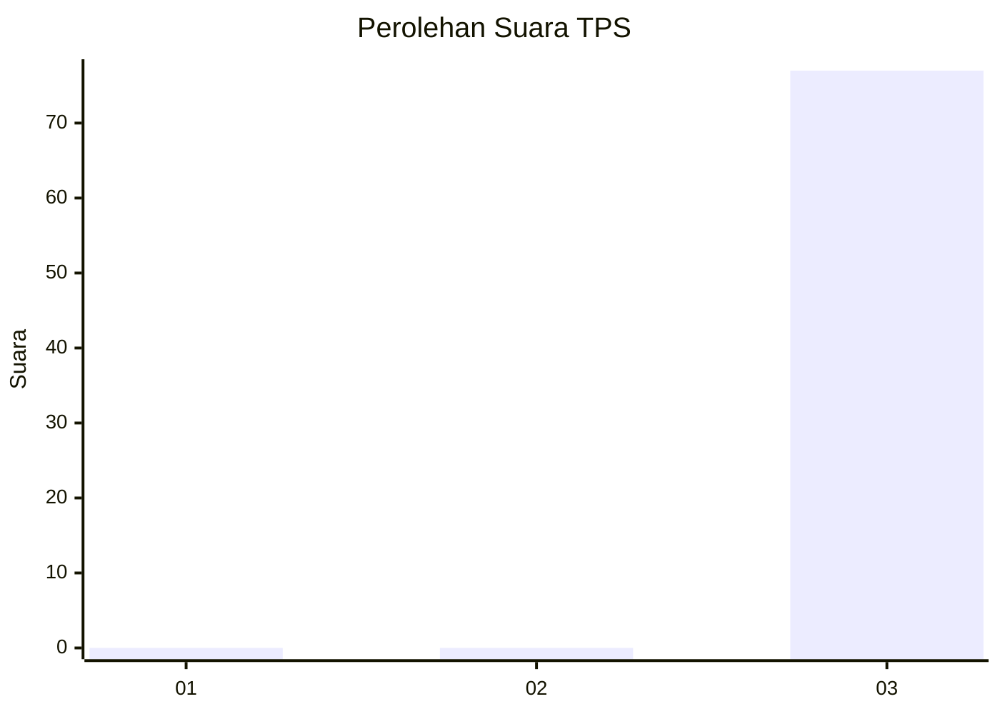
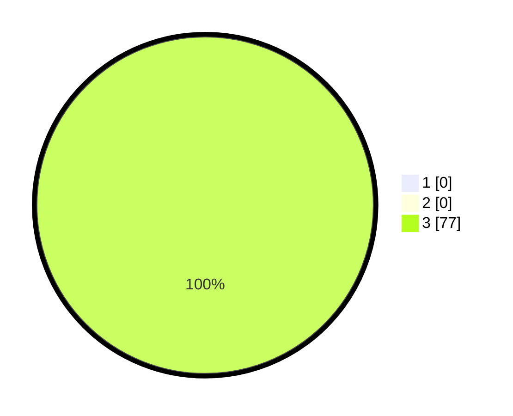

# Hasil

## Grafik

## Tabel

| No. | Nama Paslon    | Suara | Suara (raw) | Persentase |
|:--- |:-------------- | -----:| -----------:| ----------:|
| 1   | ANIES MUHAIMIN | 0     | [0][p-1]    | 0,00       |
| 2   | PRABOWO GIBRAN | 0     | [0][p-2]    | 0,00       |
| 3   | GANJAR MAHFUD  | 77    | [77][p-3]   | 100,00     |

[p-1]: https://github.com/gigit-pemilu/pemilu-2024-34-di-yogyakarta/blob/main/pilpres/hitung-suara/sub/34-di-yogyakarta/sub/02-bantul/sub/03-kretek/sub/2002-parangtritis/sub/028-tps/sub/paslon-1.txt
[p-2]: https://github.com/gigit-pemilu/pemilu-2024-34-di-yogyakarta/blob/main/pilpres/hitung-suara/sub/34-di-yogyakarta/sub/02-bantul/sub/03-kretek/sub/2002-parangtritis/sub/028-tps/sub/paslon-2.txt
[p-3]: https://github.com/gigit-pemilu/pemilu-2024-34-di-yogyakarta/blob/main/pilpres/hitung-suara/sub/34-di-yogyakarta/sub/02-bantul/sub/03-kretek/sub/2002-parangtritis/sub/028-tps/sub/paslon-3.txt

## Foto C Plano

https://sirekap-obj-formc.kpu.go.id/87b8/pemilu/ppwp/34/02/03/20/02/3402032002028-20240220-130011--78e8cbc2-f52a-48c6-8a64-bcbdfcfd3b7e.jpg

https://sirekap-obj-formc.kpu.go.id/87b8/pemilu/ppwp/34/02/03/20/02/3402032002028-20240220-130142--3c099c9b-c620-46ab-9a02-e2c85c9c498c.jpg

https://sirekap-obj-formc.kpu.go.id/87b8/pemilu/ppwp/34/02/03/20/02/3402032002028-20240220-130322--8ae15e36-422f-4e71-998d-d91d6453def8.jpg

## Metadata

| Key        | Value               |
| ---------- | ------------------- |
| Time Stamp | 2024-02-25 10:00:00 |

