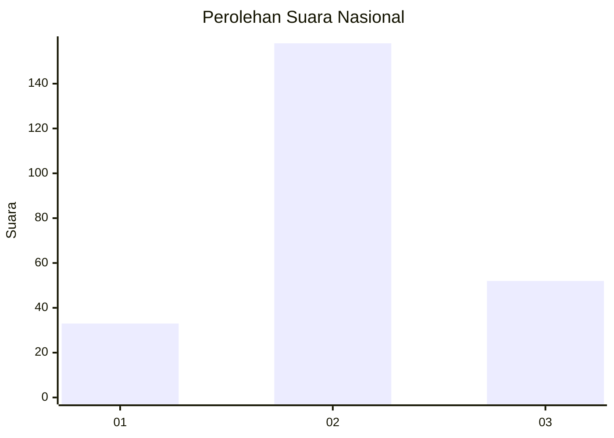
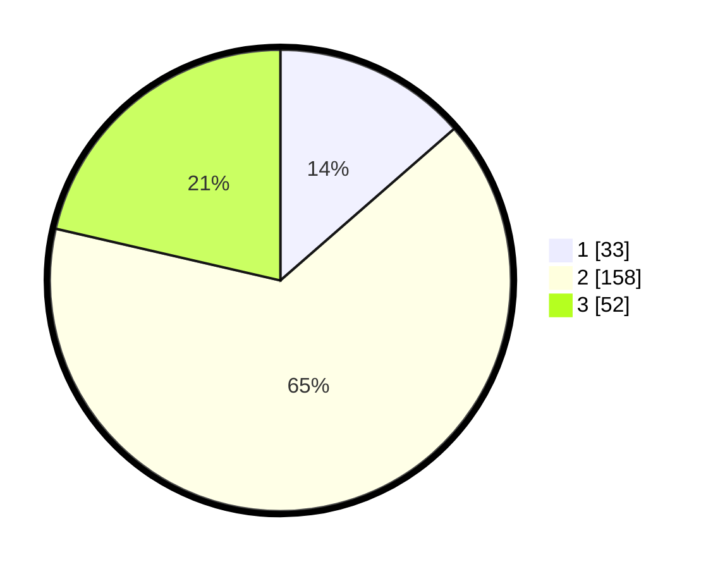

# Hasil

## Grafik

## Tabel

| No. | Nama Paslon    | Suara | Suara (raw) | Persentase |
|:--- |:-------------- | -----:| -----------:| ----------:|
| 1   | ANIES MUHAIMIN | 33    | [33][p-1]   | 13,58      |
| 2   | PRABOWO GIBRAN | 158   | [158][p-2]  | 65,02      |
| 3   | GANJAR MAHFUD  | 52    | [52][p-3]   | 21,40      |

[p-1]: https://github.com/gigit-pemilu/pemilu-2024/blob/main/pilpres/hitung-suara/sub/34-di-yogyakarta/sub/02-bantul/sub/03-kretek/sub/2003-donotirto/sub/001-tps/sub/paslon-1.txt
[p-2]: https://github.com/gigit-pemilu/pemilu-2024/blob/main/pilpres/hitung-suara/sub/34-di-yogyakarta/sub/02-bantul/sub/03-kretek/sub/2003-donotirto/sub/001-tps/sub/paslon-2.txt
[p-3]: https://github.com/gigit-pemilu/pemilu-2024/blob/main/pilpres/hitung-suara/sub/34-di-yogyakarta/sub/02-bantul/sub/03-kretek/sub/2003-donotirto/sub/001-tps/sub/paslon-3.txt

## Foto C Plano

https://sirekap-obj-formc.kpu.go.id/5a9d/pemilu/ppwp/34/02/03/20/03/3402032003001-20240216-162256--15e99f41-b381-4abb-b877-2111ab20aae7.jpg

https://sirekap-obj-formc.kpu.go.id/5a9d/pemilu/ppwp/34/02/03/20/03/3402032003001-20240216-162415--52cd43d6-029b-40ee-84ef-d4369dc07c26.jpg

https://sirekap-obj-formc.kpu.go.id/5a9d/pemilu/ppwp/34/02/03/20/03/3402032003001-20240216-162544--7fde7da0-3168-4032-b6b9-936a679db373.jpg

## Metadata

| Key        | Value               |
| ---------- | ------------------- |
| Time Stamp | 2024-02-25 15:00:00 |

