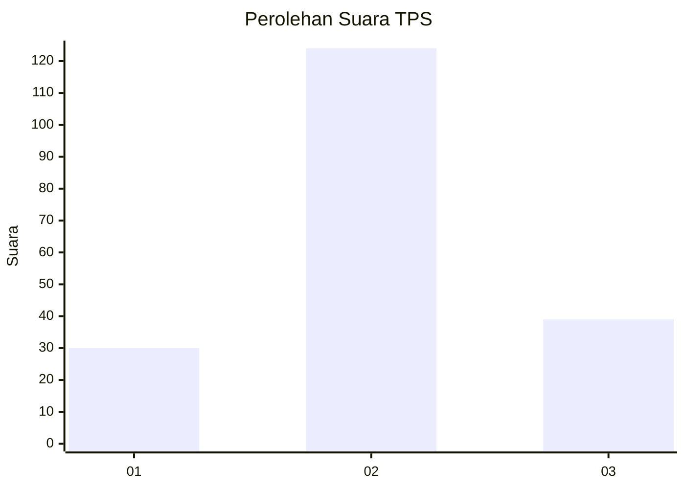
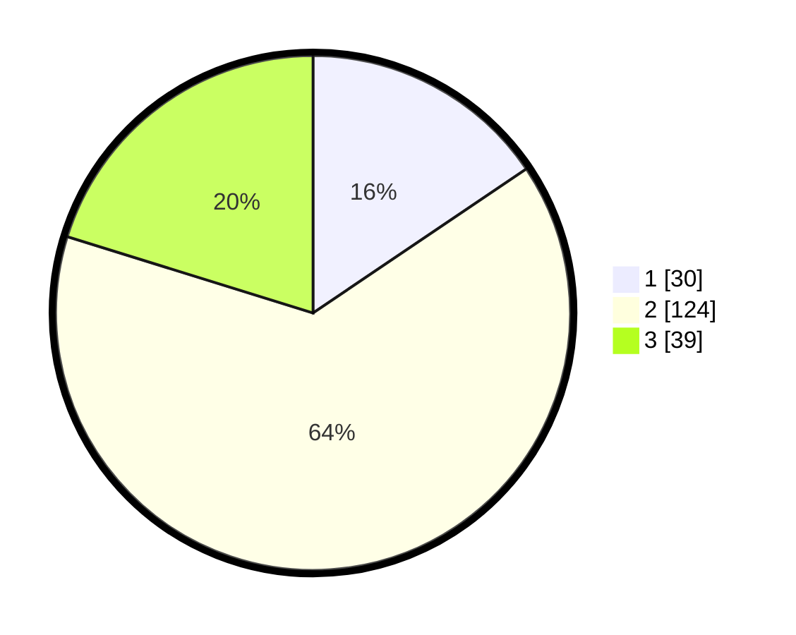

# Hasil

## Grafik

## Tabel

| No. | Nama Paslon    | Suara | Suara (raw) | Persentase |
|:--- |:-------------- | -----:| -----------:| ----------:|
| 1   | ANIES MUHAIMIN | 30    | [30][p-1]   | 15,54      |
| 2   | PRABOWO GIBRAN | 124   | [124][p-2]  | 64,25      |
| 3   | GANJAR MAHFUD  | 39    | [39][p-3]   | 20,21      |

[p-1]: https://github.com/gigit-pemilu/pemilu-2024-34-di-yogyakarta/blob/main/pilpres/hitung-suara/sub/34-di-yogyakarta/sub/02-bantul/sub/03-kretek/sub/2003-donotirto/sub/003-tps/sub/paslon-1.txt
[p-2]: https://github.com/gigit-pemilu/pemilu-2024-34-di-yogyakarta/blob/main/pilpres/hitung-suara/sub/34-di-yogyakarta/sub/02-bantul/sub/03-kretek/sub/2003-donotirto/sub/003-tps/sub/paslon-2.txt
[p-3]: https://github.com/gigit-pemilu/pemilu-2024-34-di-yogyakarta/blob/main/pilpres/hitung-suara/sub/34-di-yogyakarta/sub/02-bantul/sub/03-kretek/sub/2003-donotirto/sub/003-tps/sub/paslon-3.txt

## Foto C Plano

https://sirekap-obj-formc.kpu.go.id/e67e/pemilu/ppwp/34/02/03/20/03/3402032003003-20240214-233355--f938e170-4be4-4155-865d-48a0327c48b7.jpg

https://sirekap-obj-formc.kpu.go.id/e67e/pemilu/ppwp/34/02/03/20/03/3402032003003-20240214-231602--8165a5d5-54e9-4b65-842b-c3f6eeefb0c1.jpg

https://sirekap-obj-formc.kpu.go.id/e67e/pemilu/ppwp/34/02/03/20/03/3402032003003-20240214-231720--9fe5049d-3f62-4cdd-a7e3-6ee256837f92.jpg

## Metadata

| Key        | Value               |
| ---------- | ------------------- |
| Time Stamp | 2024-02-24 22:31:28 |

