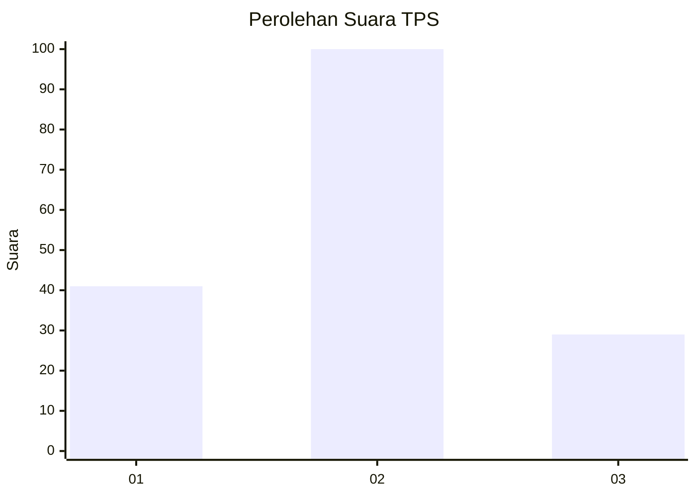

# Hasil

## Grafik

## Tabel

| No. | Nama Paslon    | Suara | Suara (raw) | Persentase |
|:--- |:-------------- | -----:| -----------:| ----------:|
| 1   | ANIES MUHAIMIN | 41    | [41][p-1]   | 24,12      |
| 2   | PRABOWO GIBRAN | 100   | [100][p-2]  | 58,82      |
| 3   | GANJAR MAHFUD  | 29    | [29][p-3]   | 17,06      |

[p-1]: https://github.com/gigit-pemilu/pemilu-2024-34-di-yogyakarta/blob/main/pilpres/hitung-suara/sub/34-di-yogyakarta/sub/02-bantul/sub/03-kretek/sub/2003-donotirto/sub/004-tps/sub/paslon-1.txt
[p-2]: https://github.com/gigit-pemilu/pemilu-2024-34-di-yogyakarta/blob/main/pilpres/hitung-suara/sub/34-di-yogyakarta/sub/02-bantul/sub/03-kretek/sub/2003-donotirto/sub/004-tps/sub/paslon-2.txt
[p-3]: https://github.com/gigit-pemilu/pemilu-2024-34-di-yogyakarta/blob/main/pilpres/hitung-suara/sub/34-di-yogyakarta/sub/02-bantul/sub/03-kretek/sub/2003-donotirto/sub/004-tps/sub/paslon-3.txt

## Foto C Plano

https://sirekap-obj-formc.kpu.go.id/e036/pemilu/ppwp/34/02/03/20/03/3402032003004-20240215-023521--5ea7bf1b-061d-4d94-b416-c788c820afe9.jpg

https://sirekap-obj-formc.kpu.go.id/e036/pemilu/ppwp/34/02/03/20/03/3402032003004-20240215-023526--c46a71d8-3bd6-495d-99c6-0c5d81b84ae2.jpg

https://sirekap-obj-formc.kpu.go.id/e036/pemilu/ppwp/34/02/03/20/03/3402032003004-20240215-023529--27930714-d2f5-4121-9aa4-430a9638f323.jpg

## Metadata

| Key        | Value               |
| ---------- | ------------------- |
| Time Stamp | 2024-02-24 22:31:28 |

