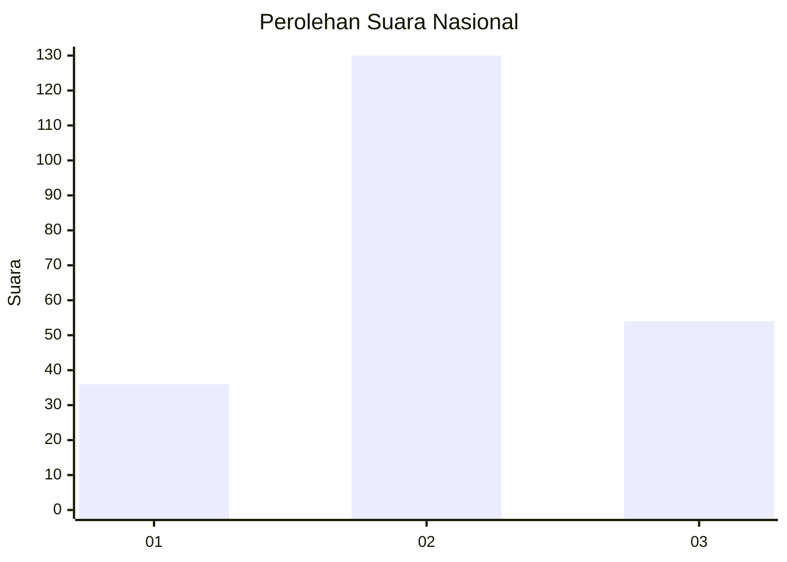
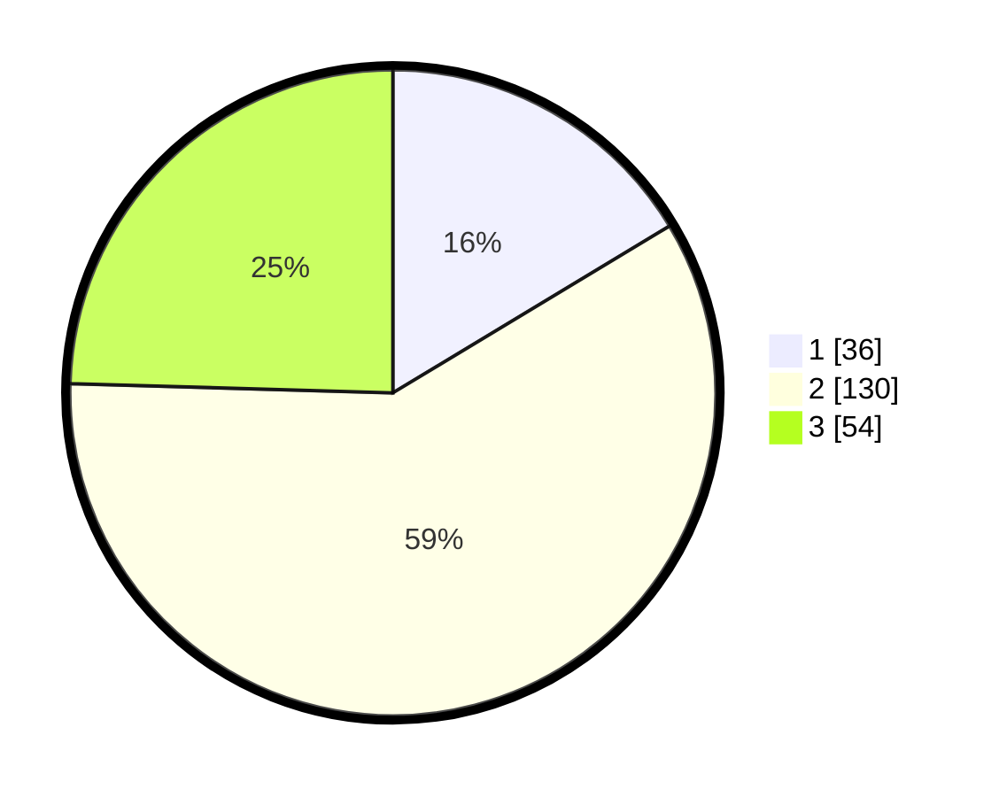

# Hasil

## Grafik

## Tabel

| No. | Nama Paslon    | Suara | Suara (raw) | Persentase |
|:--- |:-------------- | -----:| -----------:| ----------:|
| 1   | ANIES MUHAIMIN | 36    | [36][p-1]   | 16,36      |
| 2   | PRABOWO GIBRAN | 130   | [130][p-2]  | 59,09      |
| 3   | GANJAR MAHFUD  | 54    | [54][p-3]   | 24,55      |

[p-1]: https://github.com/gigit-pemilu/pemilu-2024/blob/main/pilpres/hitung-suara/sub/34-di-yogyakarta/sub/02-bantul/sub/03-kretek/sub/2003-donotirto/sub/006-tps/sub/paslon-1.txt
[p-2]: https://github.com/gigit-pemilu/pemilu-2024/blob/main/pilpres/hitung-suara/sub/34-di-yogyakarta/sub/02-bantul/sub/03-kretek/sub/2003-donotirto/sub/006-tps/sub/paslon-2.txt
[p-3]: https://github.com/gigit-pemilu/pemilu-2024/blob/main/pilpres/hitung-suara/sub/34-di-yogyakarta/sub/02-bantul/sub/03-kretek/sub/2003-donotirto/sub/006-tps/sub/paslon-3.txt

## Foto C Plano

https://sirekap-obj-formc.kpu.go.id/5cdb/pemilu/ppwp/34/02/03/20/03/3402032003006-20240215-195838--f13a3af9-946c-4f27-90c3-d91563d5aef8.jpg

https://sirekap-obj-formc.kpu.go.id/5cdb/pemilu/ppwp/34/02/03/20/03/3402032003006-20240215-195908--0f2830c1-4259-47f3-ad31-cf44e6d1c38d.jpg

https://sirekap-obj-formc.kpu.go.id/5cdb/pemilu/ppwp/34/02/03/20/03/3402032003006-20240215-200457--9475eea0-565f-4a0c-96f3-8634a5d86e21.jpg

## Metadata

| Key        | Value               |
| ---------- | ------------------- |
| Time Stamp | 2024-02-24 22:31:28 |

