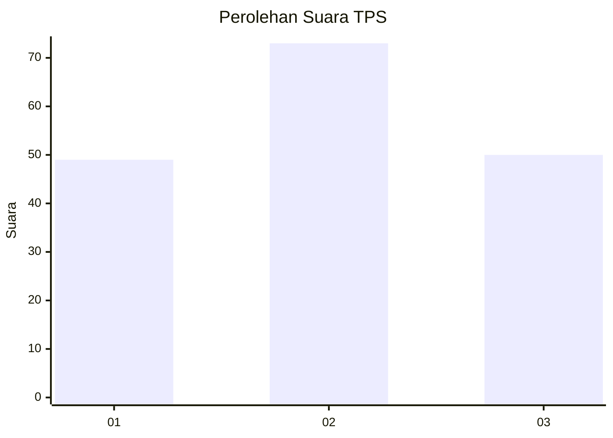
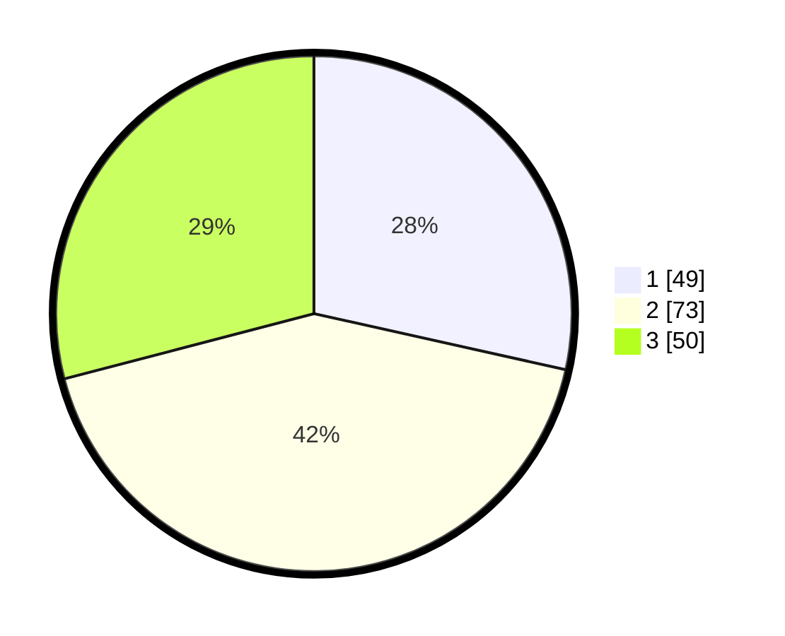

# Hasil

## Grafik

## Tabel

| No. | Nama Paslon    | Suara | Suara (raw) | Persentase |
|:--- |:-------------- | -----:| -----------:| ----------:|
| 1   | ANIES MUHAIMIN | 49    | [49][p-1]   | 28,49      |
| 2   | PRABOWO GIBRAN | 73    | [73][p-2]   | 42,44      |
| 3   | GANJAR MAHFUD  | 50    | [50][p-3]   | 29,07      |

[p-1]: https://github.com/gigit-pemilu/pemilu-2024-34-di-yogyakarta/blob/main/pilpres/hitung-suara/sub/34-di-yogyakarta/sub/02-bantul/sub/03-kretek/sub/2003-donotirto/sub/007-tps/sub/paslon-1.txt
[p-2]: https://github.com/gigit-pemilu/pemilu-2024-34-di-yogyakarta/blob/main/pilpres/hitung-suara/sub/34-di-yogyakarta/sub/02-bantul/sub/03-kretek/sub/2003-donotirto/sub/007-tps/sub/paslon-2.txt
[p-3]: https://github.com/gigit-pemilu/pemilu-2024-34-di-yogyakarta/blob/main/pilpres/hitung-suara/sub/34-di-yogyakarta/sub/02-bantul/sub/03-kretek/sub/2003-donotirto/sub/007-tps/sub/paslon-3.txt

## Foto C Plano

https://sirekap-obj-formc.kpu.go.id/3e46/pemilu/ppwp/34/02/03/20/03/3402032003007-20240217-135341--6082ee07-fd20-4d16-9871-30fb0007a860.jpg

https://sirekap-obj-formc.kpu.go.id/3e46/pemilu/ppwp/34/02/03/20/03/3402032003007-20240217-135703--a44c12ed-cc1d-4f88-8ef3-6a57cd6e06ab.jpg

https://sirekap-obj-formc.kpu.go.id/3e46/pemilu/ppwp/34/02/03/20/03/3402032003007-20240217-140057--233e561f-2313-4a2e-aea8-236c5159d4b0.jpg

## Metadata

| Key        | Value               |
| ---------- | ------------------- |
| Time Stamp | 2024-02-17 14:45:18 |

## DATA PEMILIH TETAP

Jumlah pemilih dalam DPT: **191**.
 * L: **88**.
 * P: **103**.

## DATA PENGGUNA HAK PILIH

Jumlah pengguna hak pilih dalam DPT: **176**.
 * L: **0**.
 * P: **96**.

Jumlah pengguna hak pilih dalam DPTb: **4**.
 * L: **3**.
 * P: **7**.

Jumlah pengguna hak pilih dalam DPK: **1**.
 * L: **1**.
 * P: **0**.

Jumlah pengguna hak pilih: **181**.
 * L: **84**.
 * P: **97**.

## JUMLAH SUARA SAH DAN TIDAK SAH

JUMLAH SELURUH SUARA SAH: **172**.

JUMLAH SUARA TIDAK SAH: **9**.

JUMLAH SELURUH SUARA SAH DAN SUARA TIDAK SAH: **181**.

