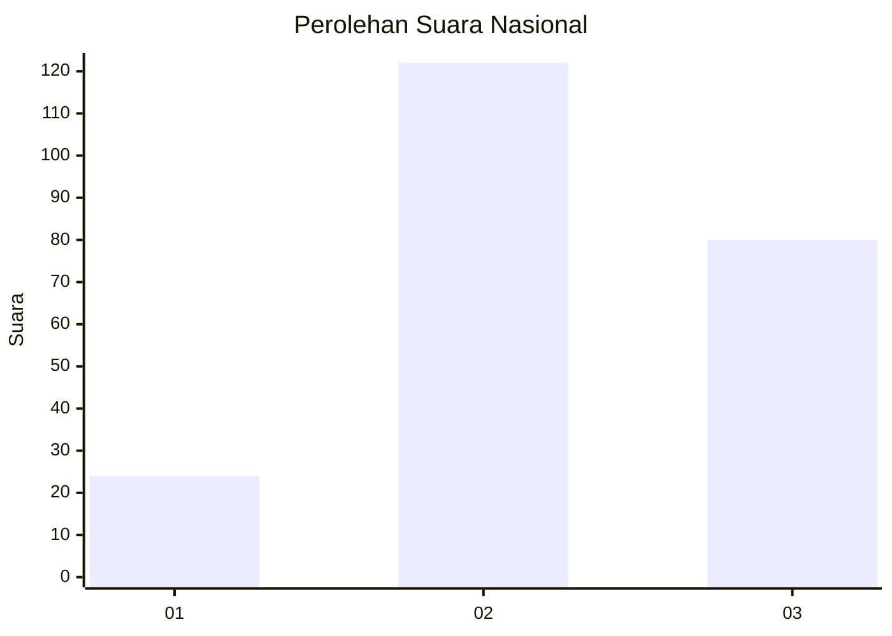
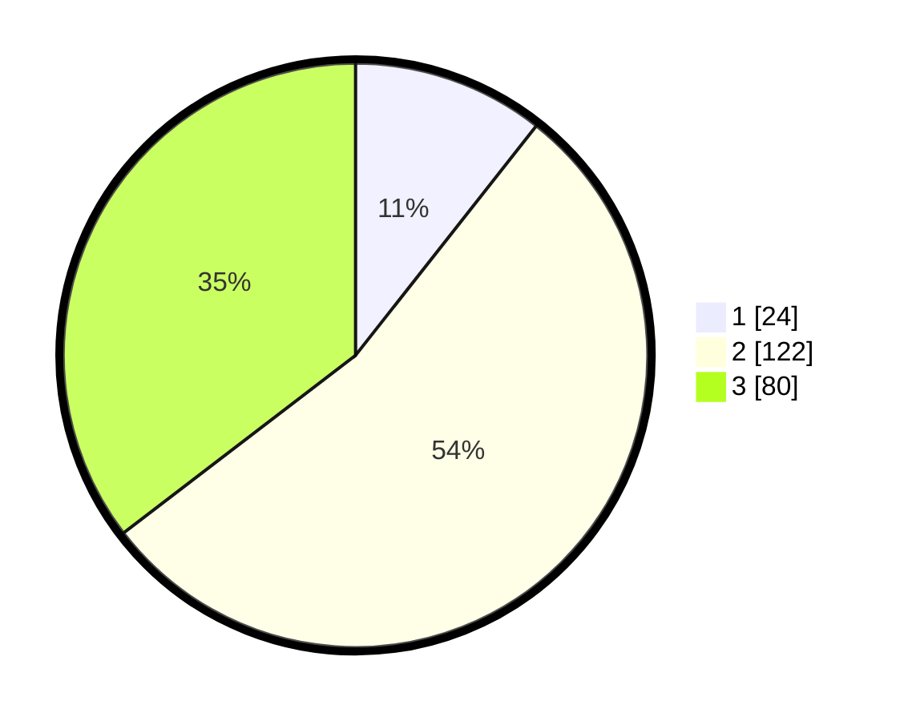

# Hasil

## Grafik

## Tabel

| No. | Nama Paslon    | Suara | Suara (raw) | Persentase |
|:--- |:-------------- | -----:| -----------:| ----------:|
| 1   | ANIES MUHAIMIN | 24    | [24][p-1]   | 10,62      |
| 2   | PRABOWO GIBRAN | 122   | [122][p-2]  | 53,98      |
| 3   | GANJAR MAHFUD  | 80    | [80][p-3]   | 35,40      |

[p-1]: https://github.com/gigit-pemilu/pemilu-2024/blob/main/pilpres/hitung-suara/sub/34-di-yogyakarta/sub/02-bantul/sub/03-kretek/sub/2003-donotirto/sub/010-tps/sub/paslon-1.txt
[p-2]: https://github.com/gigit-pemilu/pemilu-2024/blob/main/pilpres/hitung-suara/sub/34-di-yogyakarta/sub/02-bantul/sub/03-kretek/sub/2003-donotirto/sub/010-tps/sub/paslon-2.txt
[p-3]: https://github.com/gigit-pemilu/pemilu-2024/blob/main/pilpres/hitung-suara/sub/34-di-yogyakarta/sub/02-bantul/sub/03-kretek/sub/2003-donotirto/sub/010-tps/sub/paslon-3.txt

## Foto C Plano

https://sirekap-obj-formc.kpu.go.id/b8b9/pemilu/ppwp/34/02/03/20/03/3402032003010-20240219-215435--ca3c3938-3958-4289-9c33-5c3eaede626c.jpg

https://sirekap-obj-formc.kpu.go.id/b8b9/pemilu/ppwp/34/02/03/20/03/3402032003010-20240219-215524--e324af79-dbaa-4408-8495-348aed6b5655.jpg

https://sirekap-obj-formc.kpu.go.id/b8b9/pemilu/ppwp/34/02/03/20/03/3402032003010-20240219-215553--65c20424-0dea-4c2e-8d23-a60d03a25aa0.jpg

## Metadata

| Key        | Value               |
| ---------- | ------------------- |
| Time Stamp | 2024-02-19 22:00:00 |

## DATA PEMILIH TETAP

Jumlah pemilih dalam DPT: **262**.
 * L: **122**.
 * P: **140**.

## DATA PENGGUNA HAK PILIH

Jumlah pengguna hak pilih dalam DPT: **227**.
 * L: **107**.
 * P: **120**.

Jumlah pengguna hak pilih dalam DPTb: **777**.
 * L: **287**.
 * P: **777**.

Jumlah pengguna hak pilih dalam DPK: **44**.
 * L: **0**.
 * P: **2**.

Jumlah pengguna hak pilih: **444**.
 * L: **107**.
 * P: **123**.

## JUMLAH SUARA SAH DAN TIDAK SAH

JUMLAH SELURUH SUARA SAH: **226**.

JUMLAH SUARA TIDAK SAH: **4**.

JUMLAH SELURUH SUARA SAH DAN SUARA TIDAK SAH: **230**.

