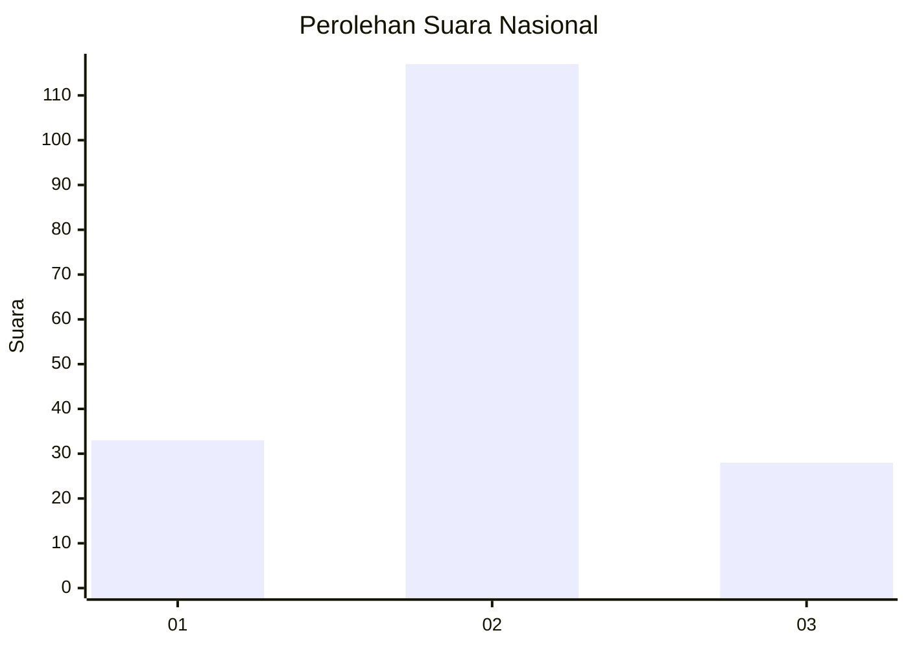
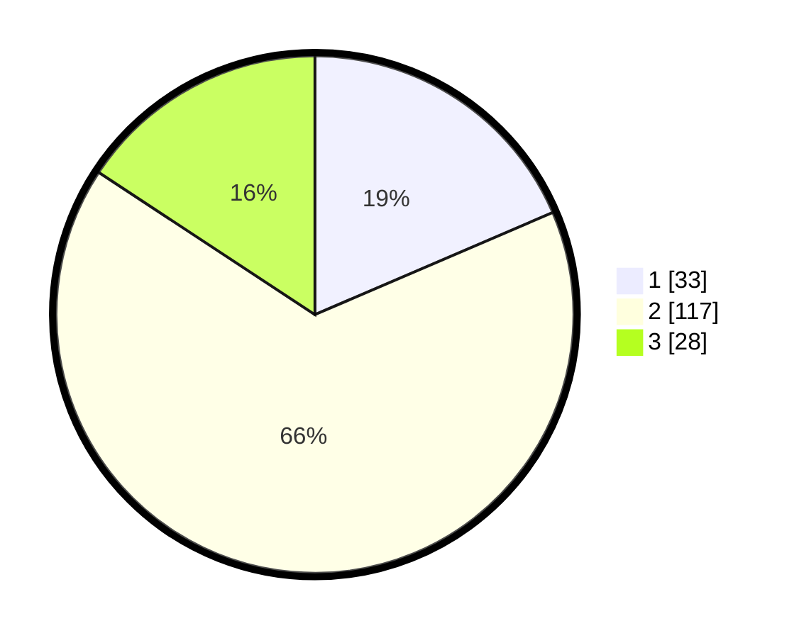

# Hasil

## Grafik

## Tabel

| No. | Nama Paslon    | Suara | Suara (raw) | Persentase |
|:--- |:-------------- | -----:| -----------:| ----------:|
| 1   | ANIES MUHAIMIN | 33    | [33][p-1]   | 18,54      |
| 2   | PRABOWO GIBRAN | 117   | [117][p-2]  | 65,73      |
| 3   | GANJAR MAHFUD  | 28    | [28][p-3]   | 15,73      |

[p-1]: https://github.com/gigit-pemilu/pemilu-2024/blob/main/pilpres/hitung-suara/sub/34-di-yogyakarta/sub/02-bantul/sub/03-kretek/sub/2003-donotirto/sub/013-tps/sub/paslon-1.txt
[p-2]: https://github.com/gigit-pemilu/pemilu-2024/blob/main/pilpres/hitung-suara/sub/34-di-yogyakarta/sub/02-bantul/sub/03-kretek/sub/2003-donotirto/sub/013-tps/sub/paslon-2.txt
[p-3]: https://github.com/gigit-pemilu/pemilu-2024/blob/main/pilpres/hitung-suara/sub/34-di-yogyakarta/sub/02-bantul/sub/03-kretek/sub/2003-donotirto/sub/013-tps/sub/paslon-3.txt

## Foto C Plano

https://sirekap-obj-formc.kpu.go.id/49c9/pemilu/ppwp/34/02/03/20/03/3402032003013-20240214-223428--2706d98b-86d3-4a52-92f8-6df3644b4a90.jpg

https://sirekap-obj-formc.kpu.go.id/49c9/pemilu/ppwp/34/02/03/20/03/3402032003013-20240214-223503--431cb61b-56d1-4540-a6b9-9fde8572c976.jpg

https://sirekap-obj-formc.kpu.go.id/49c9/pemilu/ppwp/34/02/03/20/03/3402032003013-20240214-223537--c1a49ced-6b31-41b1-a5ea-deef6551d16e.jpg

## Metadata

| Key        | Value               |
| ---------- | ------------------- |
| Time Stamp | 2024-02-24 22:31:28 |

