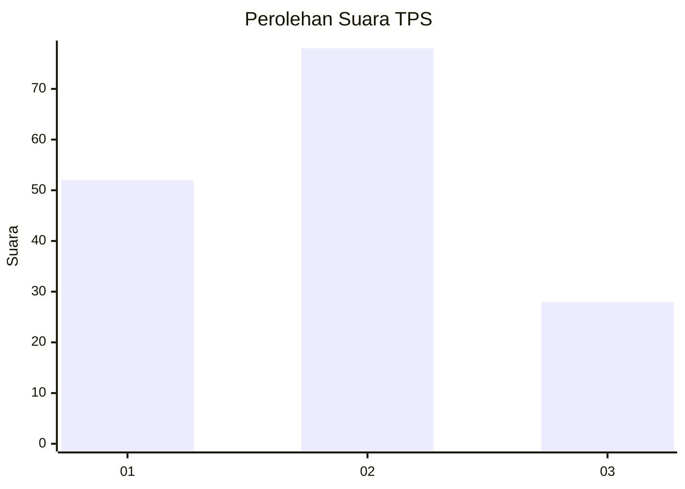
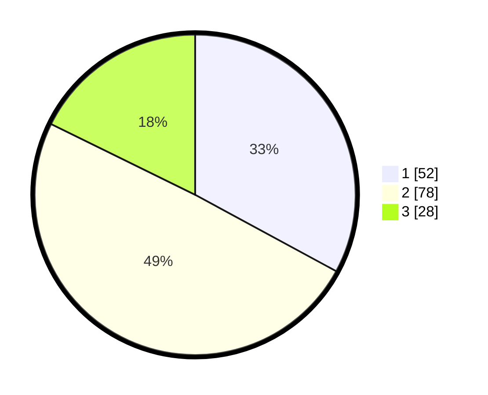

# Hasil

## Grafik

## Tabel

| No. | Nama Paslon    | Suara | Suara (raw) | Persentase |
|:--- |:-------------- | -----:| -----------:| ----------:|
| 1   | ANIES MUHAIMIN | 52    | [52][p-1]   | 32,91      |
| 2   | PRABOWO GIBRAN | 78    | [78][p-2]   | 49,37      |
| 3   | GANJAR MAHFUD  | 28    | [28][p-3]   | 17,72      |

[p-1]: https://github.com/gigit-pemilu/pemilu-2024-34-di-yogyakarta/blob/main/pilpres/hitung-suara/sub/34-di-yogyakarta/sub/02-bantul/sub/03-kretek/sub/2003-donotirto/sub/016-tps/sub/paslon-1.txt
[p-2]: https://github.com/gigit-pemilu/pemilu-2024-34-di-yogyakarta/blob/main/pilpres/hitung-suara/sub/34-di-yogyakarta/sub/02-bantul/sub/03-kretek/sub/2003-donotirto/sub/016-tps/sub/paslon-2.txt
[p-3]: https://github.com/gigit-pemilu/pemilu-2024-34-di-yogyakarta/blob/main/pilpres/hitung-suara/sub/34-di-yogyakarta/sub/02-bantul/sub/03-kretek/sub/2003-donotirto/sub/016-tps/sub/paslon-3.txt

## Foto C Plano

https://sirekap-obj-formc.kpu.go.id/5202/pemilu/ppwp/34/02/03/20/03/3402032003016-20240219-220327--8018e3bb-5065-4eec-98bc-edbf54d12c40.jpg

https://sirekap-obj-formc.kpu.go.id/5202/pemilu/ppwp/34/02/03/20/03/3402032003016-20240219-220627--e0f1bd4e-ec03-4b3d-a900-dce78ce6f0d3.jpg

https://sirekap-obj-formc.kpu.go.id/5202/pemilu/ppwp/34/02/03/20/03/3402032003016-20240219-221009--77ba784c-97ef-4017-925c-b9bcbff46909.jpg

## Metadata

| Key        | Value               |
| ---------- | ------------------- |
| Time Stamp | 2024-02-19 23:00:00 |

## DATA PEMILIH TETAP

Jumlah pemilih dalam DPT: **0**.
 * L: **7**.
 * P: **0**.

## DATA PENGGUNA HAK PILIH

Jumlah pengguna hak pilih dalam DPT: **55**.
 * L: **41**.
 * P: **5**.

Jumlah pengguna hak pilih dalam DPTb: **555**.
 * L: **1**.
 * P: **0**.

Jumlah pengguna hak pilih dalam DPK: **555**.
 * L: **0**.
 * P: **0**.

Jumlah pengguna hak pilih: **170**.
 * L: **72**.
 * P: **100**.

## JUMLAH SUARA SAH DAN TIDAK SAH

JUMLAH SELURUH SUARA SAH: **158**.

JUMLAH SUARA TIDAK SAH: **14**.

JUMLAH SELURUH SUARA SAH DAN SUARA TIDAK SAH: **172**.

