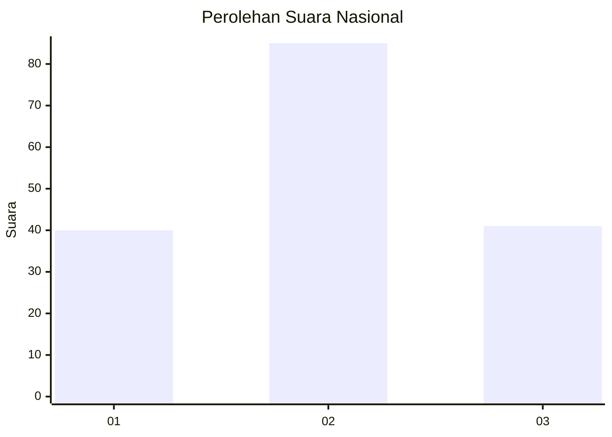
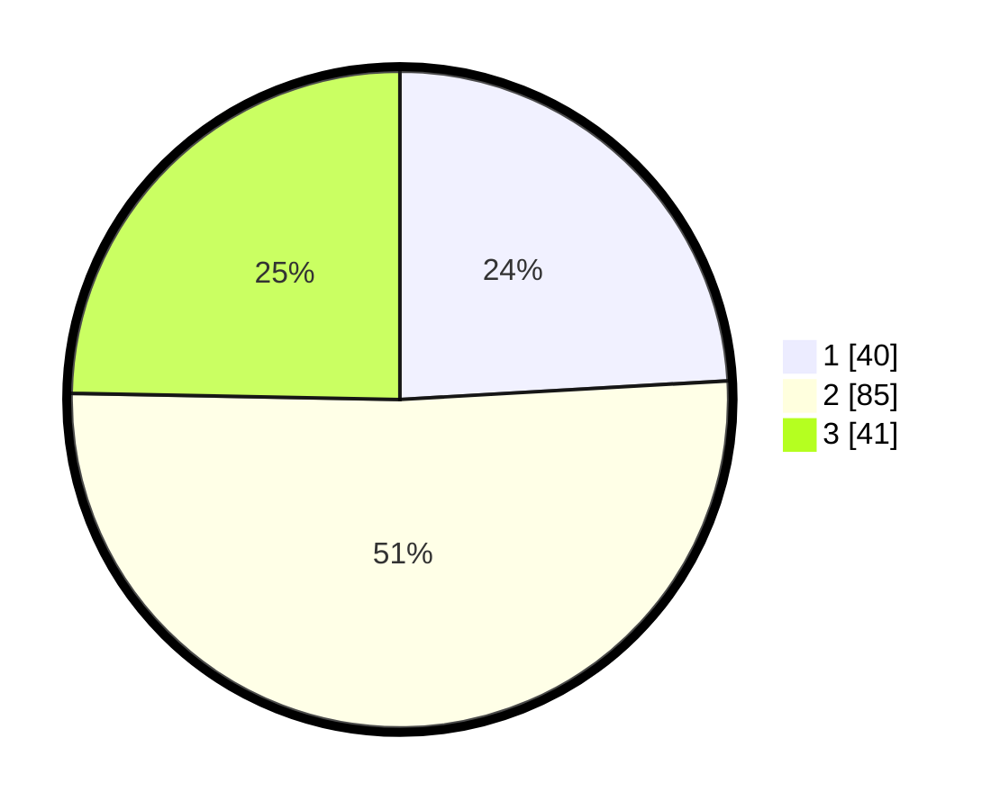

# Hasil

## Grafik

## Tabel

| No. | Nama Paslon    | Suara | Suara (raw) | Persentase |
|:--- |:-------------- | -----:| -----------:| ----------:|
| 1   | ANIES MUHAIMIN | 40    | [40][p-1]   | 24,10      |
| 2   | PRABOWO GIBRAN | 85    | [85][p-2]   | 51,20      |
| 3   | GANJAR MAHFUD  | 41    | [41][p-3]   | 24,70      |

[p-1]: https://github.com/gigit-pemilu/pemilu-2024/blob/main/pilpres/hitung-suara/sub/34-di-yogyakarta/sub/02-bantul/sub/03-kretek/sub/2003-donotirto/sub/017-tps/sub/paslon-1.txt
[p-2]: https://github.com/gigit-pemilu/pemilu-2024/blob/main/pilpres/hitung-suara/sub/34-di-yogyakarta/sub/02-bantul/sub/03-kretek/sub/2003-donotirto/sub/017-tps/sub/paslon-2.txt
[p-3]: https://github.com/gigit-pemilu/pemilu-2024/blob/main/pilpres/hitung-suara/sub/34-di-yogyakarta/sub/02-bantul/sub/03-kretek/sub/2003-donotirto/sub/017-tps/sub/paslon-3.txt

## Foto C Plano

https://sirekap-obj-formc.kpu.go.id/7bbb/pemilu/ppwp/34/02/03/20/03/3402032003017-20240219-221624--b0f9c4f4-d6a4-4bbf-b700-0b24c3882918.jpg

https://sirekap-obj-formc.kpu.go.id/7bbb/pemilu/ppwp/34/02/03/20/03/3402032003017-20240219-221704--6af7be7f-68e5-4a7d-a5b7-b5bc3d71a444.jpg

https://sirekap-obj-formc.kpu.go.id/7bbb/pemilu/ppwp/34/02/03/20/03/3402032003017-20240219-222002--37406a93-21b4-4d3c-b8f4-adc245648157.jpg

## Metadata

| Key        | Value               |
| ---------- | ------------------- |
| Time Stamp | 2024-02-19 23:00:00 |

## DATA PEMILIH TETAP

Jumlah pemilih dalam DPT: **193**.
 * L: **97**.
 * P: **702**.

## DATA PENGGUNA HAK PILIH

Jumlah pengguna hak pilih dalam DPT: **376**.
 * L: **85**.
 * P: **92**.

Jumlah pengguna hak pilih dalam DPTb: **0**.
 * L: **0**.
 * P: **0**.

Jumlah pengguna hak pilih dalam DPK: **0**.
 * L: **0**.
 * P: **0**.

Jumlah pengguna hak pilih: **176**.
 * L: **89**.
 * P: **97**.

## JUMLAH SUARA SAH DAN TIDAK SAH

JUMLAH SELURUH SUARA SAH: **166**.

JUMLAH SUARA TIDAK SAH: **20**.

JUMLAH SELURUH SUARA SAH DAN SUARA TIDAK SAH: **176**.

