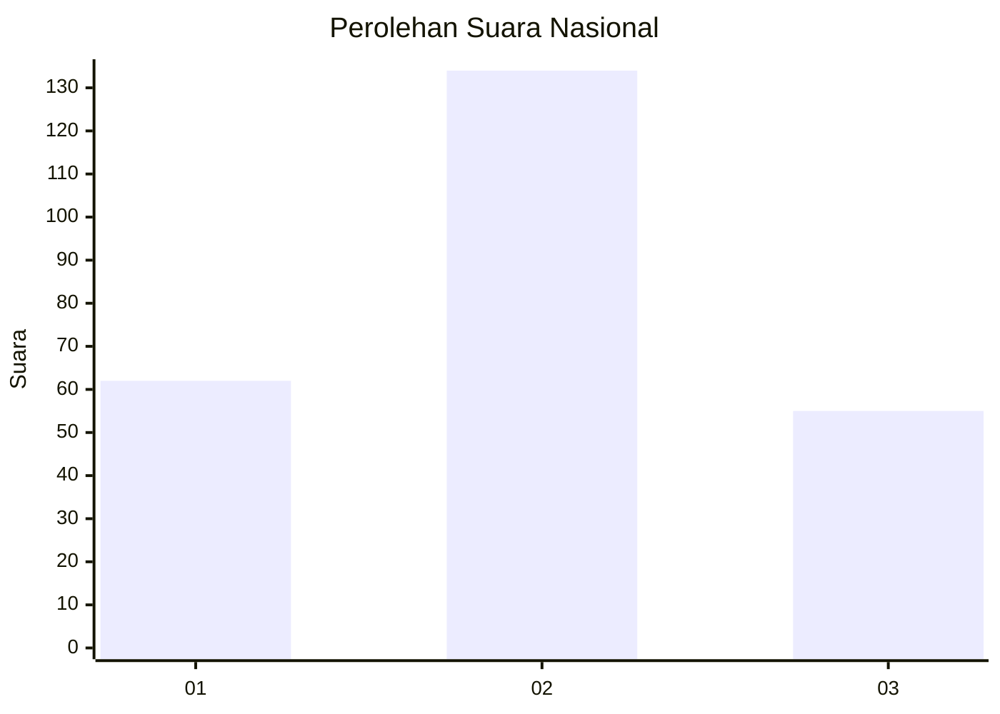
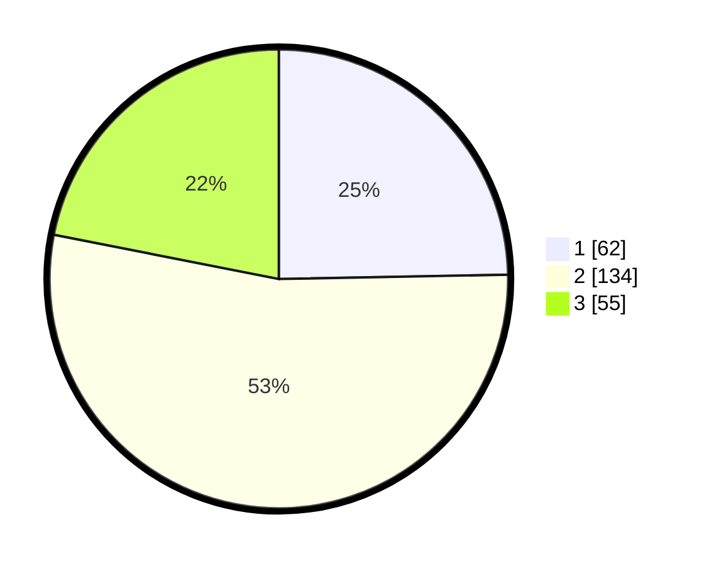

# Hasil

## Grafik

## Tabel

| No. | Nama Paslon    | Suara | Suara (raw) | Persentase |
|:--- |:-------------- | -----:| -----------:| ----------:|
| 1   | ANIES MUHAIMIN | 62    | [62][p-1]   | 24,70      |
| 2   | PRABOWO GIBRAN | 134   | [134][p-2]  | 53,39      |
| 3   | GANJAR MAHFUD  | 55    | [55][p-3]   | 21,91      |

[p-1]: https://github.com/gigit-pemilu/pemilu-2024/blob/main/pilpres/hitung-suara/sub/34-di-yogyakarta/sub/02-bantul/sub/03-kretek/sub/2003-donotirto/sub/020-tps/sub/paslon-1.txt
[p-2]: https://github.com/gigit-pemilu/pemilu-2024/blob/main/pilpres/hitung-suara/sub/34-di-yogyakarta/sub/02-bantul/sub/03-kretek/sub/2003-donotirto/sub/020-tps/sub/paslon-2.txt
[p-3]: https://github.com/gigit-pemilu/pemilu-2024/blob/main/pilpres/hitung-suara/sub/34-di-yogyakarta/sub/02-bantul/sub/03-kretek/sub/2003-donotirto/sub/020-tps/sub/paslon-3.txt

## Foto C Plano

https://sirekap-obj-formc.kpu.go.id/43e4/pemilu/ppwp/34/02/03/20/03/3402032003020-20240215-182337--29bf608d-19da-4e10-b0ea-9453ebefbefe.jpg

https://sirekap-obj-formc.kpu.go.id/43e4/pemilu/ppwp/34/02/03/20/03/3402032003020-20240215-182359--1cf19fad-962f-4d78-9bb1-9e98dbf505be.jpg

https://sirekap-obj-formc.kpu.go.id/43e4/pemilu/ppwp/34/02/03/20/03/3402032003020-20240215-182404--5d6de833-db14-45ba-8c53-0247a183ba60.jpg

## Metadata

| Key        | Value               |
| ---------- | ------------------- |
| Time Stamp | 2024-02-24 22:31:28 |

