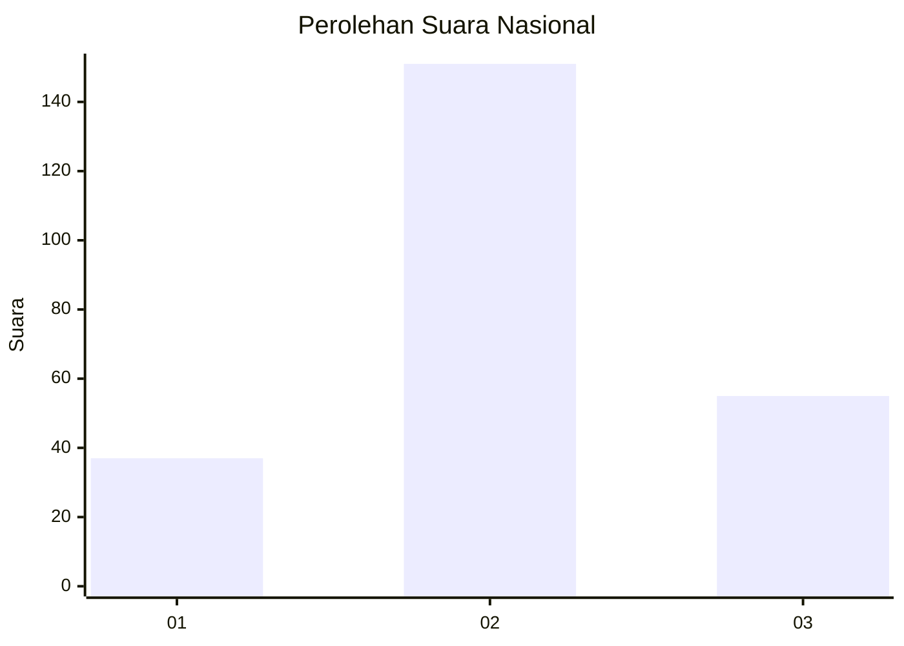
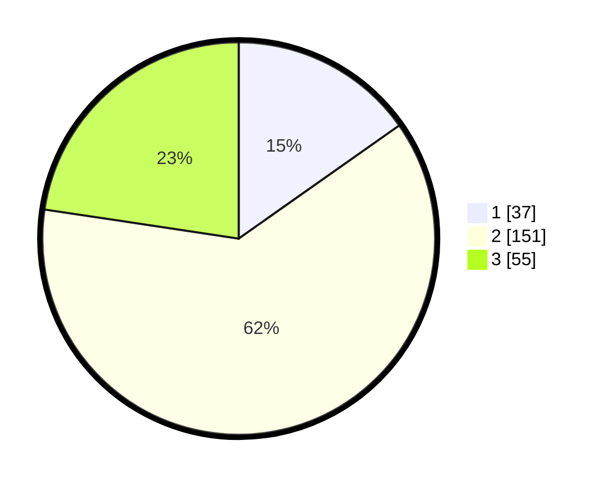

# Hasil

## Grafik

## Tabel

| No. | Nama Paslon    | Suara | Suara (raw) | Persentase |
|:--- |:-------------- | -----:| -----------:| ----------:|
| 1   | ANIES MUHAIMIN | 37    | [37][p-1]   | 15,23      |
| 2   | PRABOWO GIBRAN | 151   | [151][p-2]  | 62,14      |
| 3   | GANJAR MAHFUD  | 55    | [55][p-3]   | 22,63      |

[p-1]: https://github.com/gigit-pemilu/pemilu-2024/blob/main/pilpres/hitung-suara/sub/34-di-yogyakarta/sub/02-bantul/sub/03-kretek/sub/2003-donotirto/sub/023-tps/sub/paslon-1.txt
[p-2]: https://github.com/gigit-pemilu/pemilu-2024/blob/main/pilpres/hitung-suara/sub/34-di-yogyakarta/sub/02-bantul/sub/03-kretek/sub/2003-donotirto/sub/023-tps/sub/paslon-2.txt
[p-3]: https://github.com/gigit-pemilu/pemilu-2024/blob/main/pilpres/hitung-suara/sub/34-di-yogyakarta/sub/02-bantul/sub/03-kretek/sub/2003-donotirto/sub/023-tps/sub/paslon-3.txt

## Foto C Plano

https://sirekap-obj-formc.kpu.go.id/ced9/pemilu/ppwp/34/02/03/20/03/3402032003023-20240214-192228--e1e8b402-aad2-4120-a627-c4120c326945.jpg

https://sirekap-obj-formc.kpu.go.id/ced9/pemilu/ppwp/34/02/03/20/03/3402032003023-20240214-201137--11ea0588-4610-48fb-a104-170539c94d0d.jpg

https://sirekap-obj-formc.kpu.go.id/ced9/pemilu/ppwp/34/02/03/20/03/3402032003023-20240214-192240--13c16054-37d1-4eac-9e28-90bb5ebb77d3.jpg

## Metadata

| Key        | Value               |
| ---------- | ------------------- |
| Time Stamp | 2024-02-25 17:00:00 |

