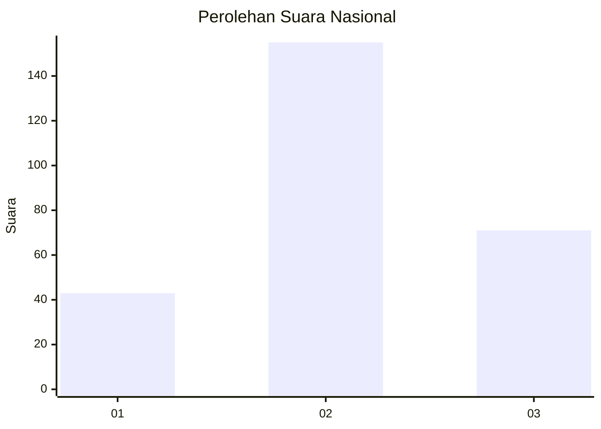
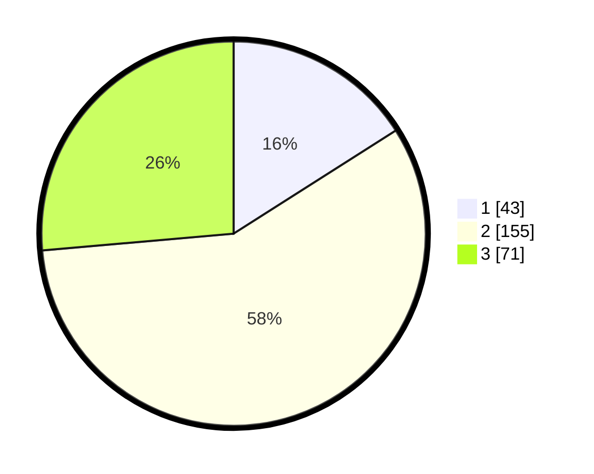

# Hasil

## Grafik

## Tabel

| No. | Nama Paslon    | Suara | Suara (raw) | Persentase |
|:--- |:-------------- | -----:| -----------:| ----------:|
| 1   | ANIES MUHAIMIN | 43    | [43][p-1]   | 15,99      |
| 2   | PRABOWO GIBRAN | 155   | [155][p-2]  | 57,62      |
| 3   | GANJAR MAHFUD  | 71    | [71][p-3]   | 26,39      |

[p-1]: https://github.com/gigit-pemilu/pemilu-2024/blob/main/pilpres/hitung-suara/sub/34-di-yogyakarta/sub/02-bantul/sub/03-kretek/sub/2003-donotirto/sub/024-tps/sub/paslon-1.txt
[p-2]: https://github.com/gigit-pemilu/pemilu-2024/blob/main/pilpres/hitung-suara/sub/34-di-yogyakarta/sub/02-bantul/sub/03-kretek/sub/2003-donotirto/sub/024-tps/sub/paslon-2.txt
[p-3]: https://github.com/gigit-pemilu/pemilu-2024/blob/main/pilpres/hitung-suara/sub/34-di-yogyakarta/sub/02-bantul/sub/03-kretek/sub/2003-donotirto/sub/024-tps/sub/paslon-3.txt

## Foto C Plano

https://sirekap-obj-formc.kpu.go.id/c5fa/pemilu/ppwp/34/02/03/20/03/3402032003024-20240215-001931--3c09e49f-343f-42bc-b249-215b272e8219.jpg

https://sirekap-obj-formc.kpu.go.id/c5fa/pemilu/ppwp/34/02/03/20/03/3402032003024-20240215-001939--147fe59e-c484-47fc-aca3-b77d5f04dd81.jpg

https://sirekap-obj-formc.kpu.go.id/c5fa/pemilu/ppwp/34/02/03/20/03/3402032003024-20240215-001946--79c80764-a31b-4b58-9177-8262832451bd.jpg

## Metadata

| Key        | Value               |
| ---------- | ------------------- |
| Time Stamp | 2024-02-25 17:00:00 |

