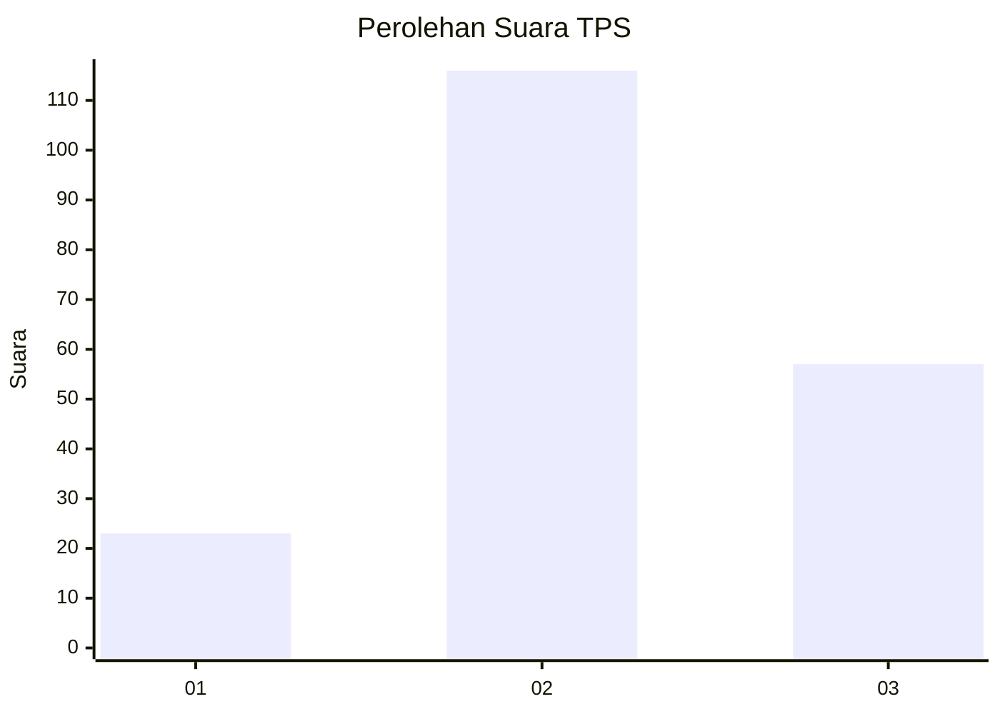
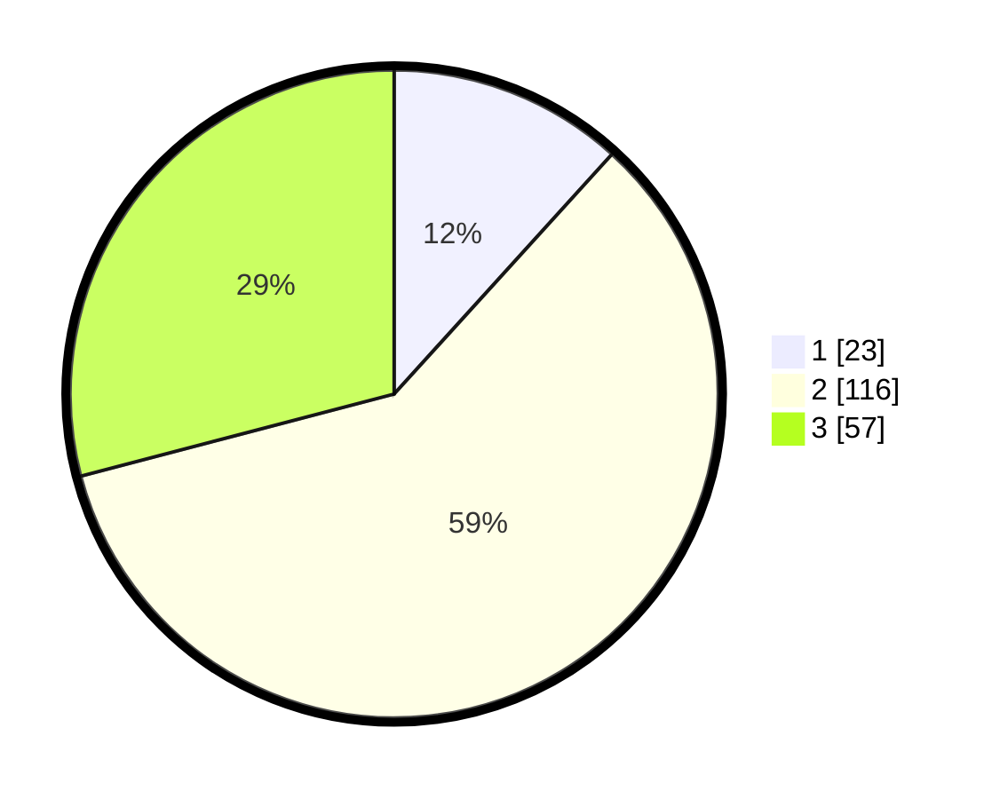

# Hasil

## Grafik

## Tabel

| No. | Nama Paslon    | Suara | Suara (raw) | Persentase |
|:--- |:-------------- | -----:| -----------:| ----------:|
| 1   | ANIES MUHAIMIN | 23    | [23][p-1]   | 11,73      |
| 2   | PRABOWO GIBRAN | 116   | [116][p-2]  | 59,18      |
| 3   | GANJAR MAHFUD  | 57    | [57][p-3]   | 29,08      |

[p-1]: https://github.com/gigit-pemilu/pemilu-2024-34-di-yogyakarta/blob/main/pilpres/hitung-suara/sub/34-di-yogyakarta/sub/02-bantul/sub/03-kretek/sub/2003-donotirto/sub/026-tps/sub/paslon-1.txt
[p-2]: https://github.com/gigit-pemilu/pemilu-2024-34-di-yogyakarta/blob/main/pilpres/hitung-suara/sub/34-di-yogyakarta/sub/02-bantul/sub/03-kretek/sub/2003-donotirto/sub/026-tps/sub/paslon-2.txt
[p-3]: https://github.com/gigit-pemilu/pemilu-2024-34-di-yogyakarta/blob/main/pilpres/hitung-suara/sub/34-di-yogyakarta/sub/02-bantul/sub/03-kretek/sub/2003-donotirto/sub/026-tps/sub/paslon-3.txt

## Foto C Plano

https://sirekap-obj-formc.kpu.go.id/0dd3/pemilu/ppwp/34/02/03/20/03/3402032003026-20240219-224604--667051e0-6481-4cf5-882a-fe428ed836e9.jpg

https://sirekap-obj-formc.kpu.go.id/0dd3/pemilu/ppwp/34/02/03/20/03/3402032003026-20240219-224649--71bbaba9-70e6-44e5-99bb-c6ae4c52687d.jpg

https://sirekap-obj-formc.kpu.go.id/0dd3/pemilu/ppwp/34/02/03/20/03/3402032003026-20240219-224755--92b972f4-6af9-4696-b00f-2f1f5d31fed0.jpg

## Metadata

| Key        | Value               |
| ---------- | ------------------- |
| Time Stamp | 2024-02-19 23:00:00 |

## DATA PEMILIH TETAP

Jumlah pemilih dalam DPT: **206**.
 * L: **47**.
 * P: **104**.

## DATA PENGGUNA HAK PILIH

Jumlah pengguna hak pilih dalam DPT: **188**.
 * L: **47**.
 * P: **101**.

Jumlah pengguna hak pilih dalam DPTb: **500**.
 * L: **700**.
 * P: **200**.

Jumlah pengguna hak pilih dalam DPK: **0**.
 * L: **770**.
 * P: **0**.

Jumlah pengguna hak pilih: **44**.
 * L: **89**.
 * P: **107**.

## JUMLAH SUARA SAH DAN TIDAK SAH

JUMLAH SELURUH SUARA SAH: **195**.

JUMLAH SUARA TIDAK SAH: **0**.

JUMLAH SELURUH SUARA SAH DAN SUARA TIDAK SAH: **145**.

