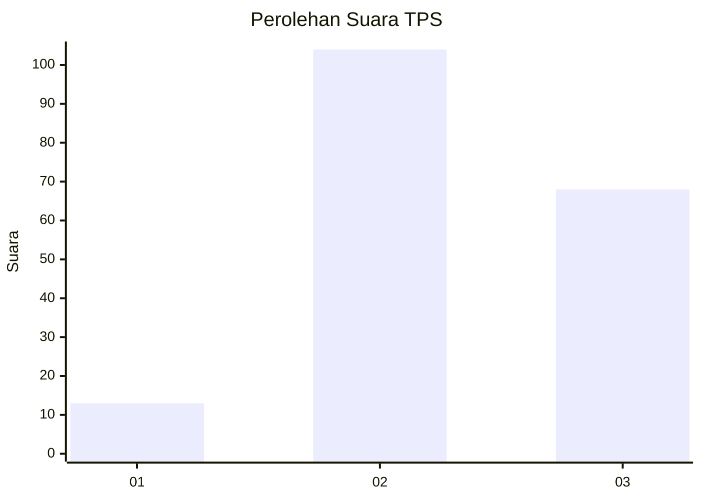
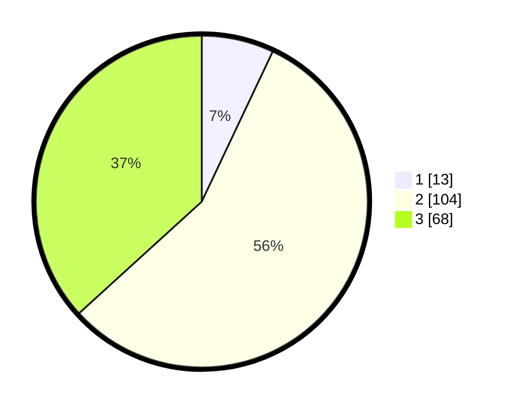

# Hasil

## Grafik

## Tabel

| No. | Nama Paslon    | Suara | Suara (raw) | Persentase |
|:--- |:-------------- | -----:| -----------:| ----------:|
| 1   | ANIES MUHAIMIN | 13    | [13][p-1]   | 7,03       |
| 2   | PRABOWO GIBRAN | 104   | [104][p-2]  | 56,22      |
| 3   | GANJAR MAHFUD  | 68    | [68][p-3]   | 36,76      |

[p-1]: https://github.com/gigit-pemilu/pemilu-2024-34-di-yogyakarta/blob/main/pilpres/hitung-suara/sub/34-di-yogyakarta/sub/02-bantul/sub/03-kretek/sub/2003-donotirto/sub/028-tps/sub/paslon-1.txt
[p-2]: https://github.com/gigit-pemilu/pemilu-2024-34-di-yogyakarta/blob/main/pilpres/hitung-suara/sub/34-di-yogyakarta/sub/02-bantul/sub/03-kretek/sub/2003-donotirto/sub/028-tps/sub/paslon-2.txt
[p-3]: https://github.com/gigit-pemilu/pemilu-2024-34-di-yogyakarta/blob/main/pilpres/hitung-suara/sub/34-di-yogyakarta/sub/02-bantul/sub/03-kretek/sub/2003-donotirto/sub/028-tps/sub/paslon-3.txt

## Foto C Plano

https://sirekap-obj-formc.kpu.go.id/e057/pemilu/ppwp/34/02/03/20/03/3402032003028-20240214-231703--b5fefa39-269f-46a9-a3f1-a53d049c3b6c.jpg

https://sirekap-obj-formc.kpu.go.id/e057/pemilu/ppwp/34/02/03/20/03/3402032003028-20240214-231753--f54b8d30-1558-4506-9b45-ec73e25c66be.jpg

https://sirekap-obj-formc.kpu.go.id/e057/pemilu/ppwp/34/02/03/20/03/3402032003028-20240214-231843--272c4651-debf-4a02-9524-d8a10abb9899.jpg

## Metadata

| Key        | Value               |
| ---------- | ------------------- |
| Time Stamp | 2024-02-24 22:31:28 |

