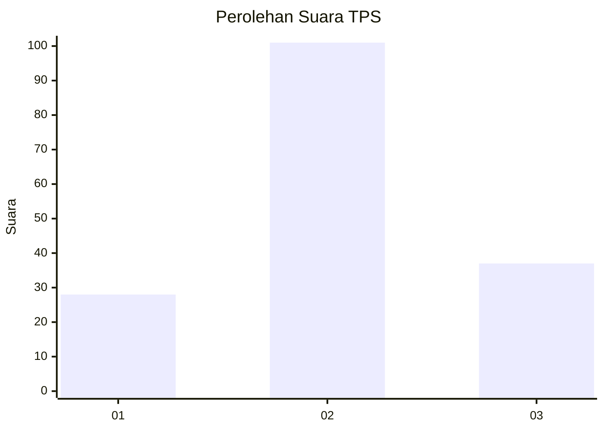
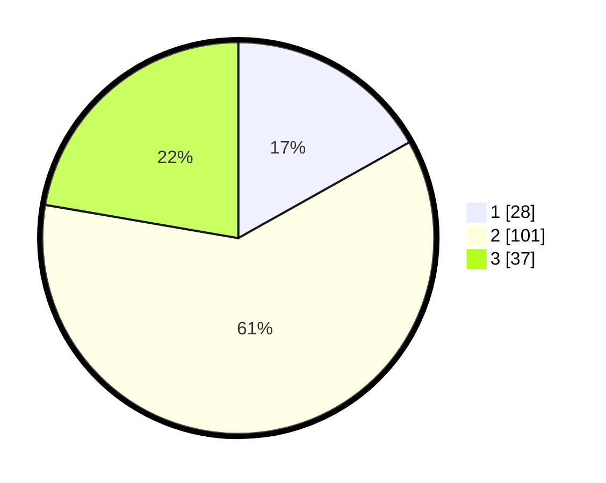

# Hasil

## Grafik

## Tabel

| No. | Nama Paslon    | Suara | Suara (raw) | Persentase |
|:--- |:-------------- | -----:| -----------:| ----------:|
| 1   | ANIES MUHAIMIN | 28    | [28][p-1]   | 16,87      |
| 2   | PRABOWO GIBRAN | 101   | [101][p-2]  | 60,84      |
| 3   | GANJAR MAHFUD  | 37    | [37][p-3]   | 22,29      |

[p-1]: https://github.com/gigit-pemilu/pemilu-2024-34-di-yogyakarta/blob/main/pilpres/hitung-suara/sub/34-di-yogyakarta/sub/02-bantul/sub/03-kretek/sub/2004-tirtosari/sub/005-tps/sub/paslon-1.txt
[p-2]: https://github.com/gigit-pemilu/pemilu-2024-34-di-yogyakarta/blob/main/pilpres/hitung-suara/sub/34-di-yogyakarta/sub/02-bantul/sub/03-kretek/sub/2004-tirtosari/sub/005-tps/sub/paslon-2.txt
[p-3]: https://github.com/gigit-pemilu/pemilu-2024-34-di-yogyakarta/blob/main/pilpres/hitung-suara/sub/34-di-yogyakarta/sub/02-bantul/sub/03-kretek/sub/2004-tirtosari/sub/005-tps/sub/paslon-3.txt

## Foto C Plano

https://sirekap-obj-formc.kpu.go.id/216c/pemilu/ppwp/34/02/03/20/04/3402032004005-20240217-061542--8cebc80d-9539-4f0f-8f2e-cc4ecf855866.jpg

https://sirekap-obj-formc.kpu.go.id/216c/pemilu/ppwp/34/02/03/20/04/3402032004005-20240215-003901--26346374-f64c-4032-99a5-bf1e5bfc9b33.jpg

https://sirekap-obj-formc.kpu.go.id/216c/pemilu/ppwp/34/02/03/20/04/3402032004005-20240215-004053--c939fcd8-5be6-4698-b8e4-e07d470b4bc0.jpg

## Metadata

| Key        | Value               |
| ---------- | ------------------- |
| Time Stamp | 2024-02-17 07:30:03 |

## DATA PEMILIH TETAP

Jumlah pemilih dalam DPT: **177**.
 * L: **76**.
 * P: **101**.

## DATA PENGGUNA HAK PILIH

Jumlah pengguna hak pilih dalam DPT: **165**.
 * L: **70**.
 * P: **95**.

Jumlah pengguna hak pilih dalam DPTb: **0**.
 * L: **0**.
 * P: **0**.

Jumlah pengguna hak pilih dalam DPK: **2**.
 * L: **1**.
 * P: **1**.

Jumlah pengguna hak pilih: **167**.
 * L: **71**.
 * P: **96**.

## JUMLAH SUARA SAH DAN TIDAK SAH

JUMLAH SELURUH SUARA SAH: **166**.

JUMLAH SUARA TIDAK SAH: **1**.

JUMLAH SELURUH SUARA SAH DAN SUARA TIDAK SAH: **167**.

