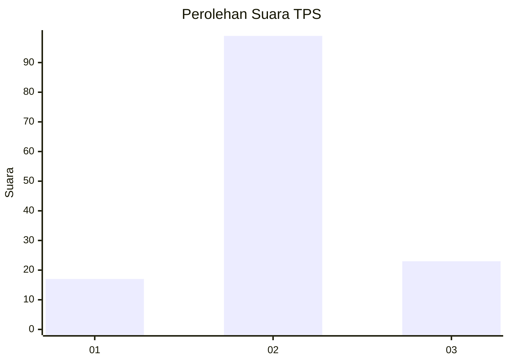
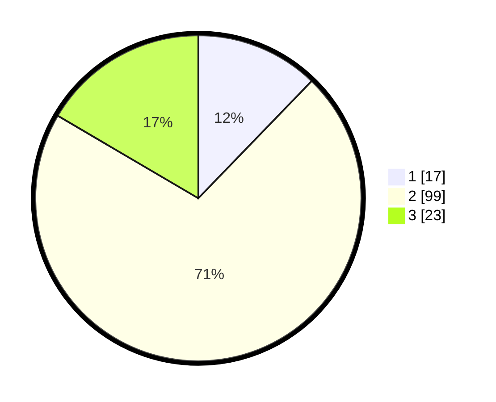

# Hasil

## Grafik

## Tabel

| No. | Nama Paslon    | Suara | Suara (raw) | Persentase |
|:--- |:-------------- | -----:| -----------:| ----------:|
| 1   | ANIES MUHAIMIN | 17    | [17][p-1]   | 12,23      |
| 2   | PRABOWO GIBRAN | 99    | [99][p-2]   | 71,22      |
| 3   | GANJAR MAHFUD  | 23    | [23][p-3]   | 16,55      |

[p-1]: https://github.com/gigit-pemilu/pemilu-2024-34-di-yogyakarta/blob/main/pilpres/hitung-suara/sub/34-di-yogyakarta/sub/02-bantul/sub/03-kretek/sub/2004-tirtosari/sub/007-tps/sub/paslon-1.txt
[p-2]: https://github.com/gigit-pemilu/pemilu-2024-34-di-yogyakarta/blob/main/pilpres/hitung-suara/sub/34-di-yogyakarta/sub/02-bantul/sub/03-kretek/sub/2004-tirtosari/sub/007-tps/sub/paslon-2.txt
[p-3]: https://github.com/gigit-pemilu/pemilu-2024-34-di-yogyakarta/blob/main/pilpres/hitung-suara/sub/34-di-yogyakarta/sub/02-bantul/sub/03-kretek/sub/2004-tirtosari/sub/007-tps/sub/paslon-3.txt

## Foto C Plano

https://sirekap-obj-formc.kpu.go.id/7e83/pemilu/ppwp/34/02/03/20/04/3402032004007-20240220-132320--89ac643f-8d85-4df0-8126-964ef17fb3a6.jpg

https://sirekap-obj-formc.kpu.go.id/7e83/pemilu/ppwp/34/02/03/20/04/3402032004007-20240220-132413--04cf5085-3be5-4f82-8454-8edd0caf5453.jpg

https://sirekap-obj-formc.kpu.go.id/7e83/pemilu/ppwp/34/02/03/20/04/3402032004007-20240220-132451--b3016a4f-0d91-4a99-b667-d825b448bc1f.jpg

## Metadata

| Key        | Value               |
| ---------- | ------------------- |
| Time Stamp | 2024-02-20 14:00:00 |

## DATA PEMILIH TETAP

Jumlah pemilih dalam DPT: **157**.
 * L: **73**.
 * P: **84**.

## DATA PENGGUNA HAK PILIH

Jumlah pengguna hak pilih dalam DPT: **141**.
 * L: **67**.
 * P: **74**.

Jumlah pengguna hak pilih dalam DPTb: **2**.
 * L: **0**.
 * P: **2**.

Jumlah pengguna hak pilih dalam DPK: **0**.
 * L: **0**.
 * P: **0**.

Jumlah pengguna hak pilih: **143**.
 * L: **67**.
 * P: **76**.

## JUMLAH SUARA SAH DAN TIDAK SAH

JUMLAH SELURUH SUARA SAH: **139**.

JUMLAH SUARA TIDAK SAH: **4**.

JUMLAH SELURUH SUARA SAH DAN SUARA TIDAK SAH: **143**.

