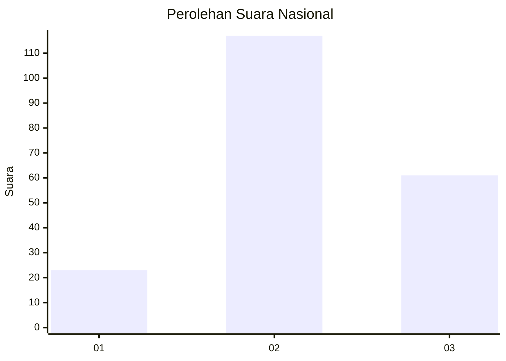
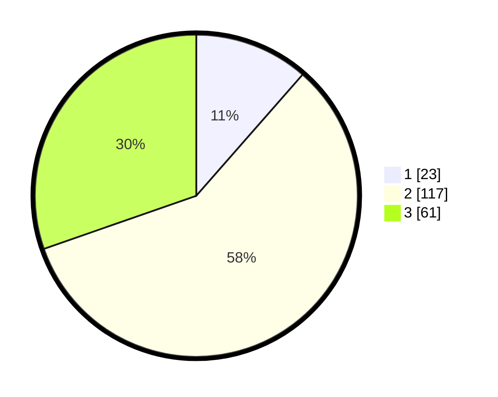

# Hasil

## Grafik

## Tabel

| No. | Nama Paslon    | Suara | Suara (raw) | Persentase |
|:--- |:-------------- | -----:| -----------:| ----------:|
| 1   | ANIES MUHAIMIN | 23    | [23][p-1]   | 11,44      |
| 2   | PRABOWO GIBRAN | 117   | [117][p-2]  | 58,21      |
| 3   | GANJAR MAHFUD  | 61    | [61][p-3]   | 30,35      |

[p-1]: https://github.com/gigit-pemilu/pemilu-2024/blob/main/pilpres/hitung-suara/sub/34-di-yogyakarta/sub/02-bantul/sub/03-kretek/sub/2004-tirtosari/sub/008-tps/sub/paslon-1.txt
[p-2]: https://github.com/gigit-pemilu/pemilu-2024/blob/main/pilpres/hitung-suara/sub/34-di-yogyakarta/sub/02-bantul/sub/03-kretek/sub/2004-tirtosari/sub/008-tps/sub/paslon-2.txt
[p-3]: https://github.com/gigit-pemilu/pemilu-2024/blob/main/pilpres/hitung-suara/sub/34-di-yogyakarta/sub/02-bantul/sub/03-kretek/sub/2004-tirtosari/sub/008-tps/sub/paslon-3.txt

## Foto C Plano

https://sirekap-obj-formc.kpu.go.id/157f/pemilu/ppwp/34/02/03/20/04/3402032004008-20240219-204511--224da7c5-012b-465c-8bc2-9d6eb9a6f65b.jpg

https://sirekap-obj-formc.kpu.go.id/157f/pemilu/ppwp/34/02/03/20/04/3402032004008-20240219-204840--274d9093-622f-47a5-bb7d-550ee108b8fb.jpg

https://sirekap-obj-formc.kpu.go.id/157f/pemilu/ppwp/34/02/03/20/04/3402032004008-20240219-205046--96904395-1011-4ac0-a19c-4f22b03faf62.jpg

## Metadata

| Key        | Value               |
| ---------- | ------------------- |
| Time Stamp | 2024-02-19 21:00:00 |

## DATA PEMILIH TETAP

Jumlah pemilih dalam DPT: **275**.
 * L: **115**.
 * P: **121**.

## DATA PENGGUNA HAK PILIH

Jumlah pengguna hak pilih dalam DPT: **205**.
 * L: **47**.
 * P: **108**.

Jumlah pengguna hak pilih dalam DPTb: **4**.
 * L: **1**.
 * P: **7**.

Jumlah pengguna hak pilih dalam DPK: **0**.
 * L: **0**.
 * P: **0**.

Jumlah pengguna hak pilih: **204**.
 * L: **44**.
 * P: **111**.

## JUMLAH SUARA SAH DAN TIDAK SAH

JUMLAH SELURUH SUARA SAH: **201**.

JUMLAH SUARA TIDAK SAH: **7**.

JUMLAH SELURUH SUARA SAH DAN SUARA TIDAK SAH: **207**.

