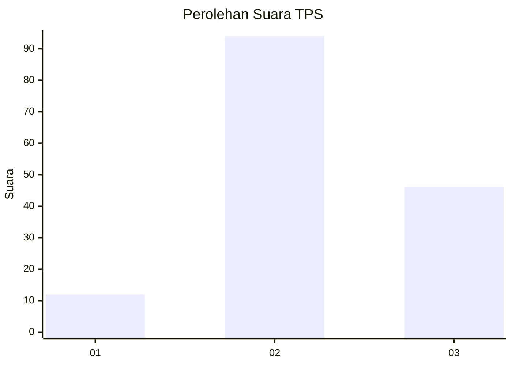
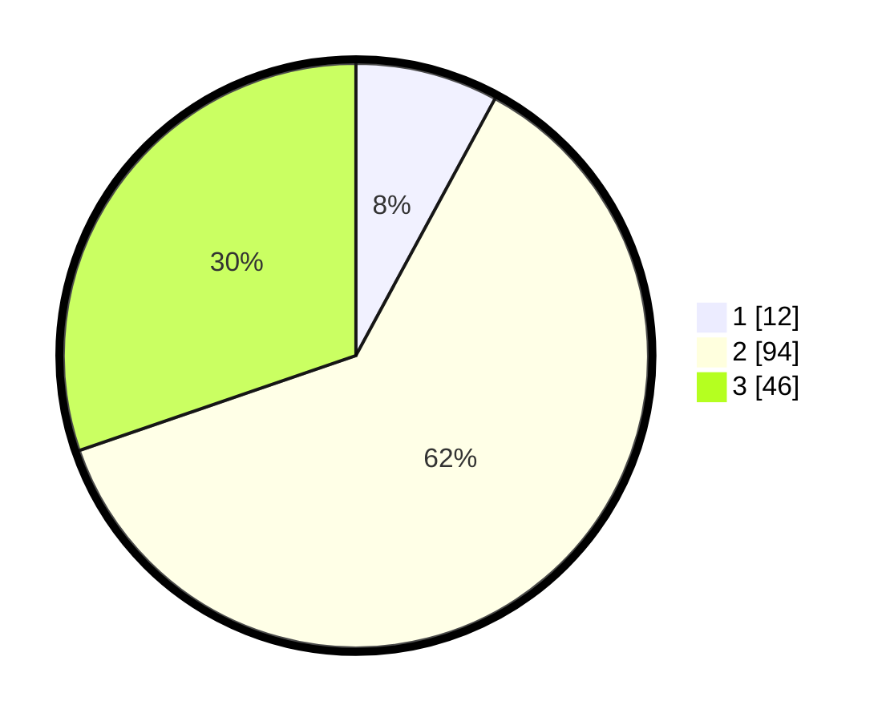

# Hasil

## Grafik

## Tabel

| No. | Nama Paslon    | Suara | Suara (raw) | Persentase |
|:--- |:-------------- | -----:| -----------:| ----------:|
| 1   | ANIES MUHAIMIN | 12    | [12][p-1]   | 7,89       |
| 2   | PRABOWO GIBRAN | 94    | [94][p-2]   | 61,84      |
| 3   | GANJAR MAHFUD  | 46    | [46][p-3]   | 30,26      |

[p-1]: https://github.com/gigit-pemilu/pemilu-2024-34-di-yogyakarta/blob/main/pilpres/hitung-suara/sub/34-di-yogyakarta/sub/02-bantul/sub/03-kretek/sub/2004-tirtosari/sub/009-tps/sub/paslon-1.txt
[p-2]: https://github.com/gigit-pemilu/pemilu-2024-34-di-yogyakarta/blob/main/pilpres/hitung-suara/sub/34-di-yogyakarta/sub/02-bantul/sub/03-kretek/sub/2004-tirtosari/sub/009-tps/sub/paslon-2.txt
[p-3]: https://github.com/gigit-pemilu/pemilu-2024-34-di-yogyakarta/blob/main/pilpres/hitung-suara/sub/34-di-yogyakarta/sub/02-bantul/sub/03-kretek/sub/2004-tirtosari/sub/009-tps/sub/paslon-3.txt

## Foto C Plano

https://sirekap-obj-formc.kpu.go.id/43b0/pemilu/ppwp/34/02/03/20/04/3402032004009-20240214-224440--778cbce3-e51a-443f-954d-1e8289328c31.jpg

https://sirekap-obj-formc.kpu.go.id/43b0/pemilu/ppwp/34/02/03/20/04/3402032004009-20240214-194137--f14a9e4a-cc0a-4e97-b558-598705c3c240.jpg

https://sirekap-obj-formc.kpu.go.id/43b0/pemilu/ppwp/34/02/03/20/04/3402032004009-20240214-220946--0738aa96-239f-4b61-b2e3-d4230926024a.jpg

## Metadata

| Key        | Value               |
| ---------- | ------------------- |
| Time Stamp | 2024-02-27 13:00:00 |

