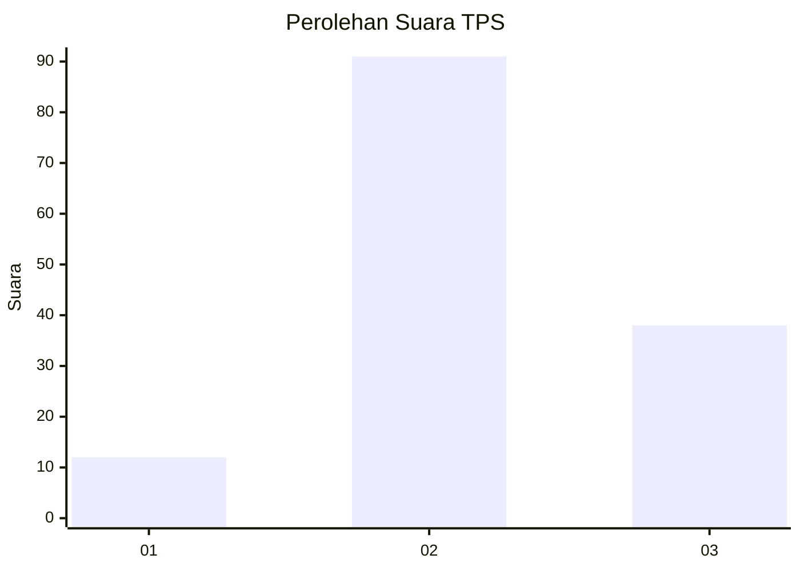
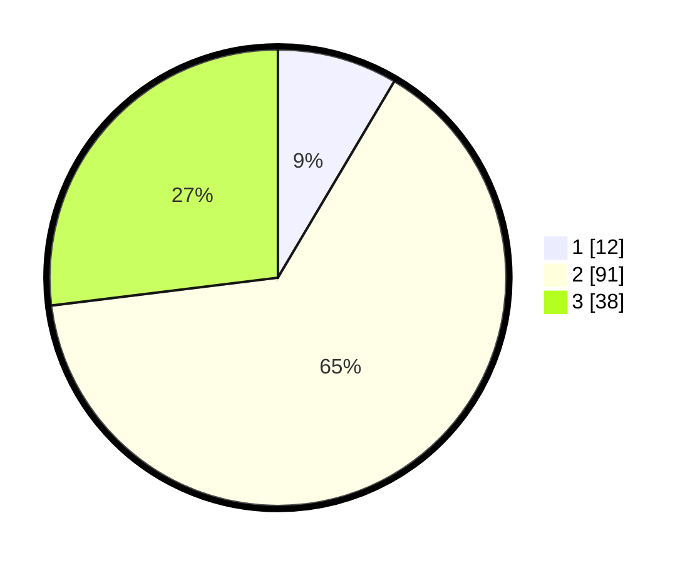

# Hasil

## Grafik

## Tabel

| No. | Nama Paslon    | Suara | Suara (raw) | Persentase |
|:--- |:-------------- | -----:| -----------:| ----------:|
| 1   | ANIES MUHAIMIN | 12    | [12][p-1]   | 8,51       |
| 2   | PRABOWO GIBRAN | 91    | [91][p-2]   | 64,54      |
| 3   | GANJAR MAHFUD  | 38    | [38][p-3]   | 26,95      |

[p-1]: https://github.com/gigit-pemilu/pemilu-2024-34-di-yogyakarta/blob/main/pilpres/hitung-suara/sub/34-di-yogyakarta/sub/02-bantul/sub/03-kretek/sub/2004-tirtosari/sub/010-tps/sub/paslon-1.txt
[p-2]: https://github.com/gigit-pemilu/pemilu-2024-34-di-yogyakarta/blob/main/pilpres/hitung-suara/sub/34-di-yogyakarta/sub/02-bantul/sub/03-kretek/sub/2004-tirtosari/sub/010-tps/sub/paslon-2.txt
[p-3]: https://github.com/gigit-pemilu/pemilu-2024-34-di-yogyakarta/blob/main/pilpres/hitung-suara/sub/34-di-yogyakarta/sub/02-bantul/sub/03-kretek/sub/2004-tirtosari/sub/010-tps/sub/paslon-3.txt

## Foto C Plano

https://sirekap-obj-formc.kpu.go.id/099d/pemilu/ppwp/34/02/03/20/04/3402032004010-20240214-155726--1bc59c2c-3370-41e6-96fb-af613d4fa6e7.jpg

https://sirekap-obj-formc.kpu.go.id/099d/pemilu/ppwp/34/02/03/20/04/3402032004010-20240214-160142--5f28acb5-bfee-4db2-8ce2-9529f3993407.jpg

https://sirekap-obj-formc.kpu.go.id/099d/pemilu/ppwp/34/02/03/20/04/3402032004010-20240214-155926--180af923-a32a-49cf-a3a9-d520b1c4541d.jpg

## Metadata

| Key        | Value               |
| ---------- | ------------------- |
| Time Stamp | 2024-02-24 22:31:28 |

