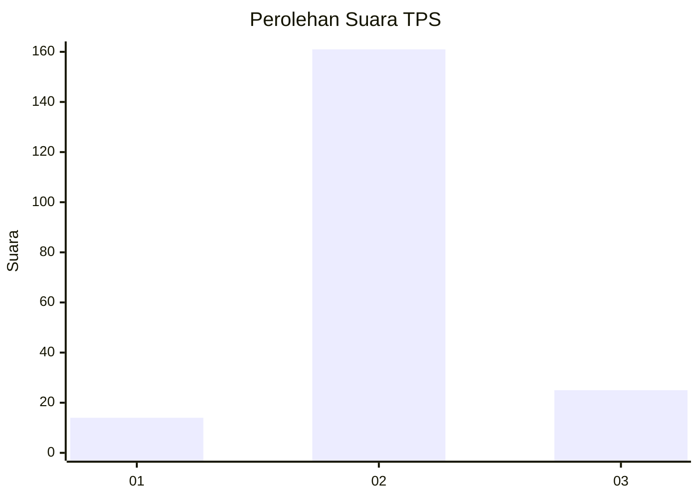
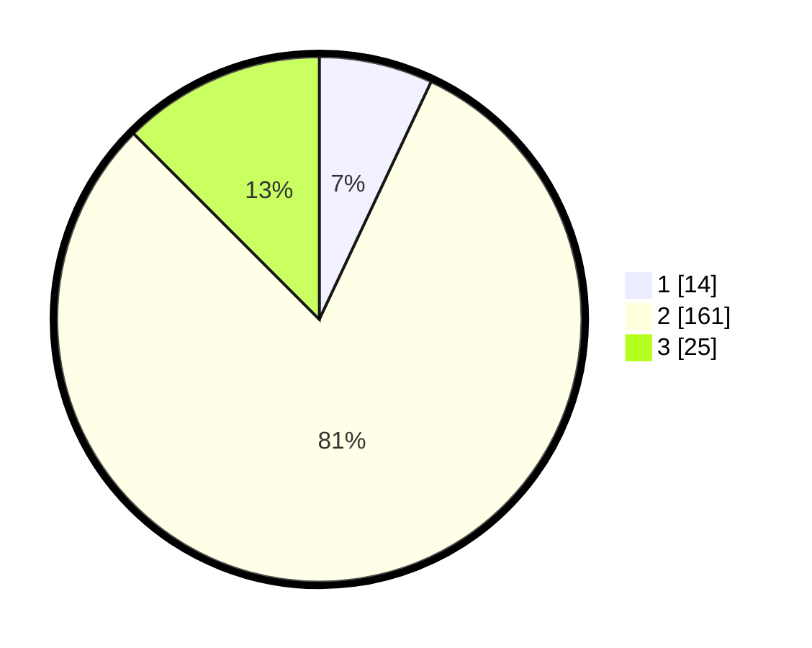

# Hasil

## Grafik

## Tabel

| No. | Nama Paslon    | Suara | Suara (raw) | Persentase |
|:--- |:-------------- | -----:| -----------:| ----------:|
| 1   | ANIES MUHAIMIN | 14    | [14][p-1]   | 7,00       |
| 2   | PRABOWO GIBRAN | 161   | [161][p-2]  | 80,50      |
| 3   | GANJAR MAHFUD  | 25    | [25][p-3]   | 12,50      |

[p-1]: https://github.com/gigit-pemilu/pemilu-2024-34-di-yogyakarta/blob/main/pilpres/hitung-suara/sub/34-di-yogyakarta/sub/02-bantul/sub/03-kretek/sub/2004-tirtosari/sub/012-tps/sub/paslon-1.txt
[p-2]: https://github.com/gigit-pemilu/pemilu-2024-34-di-yogyakarta/blob/main/pilpres/hitung-suara/sub/34-di-yogyakarta/sub/02-bantul/sub/03-kretek/sub/2004-tirtosari/sub/012-tps/sub/paslon-2.txt
[p-3]: https://github.com/gigit-pemilu/pemilu-2024-34-di-yogyakarta/blob/main/pilpres/hitung-suara/sub/34-di-yogyakarta/sub/02-bantul/sub/03-kretek/sub/2004-tirtosari/sub/012-tps/sub/paslon-3.txt

## Foto C Plano

https://sirekap-obj-formc.kpu.go.id/9b7d/pemilu/ppwp/34/02/03/20/04/3402032004012-20240219-212551--fb46ec71-7c70-40c4-9866-93861dfc3cf7.jpg

https://sirekap-obj-formc.kpu.go.id/9b7d/pemilu/ppwp/34/02/03/20/04/3402032004012-20240219-212833--ebbd8cd0-bd00-4c8d-aa26-b057f9c729d2.jpg

https://sirekap-obj-formc.kpu.go.id/9b7d/pemilu/ppwp/34/02/03/20/04/3402032004012-20240219-213550--a0069b4b-0f92-48d8-8db2-96eb09cf485c.jpg

## Metadata

| Key        | Value               |
| ---------- | ------------------- |
| Time Stamp | 2024-02-19 22:00:00 |

## DATA PEMILIH TETAP

Jumlah pemilih dalam DPT: **228**.
 * L: **117**.
 * P: **111**.

## DATA PENGGUNA HAK PILIH

Jumlah pengguna hak pilih dalam DPT: **198**.
 * L: **99**.
 * P: **99**.

Jumlah pengguna hak pilih dalam DPTb: **6**.
 * L: **6**.
 * P: **0**.

Jumlah pengguna hak pilih dalam DPK: **400**.
 * L: **0**.
 * P: **0**.

Jumlah pengguna hak pilih: **204**.
 * L: **105**.
 * P: **99**.

## JUMLAH SUARA SAH DAN TIDAK SAH

JUMLAH SELURUH SUARA SAH: **200**.

JUMLAH SUARA TIDAK SAH: **4**.

JUMLAH SELURUH SUARA SAH DAN SUARA TIDAK SAH: **204**.

