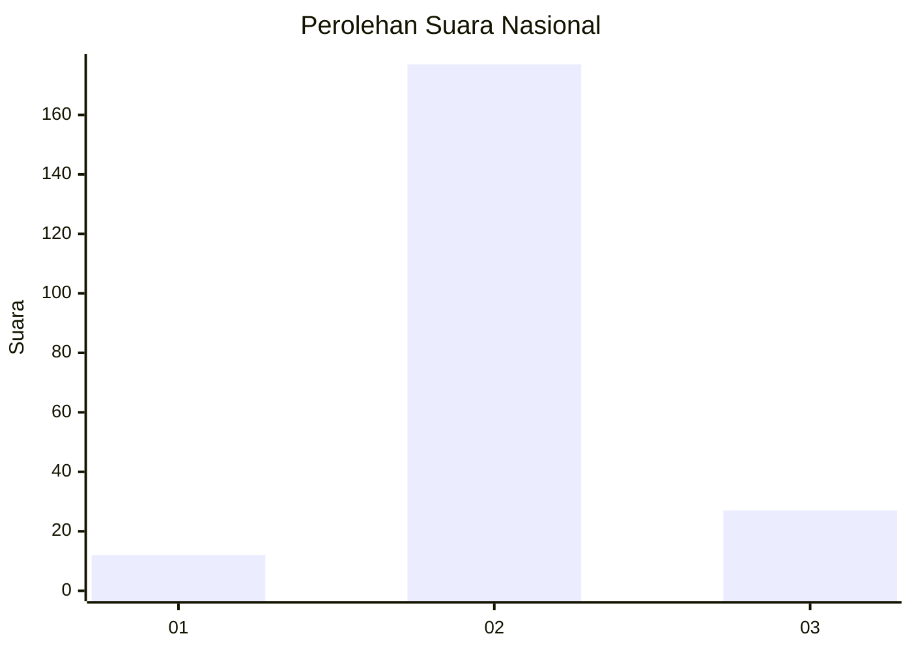
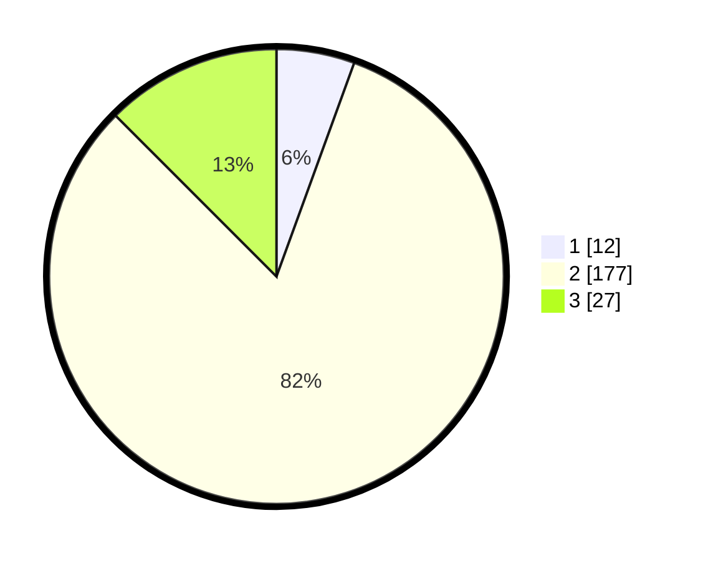

# Hasil

## Grafik

## Tabel

| No. | Nama Paslon    | Suara | Suara (raw) | Persentase |
|:--- |:-------------- | -----:| -----------:| ----------:|
| 1   | ANIES MUHAIMIN | 12    | [12][p-1]   | 5,56       |
| 2   | PRABOWO GIBRAN | 177   | [177][p-2]  | 81,94      |
| 3   | GANJAR MAHFUD  | 27    | [27][p-3]   | 12,50      |

[p-1]: https://github.com/gigit-pemilu/pemilu-2024/blob/main/pilpres/hitung-suara/sub/34-di-yogyakarta/sub/02-bantul/sub/03-kretek/sub/2004-tirtosari/sub/014-tps/sub/paslon-1.txt
[p-2]: https://github.com/gigit-pemilu/pemilu-2024/blob/main/pilpres/hitung-suara/sub/34-di-yogyakarta/sub/02-bantul/sub/03-kretek/sub/2004-tirtosari/sub/014-tps/sub/paslon-2.txt
[p-3]: https://github.com/gigit-pemilu/pemilu-2024/blob/main/pilpres/hitung-suara/sub/34-di-yogyakarta/sub/02-bantul/sub/03-kretek/sub/2004-tirtosari/sub/014-tps/sub/paslon-3.txt

## Foto C Plano

https://sirekap-obj-formc.kpu.go.id/0da6/pemilu/ppwp/34/02/03/20/04/3402032004014-20240219-214016--54134a66-baaf-479d-bb20-0f85fa1671ae.jpg

https://sirekap-obj-formc.kpu.go.id/0da6/pemilu/ppwp/34/02/03/20/04/3402032004014-20240219-214808--1b8db9fe-c3aa-48c4-9a49-2ff204e83801.jpg

https://sirekap-obj-formc.kpu.go.id/0da6/pemilu/ppwp/34/02/03/20/04/3402032004014-20240219-215300--b0b7222c-b80e-471e-b50b-111ae7691b35.jpg

## Metadata

| Key        | Value               |
| ---------- | ------------------- |
| Time Stamp | 2024-02-19 22:00:00 |

## DATA PEMILIH TETAP

Jumlah pemilih dalam DPT: **201**.
 * L: **98**.
 * P: **103**.

## DATA PENGGUNA HAK PILIH

Jumlah pengguna hak pilih dalam DPT: **175**.
 * L: **87**.
 * P: **97**.

Jumlah pengguna hak pilih dalam DPTb: **3**.
 * L: **2**.
 * P: **1**.

Jumlah pengguna hak pilih dalam DPK: **2**.
 * L: **1**.
 * P: **1**.

Jumlah pengguna hak pilih: **181**.
 * L: **85**.
 * P: **95**.

## JUMLAH SUARA SAH DAN TIDAK SAH

JUMLAH SELURUH SUARA SAH: **175**.

JUMLAH SUARA TIDAK SAH: **5**.

JUMLAH SELURUH SUARA SAH DAN SUARA TIDAK SAH: **181**.

