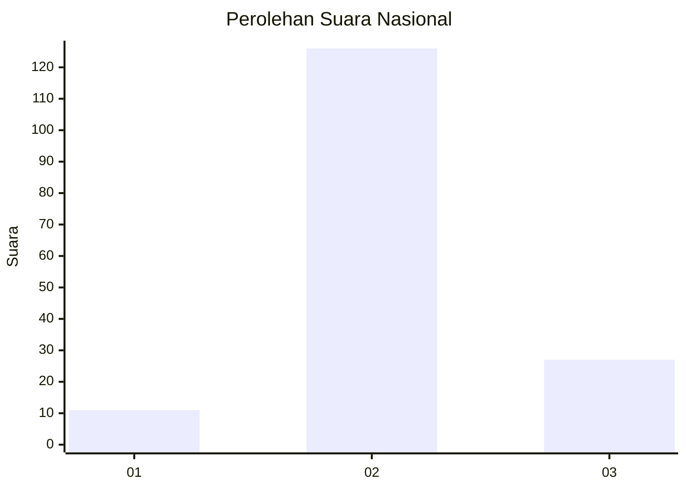
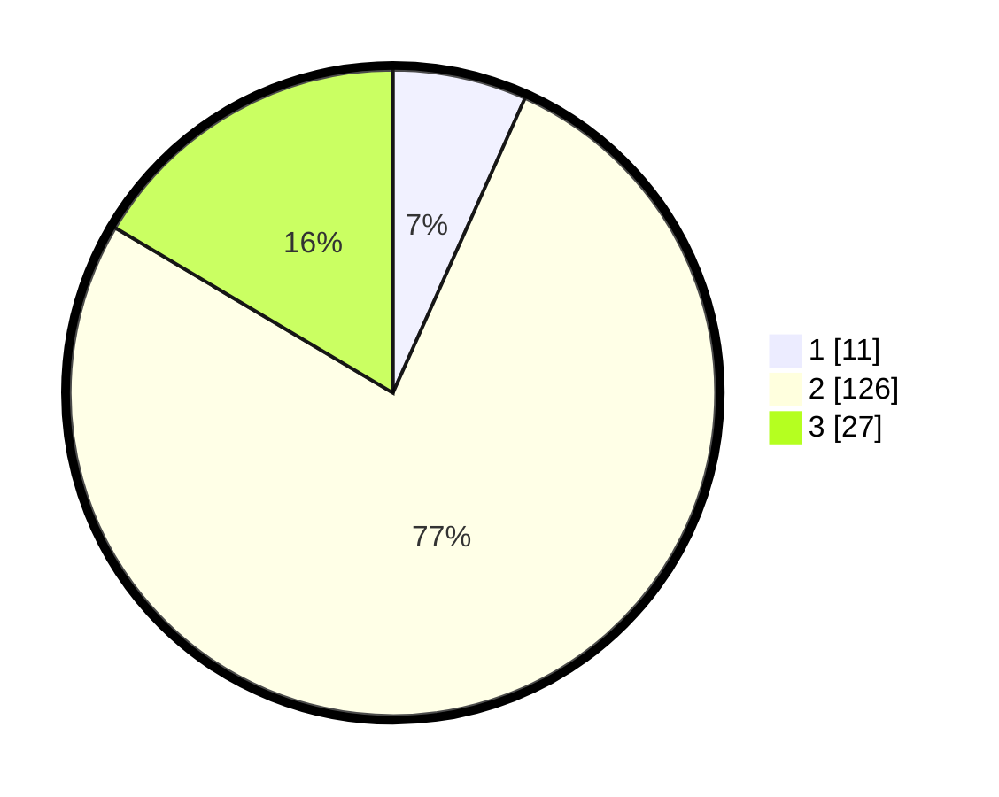

# Hasil

## Grafik

## Tabel

| No. | Nama Paslon    | Suara | Suara (raw) | Persentase |
|:--- |:-------------- | -----:| -----------:| ----------:|
| 1   | ANIES MUHAIMIN | 11    | [11][p-1]   | 6,71       |
| 2   | PRABOWO GIBRAN | 126   | [126][p-2]  | 76,83      |
| 3   | GANJAR MAHFUD  | 27    | [27][p-3]   | 16,46      |

[p-1]: https://github.com/gigit-pemilu/pemilu-2024/blob/main/pilpres/hitung-suara/sub/34-di-yogyakarta/sub/02-bantul/sub/03-kretek/sub/2004-tirtosari/sub/015-tps/sub/paslon-1.txt
[p-2]: https://github.com/gigit-pemilu/pemilu-2024/blob/main/pilpres/hitung-suara/sub/34-di-yogyakarta/sub/02-bantul/sub/03-kretek/sub/2004-tirtosari/sub/015-tps/sub/paslon-2.txt
[p-3]: https://github.com/gigit-pemilu/pemilu-2024/blob/main/pilpres/hitung-suara/sub/34-di-yogyakarta/sub/02-bantul/sub/03-kretek/sub/2004-tirtosari/sub/015-tps/sub/paslon-3.txt

## Foto C Plano

https://sirekap-obj-formc.kpu.go.id/5d66/pemilu/ppwp/34/02/03/20/04/3402032004015-20240219-210456--70b1b9b6-5121-4229-afed-e04849ad5861.jpg

https://sirekap-obj-formc.kpu.go.id/5d66/pemilu/ppwp/34/02/03/20/04/3402032004015-20240219-210648--ceca1f9a-b2ec-45a3-a184-49ecaa37653e.jpg

https://sirekap-obj-formc.kpu.go.id/5d66/pemilu/ppwp/34/02/03/20/04/3402032004015-20240219-210828--d7b0d3fb-66f5-4e6d-9a25-2257edca7a3a.jpg

## Metadata

| Key        | Value               |
| ---------- | ------------------- |
| Time Stamp | 2024-02-19 22:00:00 |

## DATA PEMILIH TETAP

Jumlah pemilih dalam DPT: **180**.
 * L: **87**.
 * P: **93**.

## DATA PENGGUNA HAK PILIH

Jumlah pengguna hak pilih dalam DPT: **167**.
 * L: **81**.
 * P: **86**.

Jumlah pengguna hak pilih dalam DPTb: **0**.
 * L: **0**.
 * P: **0**.

Jumlah pengguna hak pilih dalam DPK: **1**.
 * L: **0**.
 * P: **1**.

Jumlah pengguna hak pilih: **168**.
 * L: **81**.
 * P: **87**.

## JUMLAH SUARA SAH DAN TIDAK SAH

JUMLAH SELURUH SUARA SAH: **164**.

JUMLAH SUARA TIDAK SAH: **4**.

JUMLAH SELURUH SUARA SAH DAN SUARA TIDAK SAH: **168**.

