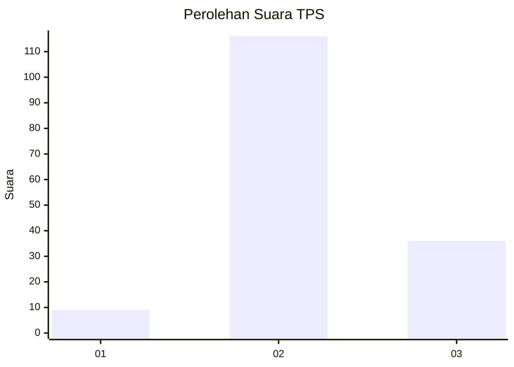
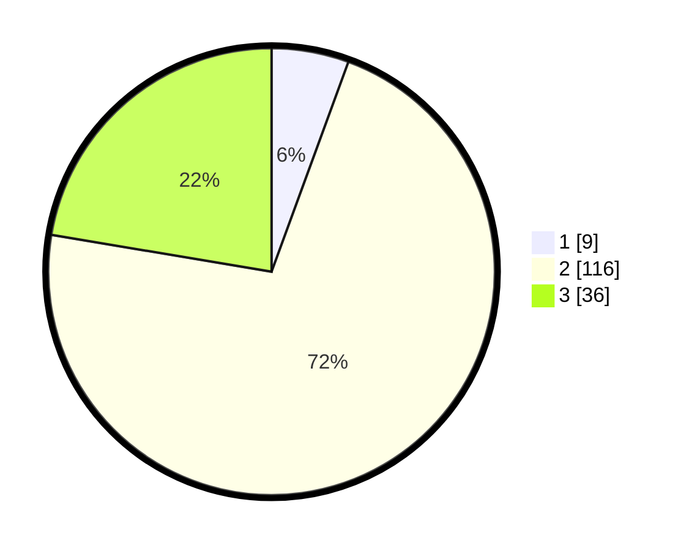

# Hasil

## Grafik

## Tabel

| No. | Nama Paslon    | Suara | Suara (raw) | Persentase |
|:--- |:-------------- | -----:| -----------:| ----------:|
| 1   | ANIES MUHAIMIN | 9     | [9][p-1]    | 5,59       |
| 2   | PRABOWO GIBRAN | 116   | [116][p-2]  | 72,05      |
| 3   | GANJAR MAHFUD  | 36    | [36][p-3]   | 22,36      |

[p-1]: https://github.com/gigit-pemilu/pemilu-2024-34-di-yogyakarta/blob/main/pilpres/hitung-suara/sub/34-di-yogyakarta/sub/02-bantul/sub/03-kretek/sub/2004-tirtosari/sub/017-tps/sub/paslon-1.txt
[p-2]: https://github.com/gigit-pemilu/pemilu-2024-34-di-yogyakarta/blob/main/pilpres/hitung-suara/sub/34-di-yogyakarta/sub/02-bantul/sub/03-kretek/sub/2004-tirtosari/sub/017-tps/sub/paslon-2.txt
[p-3]: https://github.com/gigit-pemilu/pemilu-2024-34-di-yogyakarta/blob/main/pilpres/hitung-suara/sub/34-di-yogyakarta/sub/02-bantul/sub/03-kretek/sub/2004-tirtosari/sub/017-tps/sub/paslon-3.txt

## Foto C Plano

https://sirekap-obj-formc.kpu.go.id/49fb/pemilu/ppwp/34/02/03/20/04/3402032004017-20240219-211334--6aef1628-601e-4728-ab01-dc9e641037f4.jpg

https://sirekap-obj-formc.kpu.go.id/49fb/pemilu/ppwp/34/02/03/20/04/3402032004017-20240219-211519--ea173867-bf2f-4ca3-a5d9-938fa9dd5cbc.jpg

https://sirekap-obj-formc.kpu.go.id/49fb/pemilu/ppwp/34/02/03/20/04/3402032004017-20240219-211714--9c2bdca7-76a3-4b5f-81ad-613a2717b736.jpg

## Metadata

| Key        | Value               |
| ---------- | ------------------- |
| Time Stamp | 2024-02-19 22:00:00 |

## DATA PEMILIH TETAP

Jumlah pemilih dalam DPT: **181**.
 * L: **94**.
 * P: **887**.

## DATA PENGGUNA HAK PILIH

Jumlah pengguna hak pilih dalam DPT: **160**.
 * L: **84**.
 * P: **76**.

Jumlah pengguna hak pilih dalam DPTb: **4**.
 * L: **1**.
 * P: **83**.

Jumlah pengguna hak pilih dalam DPK: **1**.
 * L: **0**.
 * P: **1**.

Jumlah pengguna hak pilih: **165**.
 * L: **85**.
 * P: **80**.

## JUMLAH SUARA SAH DAN TIDAK SAH

JUMLAH SELURUH SUARA SAH: **161**.

JUMLAH SUARA TIDAK SAH: **4**.

JUMLAH SELURUH SUARA SAH DAN SUARA TIDAK SAH: **165**.

