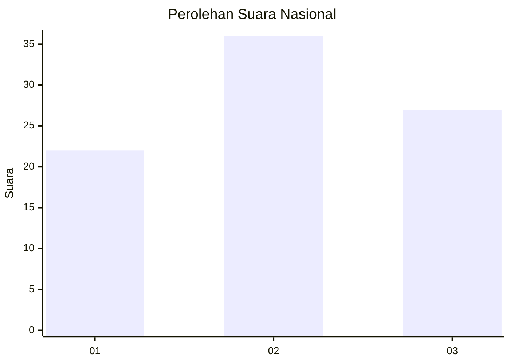
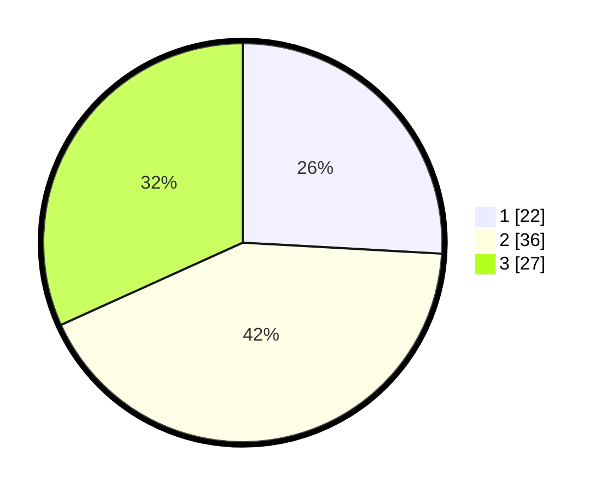

# Hasil

## Grafik

## Tabel

| No. | Nama Paslon    | Suara | Suara (raw) | Persentase |
|:--- |:-------------- | -----:| -----------:| ----------:|
| 1   | ANIES MUHAIMIN | 22    | [22][p-1]   | 25,88      |
| 2   | PRABOWO GIBRAN | 36    | [36][p-2]   | 42,35      |
| 3   | GANJAR MAHFUD  | 27    | [27][p-3]   | 31,76      |

[p-1]: https://github.com/gigit-pemilu/pemilu-2024/blob/main/pilpres/hitung-suara/sub/34-di-yogyakarta/sub/02-bantul/sub/03-kretek/sub/2005-tirtohargo/sub/001-tps/sub/paslon-1.txt
[p-2]: https://github.com/gigit-pemilu/pemilu-2024/blob/main/pilpres/hitung-suara/sub/34-di-yogyakarta/sub/02-bantul/sub/03-kretek/sub/2005-tirtohargo/sub/001-tps/sub/paslon-2.txt
[p-3]: https://github.com/gigit-pemilu/pemilu-2024/blob/main/pilpres/hitung-suara/sub/34-di-yogyakarta/sub/02-bantul/sub/03-kretek/sub/2005-tirtohargo/sub/001-tps/sub/paslon-3.txt

## Foto C Plano

https://sirekap-obj-formc.kpu.go.id/d443/pemilu/ppwp/34/02/03/20/05/3402032005001-20240219-182406--17cdf7bf-2246-40a0-9905-f703f0622b6b.jpg

https://sirekap-obj-formc.kpu.go.id/d443/pemilu/ppwp/34/02/03/20/05/3402032005001-20240219-182542--a3a4f941-d6fd-4f74-9c95-b452269e33d6.jpg

https://sirekap-obj-formc.kpu.go.id/d443/pemilu/ppwp/34/02/03/20/05/3402032005001-20240219-182909--bc4b9854-43d5-4d29-96aa-e8dfbc8a74ac.jpg

## Metadata

| Key        | Value               |
| ---------- | ------------------- |
| Time Stamp | 2024-02-19 19:00:00 |

## DATA PEMILIH TETAP

Jumlah pemilih dalam DPT: **224**.
 * L: **102**.
 * P: **722**.

## DATA PENGGUNA HAK PILIH

Jumlah pengguna hak pilih dalam DPT: **568**.
 * L: **288**.
 * P: **709**.

Jumlah pengguna hak pilih dalam DPTb: **88**.
 * L: **480**.
 * P: **480**.

Jumlah pengguna hak pilih dalam DPK: **4**.
 * L: **88**.
 * P: **804**.

Jumlah pengguna hak pilih: **83**.
 * L: **890**.
 * P: **896**.

## JUMLAH SUARA SAH DAN TIDAK SAH

JUMLAH SELURUH SUARA SAH: **187**.

JUMLAH SUARA TIDAK SAH: **80**.

JUMLAH SELURUH SUARA SAH DAN SUARA TIDAK SAH: **87**.

