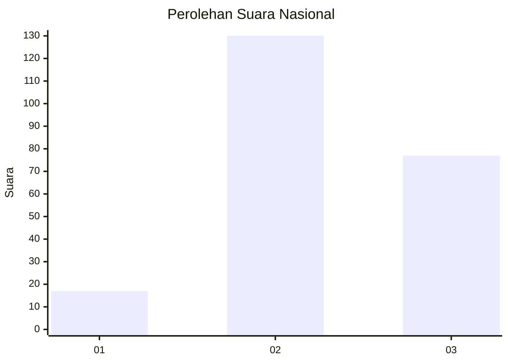
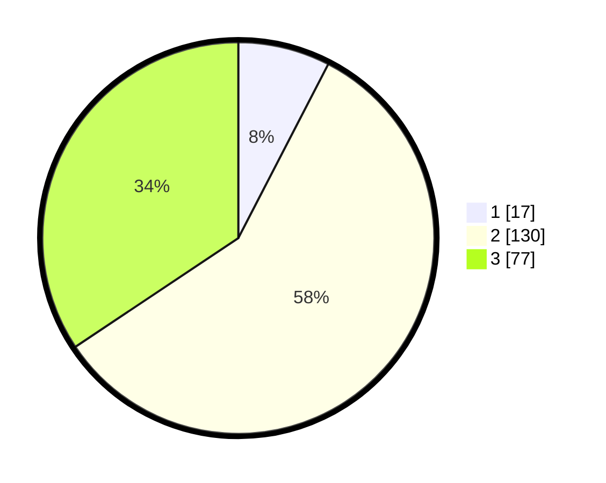

# Hasil

## Grafik

## Tabel

| No. | Nama Paslon    | Suara | Suara (raw) | Persentase |
|:--- |:-------------- | -----:| -----------:| ----------:|
| 1   | ANIES MUHAIMIN | 17    | [17][p-1]   | 7,59       |
| 2   | PRABOWO GIBRAN | 130   | [130][p-2]  | 58,04      |
| 3   | GANJAR MAHFUD  | 77    | [77][p-3]   | 34,38      |

[p-1]: https://github.com/gigit-pemilu/pemilu-2024/blob/main/pilpres/hitung-suara/sub/34-di-yogyakarta/sub/02-bantul/sub/03-kretek/sub/2005-tirtohargo/sub/003-tps/sub/paslon-1.txt
[p-2]: https://github.com/gigit-pemilu/pemilu-2024/blob/main/pilpres/hitung-suara/sub/34-di-yogyakarta/sub/02-bantul/sub/03-kretek/sub/2005-tirtohargo/sub/003-tps/sub/paslon-2.txt
[p-3]: https://github.com/gigit-pemilu/pemilu-2024/blob/main/pilpres/hitung-suara/sub/34-di-yogyakarta/sub/02-bantul/sub/03-kretek/sub/2005-tirtohargo/sub/003-tps/sub/paslon-3.txt

## Foto C Plano

https://sirekap-obj-formc.kpu.go.id/03da/pemilu/ppwp/34/02/03/20/05/3402032005003-20240219-183928--93a031de-8999-4530-bd35-eaa762b0b36d.jpg

https://sirekap-obj-formc.kpu.go.id/03da/pemilu/ppwp/34/02/03/20/05/3402032005003-20240219-184124--aa6348e9-b70e-45c6-8b09-937d2ba103db.jpg

https://sirekap-obj-formc.kpu.go.id/03da/pemilu/ppwp/34/02/03/20/05/3402032005003-20240219-184303--0d922e0d-fcbd-4948-9188-734b2e3201d9.jpg

## Metadata

| Key        | Value               |
| ---------- | ------------------- |
| Time Stamp | 2024-02-20 10:00:00 |

## DATA PEMILIH TETAP

Jumlah pemilih dalam DPT: **292**.
 * L: **625**.
 * P: **428**.

## DATA PENGGUNA HAK PILIH

Jumlah pengguna hak pilih dalam DPT: **224**.
 * L: **854**.
 * P: **460**.

Jumlah pengguna hak pilih dalam DPTb: **83**.
 * L: **6**.
 * P: **4**.

Jumlah pengguna hak pilih dalam DPK: **482**.
 * L: **886**.
 * P: **4**.

Jumlah pengguna hak pilih: **227**.
 * L: **416**.
 * P: **446**.

## JUMLAH SUARA SAH DAN TIDAK SAH

JUMLAH SELURUH SUARA SAH: **224**.

JUMLAH SUARA TIDAK SAH: **3**.

JUMLAH SELURUH SUARA SAH DAN SUARA TIDAK SAH: **227**.

