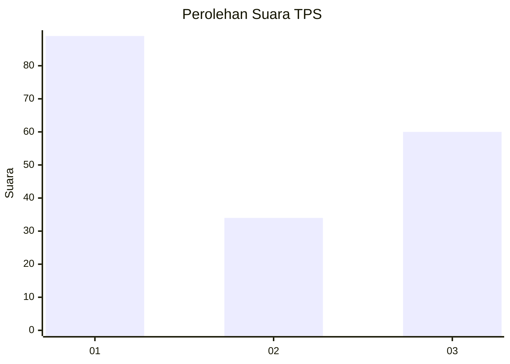
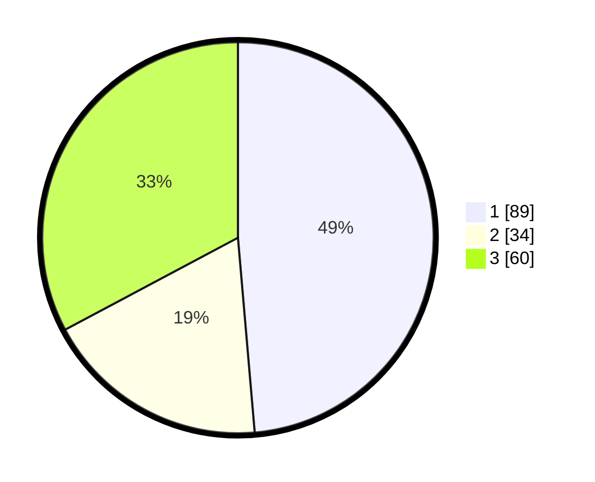

# Hasil

## Grafik

## Tabel

| No. | Nama Paslon    | Suara | Suara (raw) | Persentase |
|:--- |:-------------- | -----:| -----------:| ----------:|
| 1   | ANIES MUHAIMIN | 89    | [89][p-1]   | 48,63      |
| 2   | PRABOWO GIBRAN | 34    | [34][p-2]   | 18,58      |
| 3   | GANJAR MAHFUD  | 60    | [60][p-3]   | 32,79      |

[p-1]: https://github.com/gigit-pemilu/pemilu-2024-34-di-yogyakarta/blob/main/pilpres/hitung-suara/sub/34-di-yogyakarta/sub/02-bantul/sub/03-kretek/sub/2005-tirtohargo/sub/004-tps/sub/paslon-1.txt
[p-2]: https://github.com/gigit-pemilu/pemilu-2024-34-di-yogyakarta/blob/main/pilpres/hitung-suara/sub/34-di-yogyakarta/sub/02-bantul/sub/03-kretek/sub/2005-tirtohargo/sub/004-tps/sub/paslon-2.txt
[p-3]: https://github.com/gigit-pemilu/pemilu-2024-34-di-yogyakarta/blob/main/pilpres/hitung-suara/sub/34-di-yogyakarta/sub/02-bantul/sub/03-kretek/sub/2005-tirtohargo/sub/004-tps/sub/paslon-3.txt

## Foto C Plano

https://sirekap-obj-formc.kpu.go.id/4e7a/pemilu/ppwp/34/02/03/20/05/3402032005004-20240219-184824--c5762b2f-ba96-4b15-9005-ffd7ad6088a5.jpg

https://sirekap-obj-formc.kpu.go.id/4e7a/pemilu/ppwp/34/02/03/20/05/3402032005004-20240219-184930--2a2fa40a-86e3-4a61-b164-ac4e779eab5a.jpg

https://sirekap-obj-formc.kpu.go.id/4e7a/pemilu/ppwp/34/02/03/20/05/3402032005004-20240219-185102--8893fb14-9c17-4514-94ec-f9dcd3567574.jpg

## Metadata

| Key        | Value               |
| ---------- | ------------------- |
| Time Stamp | 2024-02-19 19:00:00 |

## DATA PEMILIH TETAP

Jumlah pemilih dalam DPT: **223**.
 * L: **224**.
 * P: **209**.

## DATA PENGGUNA HAK PILIH

Jumlah pengguna hak pilih dalam DPT: **202**.
 * L: **262**.
 * P: **206**.

Jumlah pengguna hak pilih dalam DPTb: **202**.
 * L: **4**.
 * P: **2**.

Jumlah pengguna hak pilih dalam DPK: **80**.
 * L: **8**.
 * P: **802**.

Jumlah pengguna hak pilih: **204**.
 * L: **203**.
 * P: **508**.

## JUMLAH SUARA SAH DAN TIDAK SAH

JUMLAH SELURUH SUARA SAH: **200**.

JUMLAH SUARA TIDAK SAH: **4**.

JUMLAH SELURUH SUARA SAH DAN SUARA TIDAK SAH: **204**.

