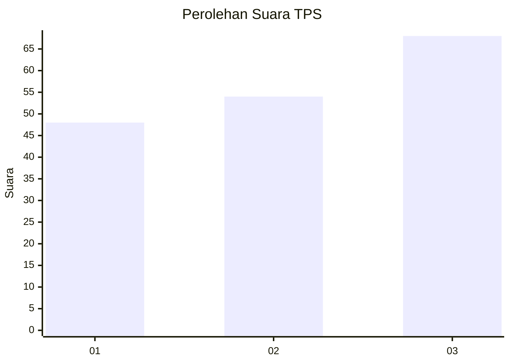
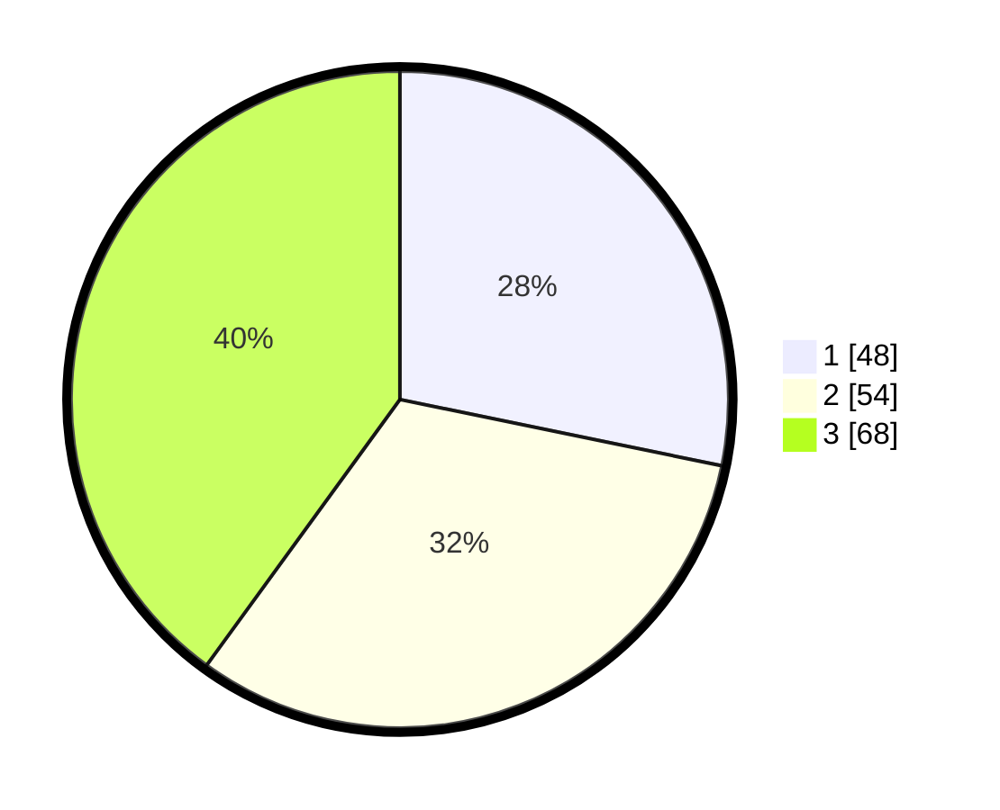

# Hasil

## Grafik

## Tabel

| No. | Nama Paslon    | Suara | Suara (raw) | Persentase |
|:--- |:-------------- | -----:| -----------:| ----------:|
| 1   | ANIES MUHAIMIN | 48    | [48][p-1]   | 28,24      |
| 2   | PRABOWO GIBRAN | 54    | [54][p-2]   | 31,76      |
| 3   | GANJAR MAHFUD  | 68    | [68][p-3]   | 40,00      |

[p-1]: https://github.com/gigit-pemilu/pemilu-2024-34-di-yogyakarta/blob/main/pilpres/hitung-suara/sub/34-di-yogyakarta/sub/02-bantul/sub/03-kretek/sub/2005-tirtohargo/sub/005-tps/sub/paslon-1.txt
[p-2]: https://github.com/gigit-pemilu/pemilu-2024-34-di-yogyakarta/blob/main/pilpres/hitung-suara/sub/34-di-yogyakarta/sub/02-bantul/sub/03-kretek/sub/2005-tirtohargo/sub/005-tps/sub/paslon-2.txt
[p-3]: https://github.com/gigit-pemilu/pemilu-2024-34-di-yogyakarta/blob/main/pilpres/hitung-suara/sub/34-di-yogyakarta/sub/02-bantul/sub/03-kretek/sub/2005-tirtohargo/sub/005-tps/sub/paslon-3.txt

## Foto C Plano

https://sirekap-obj-formc.kpu.go.id/a760/pemilu/ppwp/34/02/03/20/05/3402032005005-20240219-185704--de77d0d8-38bb-4f67-ad33-6fef06bb9f94.jpg

https://sirekap-obj-formc.kpu.go.id/a760/pemilu/ppwp/34/02/03/20/05/3402032005005-20240219-185906--3e759de7-7e87-405a-937e-60a4307c8b37.jpg

https://sirekap-obj-formc.kpu.go.id/a760/pemilu/ppwp/34/02/03/20/05/3402032005005-20240219-190148--0592d373-d2bc-4882-acd8-f84c438e5ee9.jpg

## Metadata

| Key        | Value               |
| ---------- | ------------------- |
| Time Stamp | 2024-02-19 20:00:00 |

## DATA PEMILIH TETAP

Jumlah pemilih dalam DPT: **649**.
 * L: **68**.
 * P: **32**.

## DATA PENGGUNA HAK PILIH

Jumlah pengguna hak pilih dalam DPT: **525**.
 * L: **62**.
 * P: **63**.

Jumlah pengguna hak pilih dalam DPTb: **2**.
 * L: **2**.
 * P: **0**.

Jumlah pengguna hak pilih dalam DPK: **0**.
 * L: **0**.
 * P: **800**.

Jumlah pengguna hak pilih: **127**.
 * L: **64**.
 * P: **63**.

## JUMLAH SUARA SAH DAN TIDAK SAH

JUMLAH SELURUH SUARA SAH: **189**.

JUMLAH SUARA TIDAK SAH: **8**.

JUMLAH SELURUH SUARA SAH DAN SUARA TIDAK SAH: **127**.

