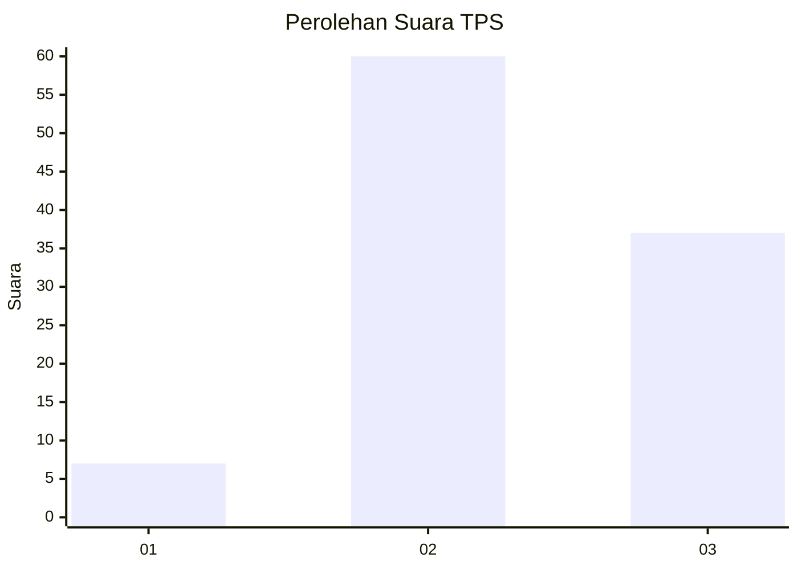
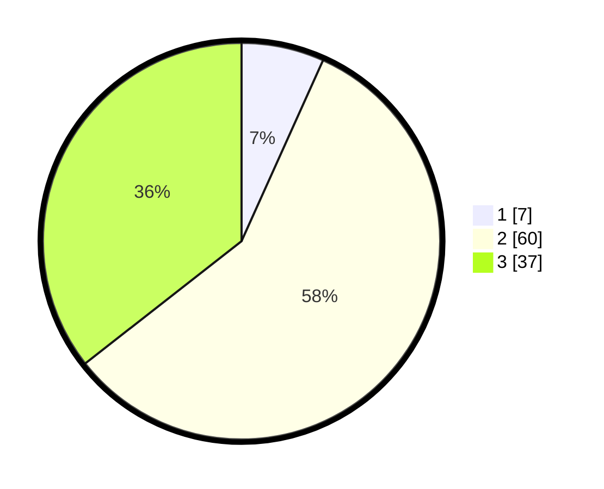

# Hasil

## Grafik

## Tabel

| No. | Nama Paslon    | Suara | Suara (raw) | Persentase |
|:--- |:-------------- | -----:| -----------:| ----------:|
| 1   | ANIES MUHAIMIN | 7     | [7][p-1]    | 6,73       |
| 2   | PRABOWO GIBRAN | 60    | [60][p-2]   | 57,69      |
| 3   | GANJAR MAHFUD  | 37    | [37][p-3]   | 35,58      |

[p-1]: https://github.com/gigit-pemilu/pemilu-2024-34-di-yogyakarta/blob/main/pilpres/hitung-suara/sub/34-di-yogyakarta/sub/02-bantul/sub/03-kretek/sub/2005-tirtohargo/sub/006-tps/sub/paslon-1.txt
[p-2]: https://github.com/gigit-pemilu/pemilu-2024-34-di-yogyakarta/blob/main/pilpres/hitung-suara/sub/34-di-yogyakarta/sub/02-bantul/sub/03-kretek/sub/2005-tirtohargo/sub/006-tps/sub/paslon-2.txt
[p-3]: https://github.com/gigit-pemilu/pemilu-2024-34-di-yogyakarta/blob/main/pilpres/hitung-suara/sub/34-di-yogyakarta/sub/02-bantul/sub/03-kretek/sub/2005-tirtohargo/sub/006-tps/sub/paslon-3.txt

## Foto C Plano

https://sirekap-obj-formc.kpu.go.id/bfdf/pemilu/ppwp/34/02/03/20/05/3402032005006-20240219-190821--9c4058c7-93f6-4c89-bdb9-138379af40cb.jpg

https://sirekap-obj-formc.kpu.go.id/bfdf/pemilu/ppwp/34/02/03/20/05/3402032005006-20240219-191006--0485106a-480e-41e3-9bbc-636783bba47e.jpg

https://sirekap-obj-formc.kpu.go.id/bfdf/pemilu/ppwp/34/02/03/20/05/3402032005006-20240219-191202--f4baef91-c2b5-4ba2-82d0-e71ca271a99e.jpg

## Metadata

| Key        | Value               |
| ---------- | ------------------- |
| Time Stamp | 2024-02-19 20:00:00 |

## DATA PEMILIH TETAP

Jumlah pemilih dalam DPT: **625**.
 * L: **58**.
 * P: **67**.

## DATA PENGGUNA HAK PILIH

Jumlah pengguna hak pilih dalam DPT: **608**.
 * L: **49**.
 * P: **59**.

Jumlah pengguna hak pilih dalam DPTb: **0**.
 * L: **0**.
 * P: **0**.

Jumlah pengguna hak pilih dalam DPK: **0**.
 * L: **0**.
 * P: **0**.

Jumlah pengguna hak pilih: **608**.
 * L: **49**.
 * P: **59**.

## JUMLAH SUARA SAH DAN TIDAK SAH

JUMLAH SELURUH SUARA SAH: **704**.

JUMLAH SUARA TIDAK SAH: **94**.

JUMLAH SELURUH SUARA SAH DAN SUARA TIDAK SAH: **408**.

