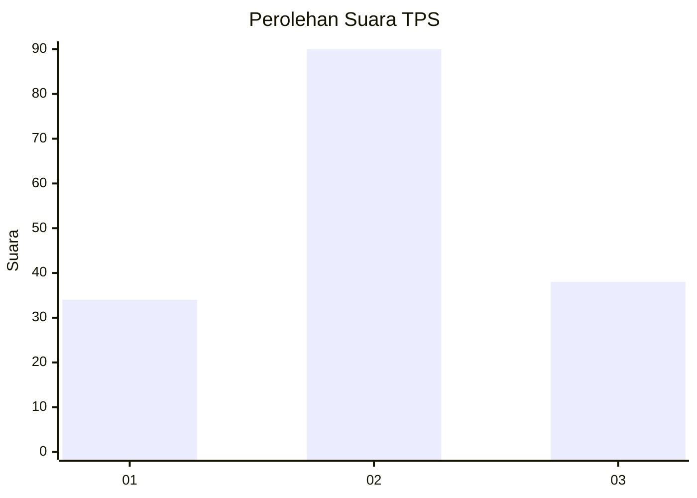
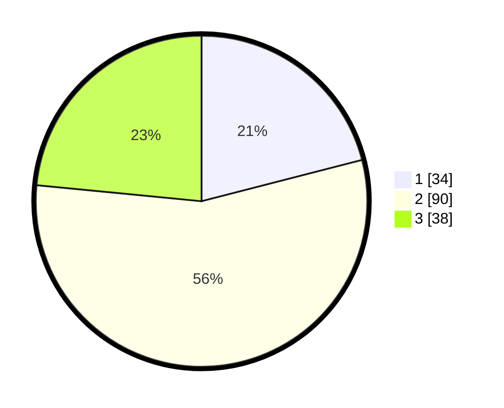

# Hasil

## Grafik

## Tabel

| No. | Nama Paslon    | Suara | Suara (raw) | Persentase |
|:--- |:-------------- | -----:| -----------:| ----------:|
| 1   | ANIES MUHAIMIN | 34    | [34][p-1]   | 20,99      |
| 2   | PRABOWO GIBRAN | 90    | [90][p-2]   | 55,56      |
| 3   | GANJAR MAHFUD  | 38    | [38][p-3]   | 23,46      |

[p-1]: https://github.com/gigit-pemilu/pemilu-2024-34-di-yogyakarta/blob/main/pilpres/hitung-suara/sub/34-di-yogyakarta/sub/02-bantul/sub/03-kretek/sub/2005-tirtohargo/sub/007-tps/sub/paslon-1.txt
[p-2]: https://github.com/gigit-pemilu/pemilu-2024-34-di-yogyakarta/blob/main/pilpres/hitung-suara/sub/34-di-yogyakarta/sub/02-bantul/sub/03-kretek/sub/2005-tirtohargo/sub/007-tps/sub/paslon-2.txt
[p-3]: https://github.com/gigit-pemilu/pemilu-2024-34-di-yogyakarta/blob/main/pilpres/hitung-suara/sub/34-di-yogyakarta/sub/02-bantul/sub/03-kretek/sub/2005-tirtohargo/sub/007-tps/sub/paslon-3.txt

## Foto C Plano

https://sirekap-obj-formc.kpu.go.id/9084/pemilu/ppwp/34/02/03/20/05/3402032005007-20240219-191625--4f27fd1e-a8ee-4fce-8452-a366a814e56e.jpg

https://sirekap-obj-formc.kpu.go.id/9084/pemilu/ppwp/34/02/03/20/05/3402032005007-20240219-191850--60ab2efb-6dfa-4dab-9ebb-293552e1acf1.jpg

https://sirekap-obj-formc.kpu.go.id/9084/pemilu/ppwp/34/02/03/20/05/3402032005007-20240219-192557--fac27f3a-5098-428a-986e-a546fe1e39de.jpg

## Metadata

| Key        | Value               |
| ---------- | ------------------- |
| Time Stamp | 2024-02-19 20:00:00 |

## DATA PEMILIH TETAP

Jumlah pemilih dalam DPT: **574**.
 * L: **889**.
 * P: **85**.

## DATA PENGGUNA HAK PILIH

Jumlah pengguna hak pilih dalam DPT: **563**.
 * L: **802**.
 * P: **884**.

Jumlah pengguna hak pilih dalam DPTb: **443**.
 * L: **885**.
 * P: **482**.

Jumlah pengguna hak pilih dalam DPK: **843**.
 * L: **455**.
 * P: **883**.

Jumlah pengguna hak pilih: **569**.
 * L: **884**.
 * P: **885**.

## JUMLAH SUARA SAH DAN TIDAK SAH

JUMLAH SELURUH SUARA SAH: **162**.

JUMLAH SUARA TIDAK SAH: **8**.

JUMLAH SELURUH SUARA SAH DAN SUARA TIDAK SAH: **163**.

