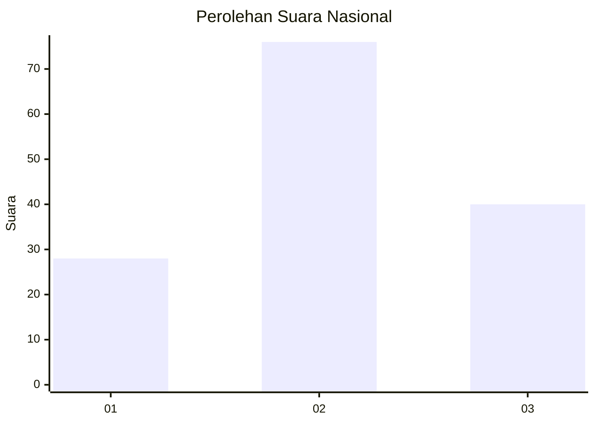
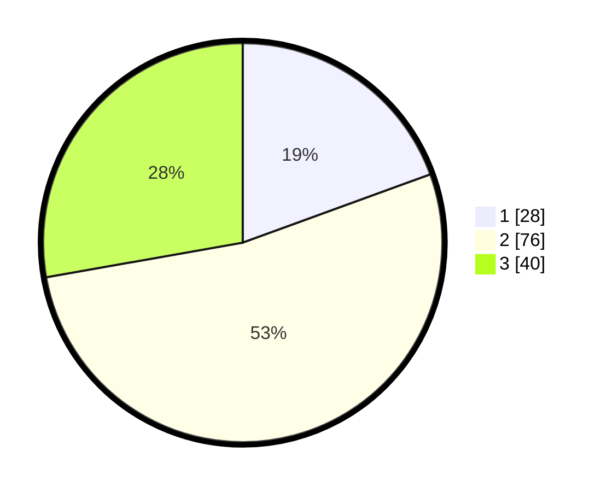

# Hasil

## Grafik

## Tabel

| No. | Nama Paslon    | Suara | Suara (raw) | Persentase |
|:--- |:-------------- | -----:| -----------:| ----------:|
| 1   | ANIES MUHAIMIN | 28    | [28][p-1]   | 19,44      |
| 2   | PRABOWO GIBRAN | 76    | [76][p-2]   | 52,78      |
| 3   | GANJAR MAHFUD  | 40    | [40][p-3]   | 27,78      |

[p-1]: https://github.com/gigit-pemilu/pemilu-2024/blob/main/pilpres/hitung-suara/sub/34-di-yogyakarta/sub/02-bantul/sub/03-kretek/sub/2005-tirtohargo/sub/008-tps/sub/paslon-1.txt
[p-2]: https://github.com/gigit-pemilu/pemilu-2024/blob/main/pilpres/hitung-suara/sub/34-di-yogyakarta/sub/02-bantul/sub/03-kretek/sub/2005-tirtohargo/sub/008-tps/sub/paslon-2.txt
[p-3]: https://github.com/gigit-pemilu/pemilu-2024/blob/main/pilpres/hitung-suara/sub/34-di-yogyakarta/sub/02-bantul/sub/03-kretek/sub/2005-tirtohargo/sub/008-tps/sub/paslon-3.txt

## Foto C Plano

https://sirekap-obj-formc.kpu.go.id/9aca/pemilu/ppwp/34/02/03/20/05/3402032005008-20240219-193130--b4284ecc-e6be-457e-bbfa-e1c208f28196.jpg

https://sirekap-obj-formc.kpu.go.id/9aca/pemilu/ppwp/34/02/03/20/05/3402032005008-20240219-193301--0056ff7e-b145-4e09-b124-85b79374b3ad.jpg

https://sirekap-obj-formc.kpu.go.id/9aca/pemilu/ppwp/34/02/03/20/05/3402032005008-20240219-193730--4cda58e9-d0ab-448f-b020-afa74872da6d.jpg

## Metadata

| Key        | Value               |
| ---------- | ------------------- |
| Time Stamp | 2024-02-19 20:00:00 |

## DATA PEMILIH TETAP

Jumlah pemilih dalam DPT: **159**.
 * L: **72**.
 * P: **95**.

## DATA PENGGUNA HAK PILIH

Jumlah pengguna hak pilih dalam DPT: **150**.
 * L: **57**.
 * P: **83**.

Jumlah pengguna hak pilih dalam DPTb: **4**.
 * L: **2**.
 * P: **2**.

Jumlah pengguna hak pilih dalam DPK: **0**.
 * L: **0**.
 * P: **0**.

Jumlah pengguna hak pilih: **454**.
 * L: **69**.
 * P: **45**.

## JUMLAH SUARA SAH DAN TIDAK SAH

JUMLAH SELURUH SUARA SAH: **149**.

JUMLAH SUARA TIDAK SAH: **35**.

JUMLAH SELURUH SUARA SAH DAN SUARA TIDAK SAH: **154**.

