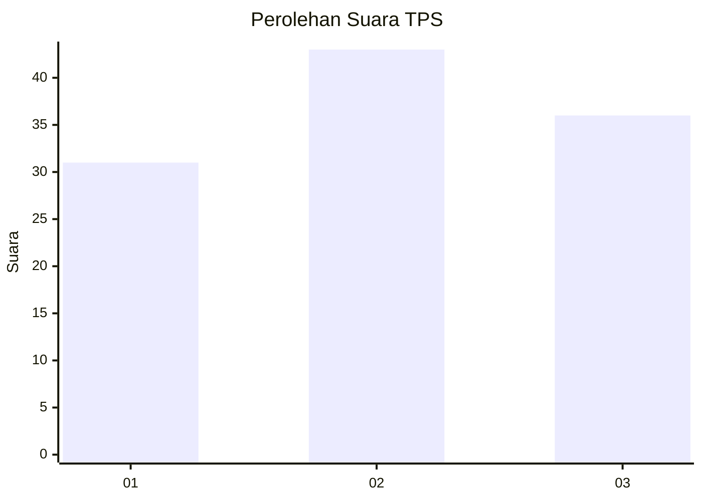
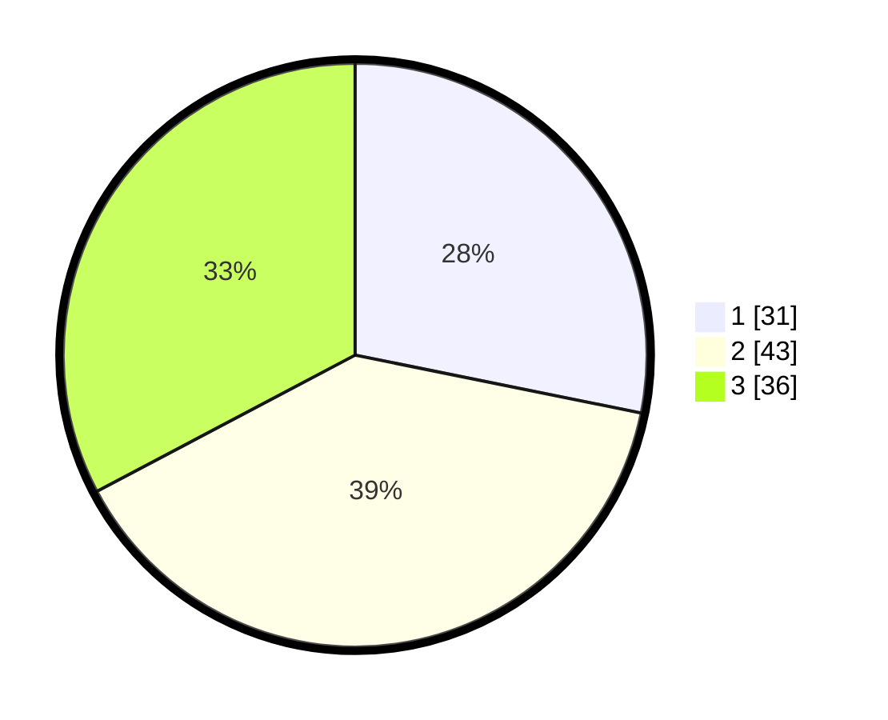

# Hasil

## Grafik

## Tabel

| No. | Nama Paslon    | Suara | Suara (raw) | Persentase |
|:--- |:-------------- | -----:| -----------:| ----------:|
| 1   | ANIES MUHAIMIN | 31    | [31][p-1]   | 28,18      |
| 2   | PRABOWO GIBRAN | 43    | [43][p-2]   | 39,09      |
| 3   | GANJAR MAHFUD  | 36    | [36][p-3]   | 32,73      |

[p-1]: https://github.com/gigit-pemilu/pemilu-2024-34-di-yogyakarta/blob/main/pilpres/hitung-suara/sub/34-di-yogyakarta/sub/02-bantul/sub/03-kretek/sub/2005-tirtohargo/sub/009-tps/sub/paslon-1.txt
[p-2]: https://github.com/gigit-pemilu/pemilu-2024-34-di-yogyakarta/blob/main/pilpres/hitung-suara/sub/34-di-yogyakarta/sub/02-bantul/sub/03-kretek/sub/2005-tirtohargo/sub/009-tps/sub/paslon-2.txt
[p-3]: https://github.com/gigit-pemilu/pemilu-2024-34-di-yogyakarta/blob/main/pilpres/hitung-suara/sub/34-di-yogyakarta/sub/02-bantul/sub/03-kretek/sub/2005-tirtohargo/sub/009-tps/sub/paslon-3.txt

## Foto C Plano

https://sirekap-obj-formc.kpu.go.id/2c8c/pemilu/ppwp/34/02/03/20/05/3402032005009-20240219-194820--54aac05d-ed13-4f09-94e0-c58930026f8d.jpg

https://sirekap-obj-formc.kpu.go.id/2c8c/pemilu/ppwp/34/02/03/20/05/3402032005009-20240219-194919--1ba109ec-3aa8-4759-9004-7f175cbe97df.jpg

https://sirekap-obj-formc.kpu.go.id/2c8c/pemilu/ppwp/34/02/03/20/05/3402032005009-20240219-195001--aa7849f4-a40e-44ec-8c2b-a45a3f33a6af.jpg

## Metadata

| Key        | Value               |
| ---------- | ------------------- |
| Time Stamp | 2024-02-19 20:00:00 |

## DATA PEMILIH TETAP

Jumlah pemilih dalam DPT: **240**.
 * L: **665**.
 * P: **25**.

## DATA PENGGUNA HAK PILIH

Jumlah pengguna hak pilih dalam DPT: **210**.
 * L: **898**.
 * P: **653**.

Jumlah pengguna hak pilih dalam DPTb: **886**.
 * L: **84**.
 * P: **882**.

Jumlah pengguna hak pilih dalam DPK: **8**.
 * L: **800**.
 * P: **0**.

Jumlah pengguna hak pilih: **256**.
 * L: **401**.
 * P: **685**.

## JUMLAH SUARA SAH DAN TIDAK SAH

JUMLAH SELURUH SUARA SAH: **210**.

JUMLAH SUARA TIDAK SAH: **6**.

JUMLAH SELURUH SUARA SAH DAN SUARA TIDAK SAH: **616**.

