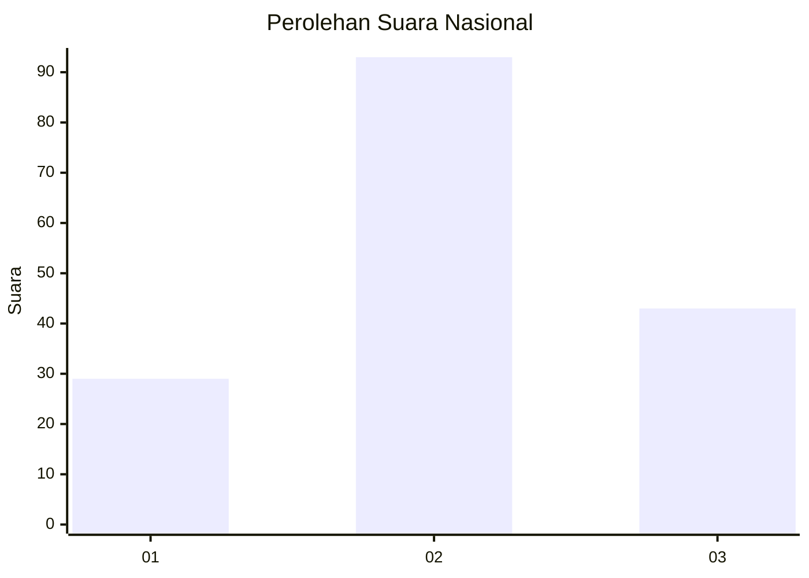
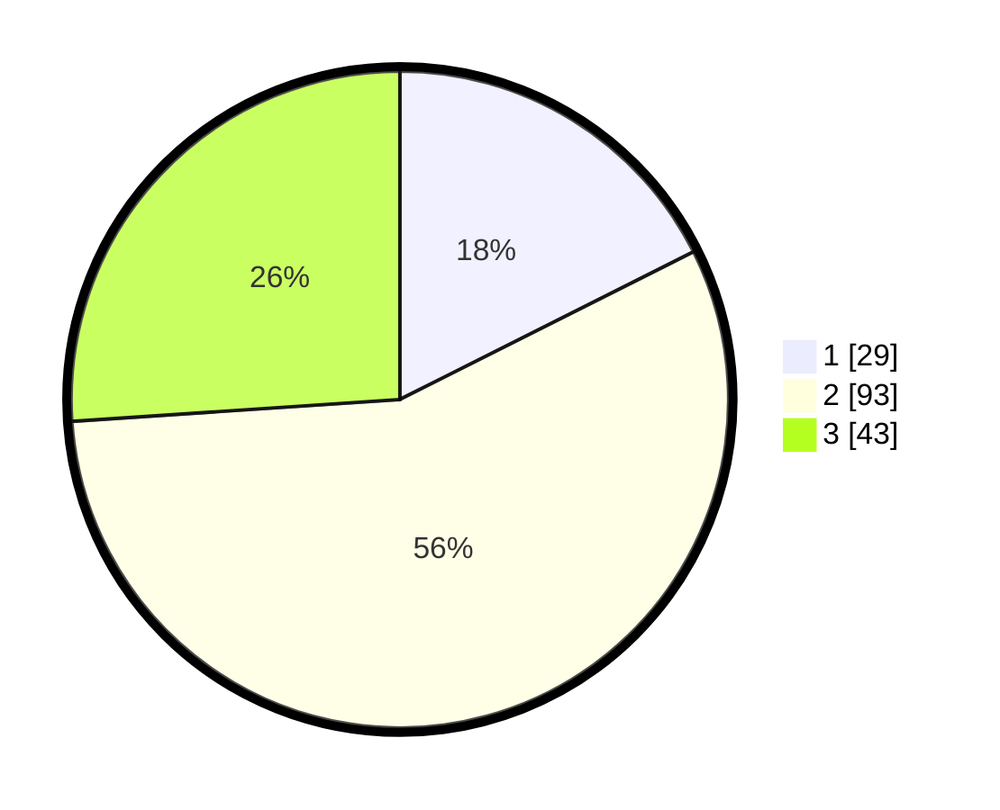

# Hasil

## Grafik

## Tabel

| No. | Nama Paslon    | Suara | Suara (raw) | Persentase |
|:--- |:-------------- | -----:| -----------:| ----------:|
| 1   | ANIES MUHAIMIN | 29    | [29][p-1]   | 17,58      |
| 2   | PRABOWO GIBRAN | 93    | [93][p-2]   | 56,36      |
| 3   | GANJAR MAHFUD  | 43    | [43][p-3]   | 26,06      |

[p-1]: https://github.com/gigit-pemilu/pemilu-2024/blob/main/pilpres/hitung-suara/sub/34-di-yogyakarta/sub/02-bantul/sub/03-kretek/sub/2005-tirtohargo/sub/010-tps/sub/paslon-1.txt
[p-2]: https://github.com/gigit-pemilu/pemilu-2024/blob/main/pilpres/hitung-suara/sub/34-di-yogyakarta/sub/02-bantul/sub/03-kretek/sub/2005-tirtohargo/sub/010-tps/sub/paslon-2.txt
[p-3]: https://github.com/gigit-pemilu/pemilu-2024/blob/main/pilpres/hitung-suara/sub/34-di-yogyakarta/sub/02-bantul/sub/03-kretek/sub/2005-tirtohargo/sub/010-tps/sub/paslon-3.txt

## Foto C Plano

https://sirekap-obj-formc.kpu.go.id/9dc7/pemilu/ppwp/34/02/03/20/05/3402032005010-20240215-022030--c906e13d-8d1e-4b0b-ad94-1df9e93390db.jpg

https://sirekap-obj-formc.kpu.go.id/9dc7/pemilu/ppwp/34/02/03/20/05/3402032005010-20240215-022119--2ecce38b-5bca-4f80-b8b2-c8ce2b35217b.jpg

https://sirekap-obj-formc.kpu.go.id/9dc7/pemilu/ppwp/34/02/03/20/05/3402032005010-20240214-203112--1e77dab0-9cee-4f1b-9c1f-d838e2106622.jpg

## Metadata

| Key        | Value               |
| ---------- | ------------------- |
| Time Stamp | 2024-02-26 12:00:00 |

