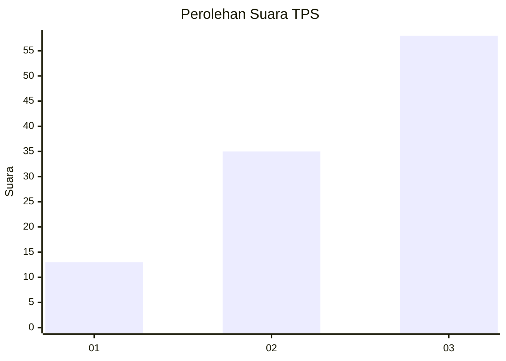
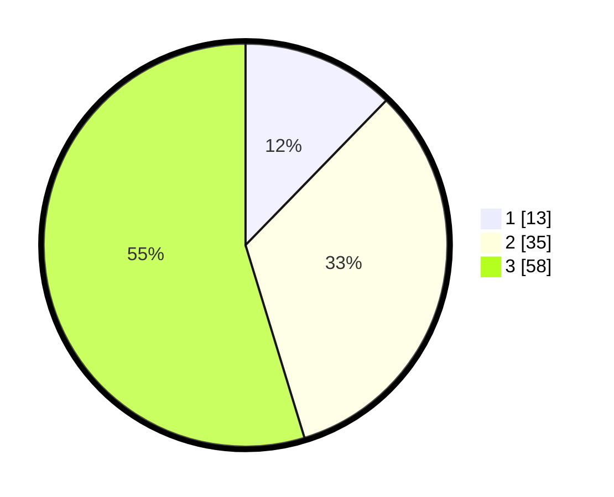

# Hasil

## Grafik

## Tabel

| No. | Nama Paslon    | Suara | Suara (raw) | Persentase |
|:--- |:-------------- | -----:| -----------:| ----------:|
| 1   | ANIES MUHAIMIN | 13    | [13][p-1]   | 12,26      |
| 2   | PRABOWO GIBRAN | 35    | [35][p-2]   | 33,02      |
| 3   | GANJAR MAHFUD  | 58    | [58][p-3]   | 54,72      |

[p-1]: https://github.com/gigit-pemilu/pemilu-2024-34-di-yogyakarta/blob/main/pilpres/hitung-suara/sub/34-di-yogyakarta/sub/02-bantul/sub/03-kretek/sub/2005-tirtohargo/sub/011-tps/sub/paslon-1.txt
[p-2]: https://github.com/gigit-pemilu/pemilu-2024-34-di-yogyakarta/blob/main/pilpres/hitung-suara/sub/34-di-yogyakarta/sub/02-bantul/sub/03-kretek/sub/2005-tirtohargo/sub/011-tps/sub/paslon-2.txt
[p-3]: https://github.com/gigit-pemilu/pemilu-2024-34-di-yogyakarta/blob/main/pilpres/hitung-suara/sub/34-di-yogyakarta/sub/02-bantul/sub/03-kretek/sub/2005-tirtohargo/sub/011-tps/sub/paslon-3.txt

## Foto C Plano

https://sirekap-obj-formc.kpu.go.id/d551/pemilu/ppwp/34/02/03/20/05/3402032005011-20240219-195658--fc2c6b87-350d-4a95-8058-ca9859597cbb.jpg

https://sirekap-obj-formc.kpu.go.id/d551/pemilu/ppwp/34/02/03/20/05/3402032005011-20240219-195831--da5d427b-8bb9-47aa-8197-2e22ad578b53.jpg

https://sirekap-obj-formc.kpu.go.id/d551/pemilu/ppwp/34/02/03/20/05/3402032005011-20240219-195921--f71cded1-b256-4126-bc40-beb3dc54bc49.jpg

## Metadata

| Key        | Value               |
| ---------- | ------------------- |
| Time Stamp | 2024-02-19 20:00:00 |

## DATA PEMILIH TETAP

Jumlah pemilih dalam DPT: **220**.
 * L: **506**.
 * P: **324**.

## DATA PENGGUNA HAK PILIH

Jumlah pengguna hak pilih dalam DPT: **205**.
 * L: **509**.
 * P: **895**.

Jumlah pengguna hak pilih dalam DPTb: **83**.
 * L: **882**.
 * P: **825**.

Jumlah pengguna hak pilih dalam DPK: **88**.
 * L: **88**.
 * P: **82**.

Jumlah pengguna hak pilih: **299**.
 * L: **402**.
 * P: **406**.

## JUMLAH SUARA SAH DAN TIDAK SAH

JUMLAH SELURUH SUARA SAH: **206**.

JUMLAH SUARA TIDAK SAH: **2**.

JUMLAH SELURUH SUARA SAH DAN SUARA TIDAK SAH: **208**.

