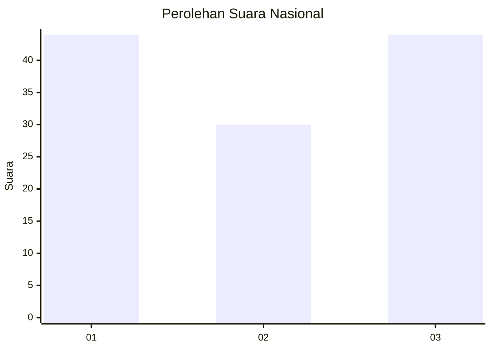
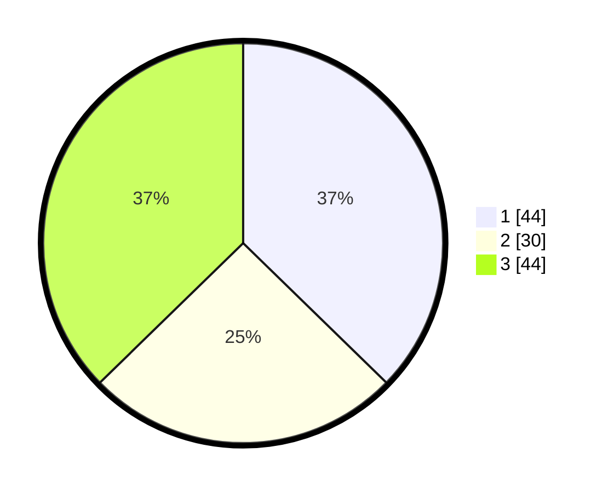

# Hasil

## Grafik

## Tabel

| No. | Nama Paslon    | Suara | Suara (raw) | Persentase |
|:--- |:-------------- | -----:| -----------:| ----------:|
| 1   | ANIES MUHAIMIN | 44    | [44][p-1]   | 37,29      |
| 2   | PRABOWO GIBRAN | 30    | [30][p-2]   | 25,42      |
| 3   | GANJAR MAHFUD  | 44    | [44][p-3]   | 37,29      |

[p-1]: https://github.com/gigit-pemilu/pemilu-2024/blob/main/pilpres/hitung-suara/sub/34-di-yogyakarta/sub/02-bantul/sub/03-kretek/sub/2005-tirtohargo/sub/012-tps/sub/paslon-1.txt
[p-2]: https://github.com/gigit-pemilu/pemilu-2024/blob/main/pilpres/hitung-suara/sub/34-di-yogyakarta/sub/02-bantul/sub/03-kretek/sub/2005-tirtohargo/sub/012-tps/sub/paslon-2.txt
[p-3]: https://github.com/gigit-pemilu/pemilu-2024/blob/main/pilpres/hitung-suara/sub/34-di-yogyakarta/sub/02-bantul/sub/03-kretek/sub/2005-tirtohargo/sub/012-tps/sub/paslon-3.txt

## Foto C Plano

https://sirekap-obj-formc.kpu.go.id/7c03/pemilu/ppwp/34/02/03/20/05/3402032005012-20240219-210515--99111a7e-64a4-4c66-ba5a-d4d7c569882e.jpg

https://sirekap-obj-formc.kpu.go.id/7c03/pemilu/ppwp/34/02/03/20/05/3402032005012-20240219-210618--384be850-6708-4837-9285-dcc089a187c1.jpg

https://sirekap-obj-formc.kpu.go.id/7c03/pemilu/ppwp/34/02/03/20/05/3402032005012-20240219-210758--b78d6a42-470e-4702-a56a-c1744c4f1df9.jpg

## Metadata

| Key        | Value               |
| ---------- | ------------------- |
| Time Stamp | 2024-02-19 22:00:00 |

## DATA PEMILIH TETAP

Jumlah pemilih dalam DPT: **293**.
 * L: **95**.
 * P: **406**.

## DATA PENGGUNA HAK PILIH

Jumlah pengguna hak pilih dalam DPT: **839**.
 * L: **99**.
 * P: **809**.

Jumlah pengguna hak pilih dalam DPTb: **8**.
 * L: **0**.
 * P: **1**.

Jumlah pengguna hak pilih dalam DPK: **0**.
 * L: **0**.
 * P: **0**.

Jumlah pengguna hak pilih: **692**.
 * L: **99**.
 * P: **94**.

## JUMLAH SUARA SAH DAN TIDAK SAH

JUMLAH SELURUH SUARA SAH: **188**.

JUMLAH SUARA TIDAK SAH: **6**.

JUMLAH SELURUH SUARA SAH DAN SUARA TIDAK SAH: **191**.

