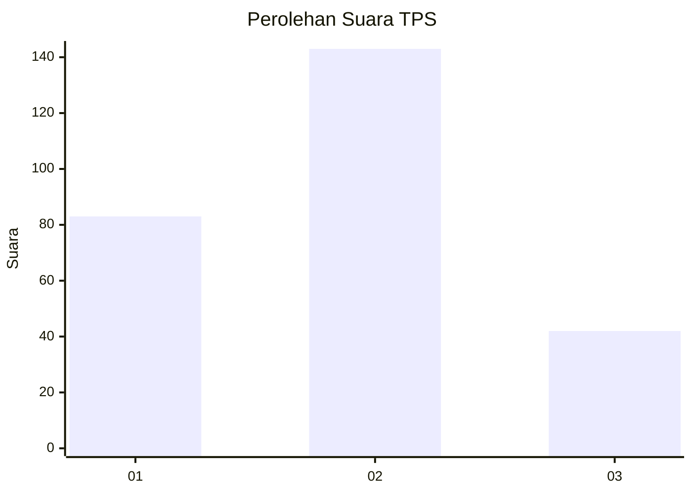
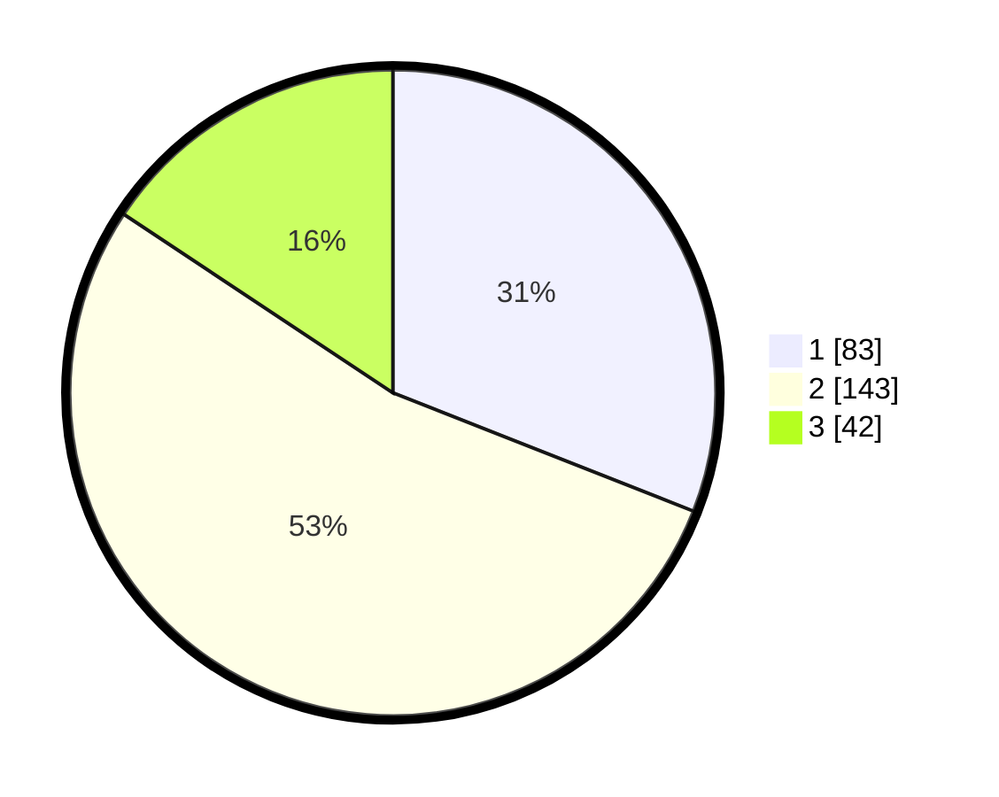

# Hasil

## Grafik

## Tabel

| No. | Nama Paslon    | Suara | Suara (raw) | Persentase |
|:--- |:-------------- | -----:| -----------:| ----------:|
| 1   | ANIES MUHAIMIN | 83    | [83][p-1]   | 30,97      |
| 2   | PRABOWO GIBRAN | 143   | [143][p-2]  | 53,36      |
| 3   | GANJAR MAHFUD  | 42    | [42][p-3]   | 15,67      |

[p-1]: https://github.com/gigit-pemilu/pemilu-2024-34-di-yogyakarta/blob/main/pilpres/hitung-suara/sub/34-di-yogyakarta/sub/02-bantul/sub/04-pundong/sub/2001-seloharjo/sub/005-tps/sub/paslon-1.txt
[p-2]: https://github.com/gigit-pemilu/pemilu-2024-34-di-yogyakarta/blob/main/pilpres/hitung-suara/sub/34-di-yogyakarta/sub/02-bantul/sub/04-pundong/sub/2001-seloharjo/sub/005-tps/sub/paslon-2.txt
[p-3]: https://github.com/gigit-pemilu/pemilu-2024-34-di-yogyakarta/blob/main/pilpres/hitung-suara/sub/34-di-yogyakarta/sub/02-bantul/sub/04-pundong/sub/2001-seloharjo/sub/005-tps/sub/paslon-3.txt

## Foto C Plano

https://sirekap-obj-formc.kpu.go.id/2d4f/pemilu/ppwp/34/02/04/20/01/3402042001005-20240216-145953--0cb0f2f8-5d1a-49af-a404-fa658f8ace4f.jpg

https://sirekap-obj-formc.kpu.go.id/2d4f/pemilu/ppwp/34/02/04/20/01/3402042001005-20240216-145953--fc18e534-342c-4899-a942-b5a60ea97109.jpg

https://sirekap-obj-formc.kpu.go.id/2d4f/pemilu/ppwp/34/02/04/20/01/3402042001005-20240216-152823--ac54ec8a-aca9-4ed1-9106-a7d4ced25bc6.jpg

## Metadata

| Key        | Value               |
| ---------- | ------------------- |
| Time Stamp | 2024-02-20 09:00:00 |

## DATA PEMILIH TETAP

Jumlah pemilih dalam DPT: **296**.
 * L: **151**.
 * P: **145**.

## DATA PENGGUNA HAK PILIH

Jumlah pengguna hak pilih dalam DPT: **270**.
 * L: **140**.
 * P: **130**.

Jumlah pengguna hak pilih dalam DPTb: **3**.
 * L: **2**.
 * P: **1**.

Jumlah pengguna hak pilih dalam DPK: **0**.
 * L: **0**.
 * P: **0**.

Jumlah pengguna hak pilih: **273**.
 * L: **142**.
 * P: **131**.

## JUMLAH SUARA SAH DAN TIDAK SAH

JUMLAH SELURUH SUARA SAH: **268**.

JUMLAH SUARA TIDAK SAH: **5**.

JUMLAH SELURUH SUARA SAH DAN SUARA TIDAK SAH: **273**.

